# Technical Specification

# 1. Introduction

## 1.1 Executive Summary

This Technical Specification documents the repository whose Git `origin` remote identifies it as `existing-projects-qa-test`, as checked out on the `QA-20-july-branch` branch. A direct, evidence-based investigation establishes that, in its present state, the repository is a **near-empty scaffold** rather than an implemented software system.

The repository contains a single tracked file, `hello`, whose complete content is the four-byte text string `hii`. There is no application source code, no README or other documentation, no dependency or build manifests, no configuration, no tests, and no continuous-integration definitions. The entire version-control history consists of a single commit, "Create hello."

Because no application has been implemented, the business-oriented elements that an Executive Summary would ordinarily present — a defined product, a business problem, a user base, and a value proposition — are not expressed anywhere in the repository. In keeping with an evidence-based approach, this section reports the repository exactly as observed rather than inferring intent the source does not support.

**Observed repository snapshot**

| Attribute | Observed Value |
|---|---|
| Repository name (Git `origin`) | `existing-projects-qa-test` |
| Checked-out branch | `QA-20-july-branch` |
| Tracked files | 1 — `hello` |
| `hello` size / content | 4 bytes / plain text `hii` |
| Commit history | 1 commit — "Create hello" |
| Source code, manifests, docs, config | None present |

**Executive summary elements against the prompt**

| Requested Element | Status in Repository |
|---|---|
| Project overview | Not defined; only a placeholder file is present |
| Core business problem | Not stated anywhere in the repository |
| Key stakeholders and users | Not identified (only Git authorship metadata exists) |
| Business impact / value proposition | Not documented |

The only human reference discoverable in the repository is Git commit-authorship metadata (author "Sandeep01Kumar," on the `blitzy.com` email domain). The repository name, which includes "qa-test," is consistent with a quality-assurance or testing scaffold. However, no functional purpose, requirement, or value statement is declared within the repository's contents, and none is asserted here.

## 1.2 System Overview

The repository does not contain an implemented system. The following subsections describe the project context, a high-level description, and success criteria strictly as they can — or cannot — be derived from the repository's actual contents.

### 1.2.1 Project Context

No business context, market positioning, or enterprise-integration information is present in the repository. There is no product description, no domain model, and no configuration that would connect the repository to any external platform or service. Because there is no prior application code, migration script, or legacy artifact, there is likewise no existing system being replaced or upgraded.

| Project Context Dimension | Observed Evidence |
|---|---|
| Business context & market positioning | Not documented in the repository |
| Existing system being replaced/upgraded | None indicated; no legacy code or migration artifacts |
| Enterprise / third-party integrations | None; no integration code, credential config, or dependency manifests |

The repository name `existing-projects-qa-test` and the commit author's `blitzy.com` email domain are the only contextual signals available, and both are consistent with the repository serving as a QA/testing placeholder rather than a production project. No further context can be substantiated from the source.

### 1.2.2 High-Level Description

The repository declares no capabilities, components, or technical approach. The single `hello` file carries no file extension, no shebang line, and no executable logic; it is inert text. Consequently, the repository commits to no programming language, framework, runtime, or architectural pattern.

| Aspect | Observed Evidence |
|---|---|
| Primary system capabilities | None; the sole file `hello` is inert text (`hii`) with no behavior |
| Major system components | None; the working tree has no directories other than `.git` |
| Core technical approach | Not declared; no language, framework, or runtime is indicated |

### 1.2.3 Success Criteria

The repository defines no objectives, success factors, or performance indicators. There are no specification documents, acceptance tests, service-level definitions, or metrics. Consistent with an evidence-based approach, this specification does not fabricate measurable objectives, critical success factors, or key performance indicators where none exist in the source.

| Success-Criteria Element | Status in Repository |
|---|---|
| Measurable objectives | None defined |
| Critical success factors | None defined |
| Key performance indicators (KPIs) | None defined |

## 1.3 Scope

The scope below reflects only what is materially present in the repository. Given the near-empty state, the in-scope surface is limited to a single placeholder file, and virtually all capabilities normally associated with a software system are, by definition, absent.

### 1.3.1 In-Scope

The complete set of artifacts present in the repository is enumerated below.

| In-Scope Item | Description |
|---|---|
| `hello` file | A single 4-byte text file containing `hii`; the only tracked content |
| Git version control | A repository with one commit ("Create hello") across all branches |

The core-feature dimensions requested by the specification map to the repository as follows:

- **Must-have capabilities:** None are implemented; there is no runnable functionality.
- **Primary user workflows:** None; the repository exposes no interface, command, or entry point.
- **Essential integrations:** None; no external systems are referenced or configured.
- **Key technical requirements:** None declared; no manifests, runtime, or dependency constraints exist.

**Implementation boundaries.** The system boundary is effectively the single `hello` file within the Git working tree. No user groups, geographic or market coverage, or data domains are defined anywhere in the repository.

### 1.3.2 Out-of-Scope

Because the repository contains no implemented application, all of the following are out of scope for the repository's current state. They are listed to make the boundary explicit, not to imply any commitment to deliver them.

| Out-of-Scope Area | Reason |
|---|---|
| Application features / business logic | No source code exists |
| APIs, user interfaces, CLIs | No entry points or interface definitions exist |
| Data storage & data domains | No schema, database, or data files exist |
| External / enterprise integrations | No integration code or configuration exists |
| Build, packaging, CI/CD, deployment | No manifests, pipelines, or infrastructure definitions exist |
| Testing & quality gates | No test suites or frameworks exist |

- **Future phase considerations:** None are documented in the repository; any future functionality cannot be determined from the current source and is therefore out of scope for this specification.
- **Integration points not covered:** All integration points are uncovered, as none are defined.
- **Unsupported use cases:** All use cases are unsupported, as no functionality is implemented.

## 1.4 References

The following repository artifacts and inspection results were used as evidence for this section.

**Files examined**

- `hello` — the sole tracked file; established the repository's only content (4-byte plain text `hii`, no extension, no executable logic).

**Folders examined**

- Repository root (`""`) — established that the working tree contains no application directories; the only directory present is the `.git` version-control directory.

**Repository metadata inspected**

- Git commit history — established a single commit ("Create hello") total across all branches (`main`, `QA-20-july-branch`, and the `QA-02-july-branch` / `QA-09-Feb-branch` remotes).
- Git `origin` remote — established the repository name `existing-projects-qa-test` and the commit-author email domain.
- Manifest, source-code, and configuration sweeps — confirmed the absence of package manifests, source files, documentation, configuration, tests, and CI/CD definitions.

No external (web) sources were required, and no sibling Technical Specification sections were available to cross-reference at the time of writing.

# 2. Product Requirements

## 2.1 Feature Catalog

The Product Requirements for this repository are documented as discrete, testable features, each identified by a unique `F-XXX` identifier. A direct, evidence-based investigation of the repository under documentation (Git `origin` `existing-projects-qa-test`, checked out on branch `QA-20-july-branch`) establishes that **no product features are implemented, declared, or specified**. Consequently, the feature catalog is empty and no `F-XXX` identifiers have been assigned.

This finding holds across the entire version-controlled surface and corroborates the foundational sections of this specification (see §1.1 Executive Summary, §1.2 System Overview, and §1.3 Scope), all of which document the repository as a near-empty scaffold.

**Observed evidence relevant to feature identification**

| Attribute | Observed Value |
|---|---|
| Tracked files (all branches) | 1 — `hello` |
| `hello` content / size | plain text `hii` / 4 bytes |
| Application source code | None present |
| Dependency / build manifests | None present |
| Configuration, documentation, tests, CI/CD | None present |
| Runnable entry points / interfaces | None present |
| Catalogued features (`F-XXX`) | 0 |

Because the sole artifact (`hello`) is inert text carrying no executable logic and declaring no language, framework, runtime, interface, or dependency, it does not constitute a product feature and cannot be decomposed into testable capabilities.

### 2.1.1 Feature Metadata Schema (Not Populated)

The metadata schema below would govern each catalogued feature. Because zero features exist, every attribute is unpopulated; the schema is reproduced to define the intended structure and to make the absence explicit.

| Metadata Field | Prescribed Format / Values | Populated? |
|---|---|---|
| Unique ID | `F-XXX` (sequential) | No feature to identify |
| Feature Name | Short descriptive title | No feature to name |
| Feature Category | Functional grouping | No category exists |
| Priority Level | Critical / High / Medium / Low | Not applicable |
| Status | Proposed / Approved / In Development / Completed | Not applicable |

### 2.1.2 Feature Descriptions and Dependencies (None Defined)

With an empty catalog, no per-feature Description or Dependencies content can be derived from source. The requested dimensions map to the repository as follows.

| Requested Dimension | Status in Repository |
|---|---|
| Overview / Business Value / User Benefits | Not stated anywhere in the repository |
| Technical Context | None; no language, framework, or runtime declared |
| Prerequisite Features | None; the catalog is empty |
| System Dependencies | None; no manifests or runtime declared |
| External Dependencies | None; no third-party libraries or services referenced |
| Integration Requirements | None; no integration code or configuration present |

### 2.1.3 Assumptions and Constraints

The following assumptions and constraints govern this section and are themselves grounded in observed evidence.

- **Constraint — No implemented product:** The repository contains only the placeholder file `hello`; there is no source code from which features could be identified.
- **Constraint — Single version-control datapoint:** The entire history is one commit ("Create hello"), so there are no feature versions or requirement revisions to track.
- **Assumption — QA/testing scaffold:** The repository name `existing-projects-qa-test` is consistent with a quality-assurance or testing placeholder rather than a product; no functional intent is asserted beyond what the source shows.
- **Assumption — Future scope undefined:** Any future features are undocumented and therefore lie outside the evidence base of this specification (see §1.3.2 Out-of-Scope).

## 2.2 Functional Requirements

Functional requirements are expressed per feature using the identifier format `F-XXX-RQ-YYY`, where `F-XXX` denotes the parent feature and `RQ-YYY` the sequential requirement. Because the Feature Catalog (§2.1) contains zero features, **no functional requirements exist** and no `F-XXX-RQ-YYY` identifiers have been assigned. The requirements table below is therefore intentionally empty.

### 2.2.1 Requirement Details (Empty)

| Requirement ID | Description | Priority | Complexity |
|---|---|---|---|
| — | No functional requirements defined (no feature exists) | — | — |

No acceptance criteria are defined, because there is no behavior to accept or verify. No requirement versions are tracked, because no requirements exist and the repository's history comprises a single commit ("Create hello").

### 2.2.2 Technical Specifications and Validation Rules (Not Applicable)

The technical-specification and validation-rule dimensions that would accompany each requirement have no basis in the repository, as summarized below.

| Requested Dimension | Status in Repository |
|---|---|
| Input Parameters | None; no interface, function, or endpoint exists |
| Output / Response | None; the `hello` file exposes no behavior |
| Performance Criteria | None declared; no runtime or service-level targets present |
| Data Requirements | None; no schema, database, or data files exist |
| Business Rules | None declared |
| Data Validation | None; no validation logic exists |
| Security Requirements | None declared; no authentication, authorization, or secrets management present |
| Compliance Requirements | None declared |

## 2.3 Feature Relationships

Per this section's evidence constraint, only feature relationships clearly evident in the source are documented. Because no features or components exist (§2.1, §2.2), there are **no feature relationships to document**: the dependency map is empty, and there are no integration points, shared components, or common services.

| Relationship Type | Requested Content | Status in Repository |
|---|---|---|
| Feature Dependencies Map | Inter-feature prerequisite graph | Empty; no feature nodes |
| Integration Points | Interfaces between features / externals | None; no interfaces exist |
| Shared Components | Reused modules or libraries | None; no code exists |
| Common Services | Cross-cutting services | None; no services exist |

The observed product surface and its (empty) feature-relationship graph are depicted below. The graph contains only version-control artifacts; there are no feature or requirement nodes and therefore no dependency edges.

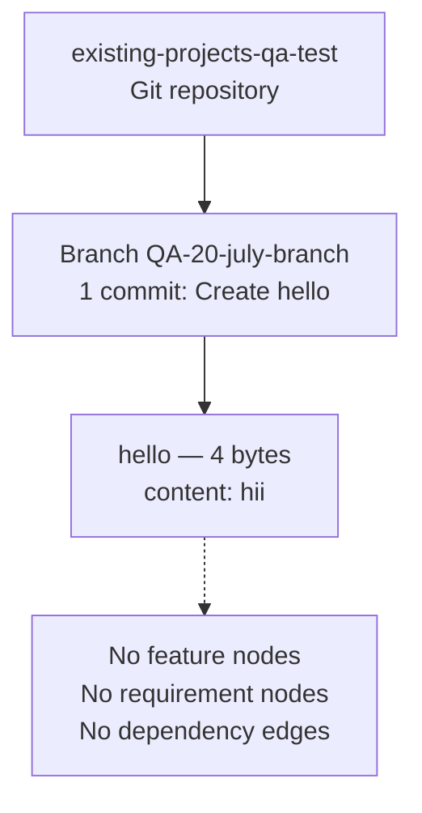

## 2.4 Implementation Considerations

Implementation considerations are documented per feature. Because no features or source code exist, per-feature technical constraints, performance requirements, scalability considerations, security implications, and maintenance requirements cannot be derived. The table below records each requested dimension against the observed repository state.

| Consideration | Status / Observed Evidence |
|---|---|
| Technical Constraints | No language, framework, runtime, or build tooling declared |
| Performance Requirements | None; no executable code or performance targets present |
| Scalability Considerations | None; no runtime, service, or data tier exists |
| Security Implications | None; no code, secrets, authentication, or data handling present |
| Maintenance Requirements | The only maintainable artifact is the 4-byte `hello` placeholder; no build, dependency, or deployment lifecycle exists |

Any future implementation considerations would be introduced only when actual features are added to the repository; none can be asserted from the current source (see §1.3 Scope).

## 2.5 Requirements Traceability Matrix

A traceability matrix links each feature to its functional requirements, acceptance criteria, and verification method. Because the catalog contains zero features and zero requirements (§2.1, §2.2), the matrix is intentionally empty.

| Feature ID | Requirement ID | Acceptance Criteria | Verification Method |
|---|---|---|---|
| — | — | No requirements to trace | — |

**Process-flow references.** No process flowcharts are applicable, because the repository defines no user workflows, commands, or entry points — a finding corroborated by §1.3.1 In-Scope, which records that the repository exposes no interface, command, or entry point. Should features be implemented in the future, this matrix and the corresponding process flows would be populated accordingly.

## 2.6 References

The following repository artifacts, metadata, and specification sections were used as evidence for this section.

**Files examined**

- `hello` — the sole tracked file; established that the only repository content is 4-byte plain text (`hii`) with no executable logic, confirming the absence of any feature.

**Folders examined**

- Repository root (`""`) — established that the working tree contains no application directories (only the `.git` version-control directory), confirming that no feature source exists.

**Repository metadata inspected**

- Git commit history — established a single commit ("Create hello") across all branches, confirming there are no feature or requirement versions to track.
- Git branches — `main`, `QA-20-july-branch`, `QA-02-july-branch`, and `QA-09-Feb-branch`, each containing only the `hello` file.
- Git `origin` remote — established the repository name `existing-projects-qa-test`, consistent with a QA/testing scaffold.
- Manifest, source-code, configuration, test, and CI/CD sweeps — confirmed the absence of any features, dependencies, interfaces, or workflows.

**Technical Specification sections cross-referenced**

- §1.1 Executive Summary — corroborates the near-empty scaffold state.
- §1.2 System Overview — corroborates the absence of capabilities, components, and success criteria.
- §1.3 Scope — corroborates the absence of in-scope features, workflows, integrations, and entry points.
- §1.4 References — corroborates the underlying evidence base (files, folders, and metadata examined).

No external (web) sources were required.

# 3. Technology Stack

## 3.1 Programming Languages

This section documents the technology stack that is **actually present** in the repository (Git `origin` `existing-projects-qa-test`, checked out on branch `QA-20-july-branch`, HEAD `97e6b3a`). A direct, evidence-based investigation of the entire version-controlled surface establishes that the repository is a near-empty scaffold whose only tracked artifact is a 4-byte placeholder file, `hello`, containing the plain text `hii`. Consequently, **no technology stack has been adopted**: there are no programming languages, frameworks, libraries, dependency manifests, third-party services, databases, or build/deployment tooling. Each subsection below records the requested category against the observed evidence, consistent with §1.1 Executive Summary, §1.2 System Overview, §1.3 Scope, and §2.4 Implementation Considerations.

No programming language is declared, used, or configured anywhere in the repository. The sole tracked file, `hello`, carries no file extension, no shebang line (a byte-level inspection with `od -c` shows exactly the four bytes `h i i \n`), and no executable logic; it therefore commits the repository to no language, runtime, or toolchain. This corroborates §1.2 System Overview, which records that the repository "commits to no programming language, framework, runtime, or architectural pattern."

A repository-wide sweep for source files across common language extensions — including `.py`, `.js`, `.ts`, `.tsx`, `.jsx`, `.java`, `.kt`, `.swift`, `.m`, `.go`, `.rb`, `.rs`, `.c`, `.cpp`, `.cs`, `.php`, `.sh`, `.html`, and `.css` — returned no matches.

| Requested Dimension | Observed Evidence |
|---|---|
| Languages by platform / component | None; no source files of any language exist, and there are no platform/component directories (the working tree contains only `hello`) |
| Selection criteria / justification | Not applicable; no language has been selected, so no selection rationale exists to document |
| Constraints / dependencies | None; no language version file (e.g., `.nvmrc`, `.python-version`, `.ruby-version`, `.tool-versions`), runtime declaration, or toolchain configuration is present |

Because no language is present, none of the entries in the provided default technology stack (for example, Python, TypeScript, Swift, Kotlin, or Objective-C) have been instantiated in the source and are therefore not documented as in use. No language-level security considerations arise, as there is no code to compile, interpret, or execute.

## 3.2 Frameworks & Libraries

No application framework or software library is present, imported, or declared in the repository. Because there is no source code and no dependency or build manifest, there are no framework versions, supporting libraries, or compatibility requirements to enumerate, and no framework-selection decisions to justify.

A sweep for dependency and build manifests that would ordinarily declare frameworks and libraries — including `package.json`, `requirements*.txt`, `pyproject.toml`, `setup.py`, `Pipfile`, `go.mod`, `pom.xml`, `build.gradle`, `Cargo.toml`, `Gemfile`, `composer.json`, and `*.csproj` — returned no matches across all branches.

| Requested Dimension | Observed Evidence |
|---|---|
| Core frameworks (with versions) | None; no framework is referenced in source or declared in any manifest |
| Supporting libraries | None; no libraries are imported or vendored |
| Compatibility requirements | None; no runtime, engine, or peer-dependency constraints are declared |
| Justification for each major choice | Not applicable; no framework or library has been chosen |

This finding is consistent with §2.1 Feature Catalog, which records that no external libraries or dependencies are referenced, and with §2.4 Implementation Considerations, which records that "no language, framework, runtime, or build tooling [is] declared." Accordingly, no framework-specific compatibility or security considerations apply.

## 3.3 Open Source Dependencies

No open-source or third-party dependencies are used by the repository. There are no dependency manifests and no lockfiles, so there is no dependency graph, no pinned versions, and no package registries in use.

A sweep for lockfiles and manifests that would identify open-source dependencies and their registries — including `package-lock.json`, `yarn.lock`, `pnpm-lock.yaml`, `poetry.lock`, `Pipfile.lock`, `go.sum`, and `Cargo.lock` — returned no matches. No vendored dependency directories (for example, `node_modules/`, `vendor/`, or `site-packages/`) exist in the working tree, which contains only the `hello` file.

| Requested Dimension | Observed Evidence |
|---|---|
| Third-party / open-source libraries | None identified; no imports, manifests, or vendored code exist |
| Package dependencies | None; no direct or transitive dependencies are declared |
| Package registries | None referenced (no npm, PyPI, Maven Central, Go proxy, crates.io, RubyGems, or Packagist configuration) |
| Versions | Not applicable; there are no dependencies to pin |

With no external dependencies present, the repository has no third-party supply-chain surface, and no dependency-related security exposure (such as vulnerable transitive packages) can arise from the current source. This is consistent with §2.1 Feature Catalog ("no third-party libraries or services referenced").

## 3.4 Third-Party Services

No third-party services are integrated with the repository. There is no integration code, no client SDK, no service configuration, and no environment or credential files. Accordingly, there are no external APIs, authentication providers, monitoring/observability tools, or cloud services in use.

| Service Category | Observed Evidence |
|---|---|
| External APIs / integrations | None; no HTTP clients, SDKs, endpoint URLs, or API configuration exist |
| Authentication services | None; no identity provider, OAuth/OIDC, token, or session configuration exists (e.g., no Auth0 or equivalent) |
| Monitoring / observability tools | None; no logging, metrics, tracing, or error-reporting integration exists |
| Cloud services | None; no cloud provider SDKs, service definitions, or account configuration exist (e.g., no AWS or equivalent) |

The only external reference of any kind is the Git `origin` remote used for source hosting on GitHub (repository `Sandeep01Kumar/existing-projects-qa-test`); this is version-control hosting rather than an application-level service integration. No secrets, API keys, or credentials are present in the tracked source, which is consistent with §2.4 Implementation Considerations ("no code, secrets, authentication, or data handling present"). As a result, no third-party integration or credential-management security concerns arise from the repository's committed contents.

## 3.5 Databases & Storage

No database or storage technology is used by the repository. There is no database driver or ORM, no schema or migration files, no connection configuration, and no caching layer or object-storage integration.

| Requested Dimension | Observed Evidence |
|---|---|
| Primary / secondary databases | None; no relational, document, key-value, or other database is configured or referenced (e.g., no MongoDB or equivalent) |
| Data persistence strategies | None at the application level; the only persisted artifact is the 4-byte `hello` file stored as a Git blob under version control |
| Caching solutions | None; no in-memory or distributed cache (e.g., Redis/Memcached) is present |
| Storage services | None; no local data files, object storage, or file-storage service integration exists |

The repository defines no data domains and no data-handling logic, which is consistent with §1.3 Scope ("no schema, database, or data files exist") and §2.4 Implementation Considerations. Because no data is collected, stored, or processed, no data-at-rest, data-in-transit, or data-privacy security considerations arise from the current source.

## 3.6 Development & Deployment

No development, build, or deployment tooling is defined in the repository. There is no build system, no containerization, no continuous-integration/continuous-deployment (CI/CD) pipeline, and no infrastructure-as-code (IaC). The only development-lifecycle tooling in evidence is the Git version-control system itself.

Sweeps for the relevant artifacts returned no matches: no build files (`Makefile`, `build.gradle`, `pom.xml`, npm scripts in a `package.json`); no containerization (`Dockerfile`, `docker-compose*.yml`); no CI/CD definitions (no `.github/workflows/`, `.circleci/`, or `.gitlab-ci.yml`); and no IaC (`*.tf` Terraform or equivalent).

| Requested Dimension | Observed Evidence |
|---|---|
| Development tools | None configured; no linters, formatters, editor config, or `.gitignore` are present. Version control is Git; the entire history is a single commit ("Create hello") across all branches |
| Build system | None; no build manifest, task runner, or compilation/packaging configuration exists |
| Containerization | None; no `Dockerfile` or container-orchestration definition exists (e.g., no Docker or equivalent) |
| CI/CD | None; no pipeline definitions exist (e.g., no GitHub Actions workflows or equivalent) |

The repository is hosted on GitHub and uses Git for version control across the branches `main`, `QA-20-july-branch`, `QA-02-july-branch`, and `QA-09-Feb-branch`, each of which points to the same single commit. The absence of any build, packaging, CI/CD, or deployment definition is consistent with §1.3 Scope, which lists "Build, packaging, CI/CD, deployment" as out-of-scope because "no manifests, pipelines, or infrastructure definitions exist." No CI/CD- or deployment-related security controls (such as pipeline secrets or supply-chain signing) are present or required by the current source.

## 3.7 References

The following repository artifacts were inspected as evidence for this section:

- `hello` - the sole tracked file (4 bytes, content `hii`); byte-level inspection confirmed no file extension, no shebang, and no executable logic, establishing that no language, framework, dependency, or runtime is declared.
- Repository root working tree (`/`) - enumerated to confirm the working tree contains only `hello` (plus the `.git` metadata directory); no source, manifest, configuration, containerization, CI/CD, or IaC files exist.
- Git version-control metadata (`.git/`) - queried for branch and commit history; confirmed a single commit ("Create hello", `97e6b3a`) across all branches (`main`, `QA-20-july-branch`, `QA-02-july-branch`, `QA-09-Feb-branch`) and the GitHub `origin` remote used for source hosting.

Repository-wide file sweeps (by name and extension) for language sources, dependency/build manifests, lockfiles, configuration, containerization, CI/CD, and IaC returned no matches; these searches substantiate the evidence-based absences reported throughout §3.1–§3.6.

The following sections of this Technical Specification were cross-referenced for consistency:

- §1.1 Executive Summary - characterization of the repository as a near-empty scaffold with a single `hello` file and one commit.
- §1.2 System Overview - finding that the repository "does not contain an implemented system" and commits to no language, framework, or runtime.
- §1.3 Scope - in-scope/out-of-scope boundaries, including build, packaging, CI/CD, and deployment listed as out-of-scope.
- §2.1 Feature Catalog - zero implemented features and no third-party libraries or services referenced.
- §2.4 Implementation Considerations - no language/framework/runtime/build tooling declared, and no code, secrets, authentication, or data handling present.

No external or web sources were required or used for this section.

# 4. Process Flowchart

## 4.1 System Workflows

Section 4 documents the runtime process flows, workflows, and state transitions of the system under specification. Consistent with the evidence-based approach applied throughout this document, only flows that are directly substantiated by repository artifacts are documented; no workflow, decision point, timing constraint, or error path is invented.

A direct investigation of the repository (Git origin `existing-projects-qa-test`, checked out on branch `QA-20-july-branch`) establishes that it is a **near-empty scaffold**: the entire version-controlled surface consists of a single 4-byte placeholder file, `hello` (content `hii`), introduced by one commit ("Create hello", `97e6b3a`). There is no application source code, no runnable entry point, no interface, no service or data tier, and no configuration. Consequently, **there are no business processes, integration workflows, state machines, or error-handling flows to document**. This finding is corroborated by §1.2 System Overview, §1.3 Scope, §2.1 Feature Catalog, §2.2 Functional Requirements, §2.3 Feature Relationships, and §2.4 Implementation Considerations, all of which document the repository as a near-empty placeholder.

To honor the required structure of this section while remaining strictly evidence-based, each sub-section below reproduces the requested workflow dimensions and maps them to the observed repository state. Every Mermaid diagram depicts only artifacts that actually exist — the repository's version-control provenance — and never a fabricated runtime behavior. Swim lanes, timing/SLA annotations, decision branches, and error/recovery paths are shown only where a real actor or system can be identified from evidence; where none exists, that absence is stated explicitly and, where drawn, is clearly labeled as unreachable.

### 4.1.1 Core Business Processes

No business process is implemented or declared in the repository. The `hello` file is inert text with no executable logic, so there is no end-to-end user journey, no system interaction, no decision logic, and no runtime error path. The requested core-process dimensions map to the repository as follows.

| Core-Process Dimension | Status in Repository |
|---|---|
| End-to-end user journeys | None; the repository exposes no interface, command, or entry point (see §1.3.1) |
| System interactions | None; no components exist that could interact (see §1.2.2) |
| Decision points | None; no conditional or branching logic exists in any artifact |
| Error handling paths | None; no executable code exists that could raise or handle errors |

The only workflow derivable from evidence is the high-level relationship between the repository, its single branch, and the inert placeholder file — culminating in the determination that no executable process exists. The diagram below is a factual representation of that state, not of any runtime behavior. The single "start" node is the repository state at the sole commit; the terminal node reflects that no runnable process follows. Because no actor or external system participates, no swim lanes and no timing/SLA constraints apply.

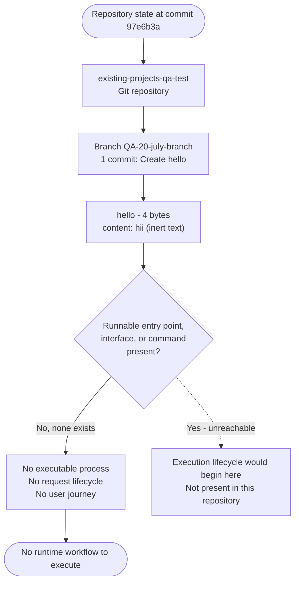

*Figure 4.1.1 — High-level "system workflow." The diagram traces the repository's only tracked artifact to the evidence-based conclusion that no runnable process, request lifecycle, or user journey exists. The dotted "Yes" branch is unreachable because no entry point is present.*

Because zero features are catalogued (§2.1) and zero functional requirements are defined (§2.2), the "detailed process flow for each core feature" required by this section's brief cannot be produced: there is no feature to decompose into a flow. This absence is documented rather than fabricated.

### 4.1.2 Integration Workflows

No integration workflow exists. The repository references no external systems, declares no APIs or SDKs, defines no event producers or consumers, and contains no scheduled or batch jobs. The requested integration dimensions map to the repository as follows.

| Integration Dimension | Status in Repository |
|---|---|
| Data flow between systems | None; there is no data tier, schema, or second system (see §2.3) |
| API interactions | None; no endpoints, clients, or SDKs are declared (see §1.3.2) |
| Event processing flows | None; no message broker, queue, or event handler exists |
| Batch processing sequences | None; no scheduler, cron definition, or batch job exists |

The single interaction observable anywhere in the repository is its version-control provenance: the commit that created the `hello` placeholder and the branch on the `origin` remote that carries it. The sequence diagram below depicts that provenance across the author, the local working tree, the Git repository, and the remote, with each participant shown as its own lane. It is explicitly a version-control interaction, not an application-level integration, and no timing or SLA constraints are defined for it in the repository.

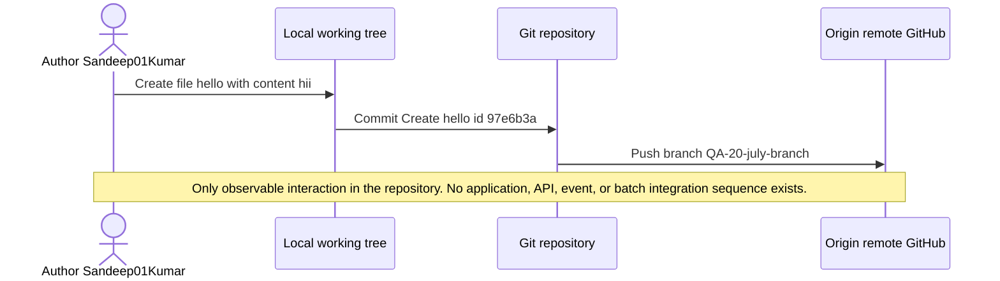

*Figure 4.1.2 — Version-control provenance sequence (the only observable interaction). No application, API, event, or batch integration sequence exists in the repository.*

## 4.2 Flowchart Requirements and Validation Rules

This sub-section enumerates the standard flowchart components that the brief requires for every major workflow, together with the validation rules that would govern each step. Because no workflow exists in the repository (see §4.1), each component and rule is mapped to its observed absence rather than fabricated. The tables make the absence explicit and preserve the intended structure for the point at which real functionality is added.

### 4.2.1 Workflow Components, Boundaries, and SLA Considerations

The brief specifies that each major workflow define start and end points, process steps, decision diamonds, system boundaries, user touchpoints, error states with recovery paths, and timing/SLA considerations. Because the repository contains no runnable workflow, none of these components can be populated from evidence. The only boundary that can be identified is the Git working tree, whose sole member is the `hello` placeholder file.

| Required Flowchart Component | Status in Repository |
|---|---|
| Start point | None; no process is initiated because no entry point exists |
| End point | None; no process terminates because none starts |
| Process steps | None; no executable steps exist in any artifact |
| Decision diamonds | None; no conditional or branching logic exists |
| System boundaries | Effectively the Git working tree; its only member is the `hello` file (see §1.3.1) |
| User touchpoints | None; no interface, command, or endpoint is exposed |
| Error states and recovery paths | None; no runtime exists in which errors could occur (elaborated in §4.3.2) |
| Timing and SLA considerations | None declared; no performance targets or service-level definitions are present (see §2.2, §2.4) |

The "system boundary" therefore reduces to the version-control working tree depicted in Figure 4.1.1. There is no process boundary, transaction boundary, or trust boundary, because no runtime, data store, or security perimeter exists to delimit. No timing constraint or service-level agreement is recorded anywhere in the repository; §2.4 confirms that no performance requirements are declared.

### 4.2.2 Validation Rules

Validation rules normally govern the data and transitions at each step of a workflow. Because the repository defines no workflow, no interface, and no data handling, **no validation rule of any kind is present**. The requested validation categories map to the observed repository state as follows, corroborated by §2.2 Functional Requirements.

| Validation Category | Status in Repository |
|---|---|
| Business rules at each step | None declared; there are no process steps to govern (see §2.2) |
| Data validation requirements | None; no input parameters, schema, or validation logic exist (see §2.2) |
| Authorization checkpoints | None; no authentication or authorization mechanism is present (see §2.2, §2.4) |
| Regulatory compliance checks | None declared; no compliance requirements are stated (see §2.2) |

The `hello` file itself is not subject to any validation logic: it is inert text with no declared format, schema, encoding constraint, or acceptance criterion. Should features later be introduced, business rules, data-validation requirements, authorization checkpoints, and compliance checks would be documented here per feature; none can be asserted from the current source.

## 4.3 Technical Implementation Flows

This sub-section documents the technical implementation of the system's process flows — state management and error handling. Because the repository contains no executable code, no application-level state or error-handling behavior exists. The only technically observable process is the repository's version-control lifecycle, which is modeled below and explicitly distinguished from application behavior.

### 4.3.1 State Management

The brief requires state transitions, data persistence points, caching requirements, and transaction boundaries. Because the repository provides no runtime and no data tier, no application state exists. The requested state-management dimensions map to the observed repository state as follows.

| State-Management Dimension | Status in Repository |
|---|---|
| State transitions | None at the application level; the only observable transitions are the repository's version-control states (see Figure 4.3.1) |
| Data persistence points | None; no database, file store, or data file exists beyond the inert `hello` placeholder (see §1.3.2, §2.2) |
| Caching requirements | None; no cache, in-memory store, or caching layer is declared |
| Transaction boundaries | None; no transactional resource (database, queue, or external service) exists |

The only state that can be substantiated from evidence is the version-control lifecycle of the repository itself: an initial (pre-commit) condition, the single commit that introduced the `hello` placeholder, and the resulting clean working tree. The diagram below models that lifecycle and is explicitly not an application state machine.

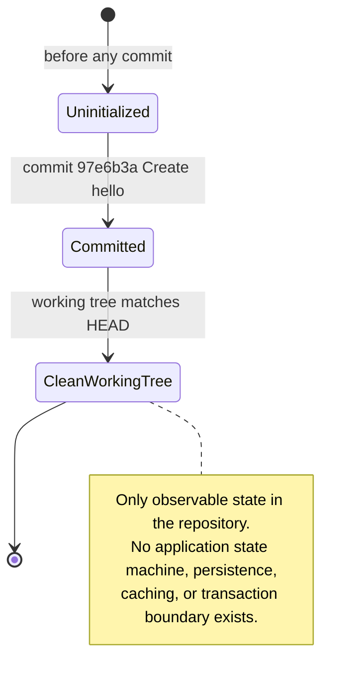

*Figure 4.3.1 — Version-control state transitions (the only observable state). This depicts the repository's Git lifecycle across a single commit, not an application state machine; no application persistence point, caching layer, or transaction boundary exists.*

### 4.3.2 Error Handling

The brief requires retry mechanisms, fallback processes, error notification flows, and recovery procedures. Because no executable code exists, there is no runtime in which errors could arise, and consequently no error-handling logic of any kind. The requested error-handling dimensions map to the observed repository state as follows.

| Error-Handling Dimension | Status in Repository |
|---|---|
| Retry mechanisms | None; no operation exists that could fail and be retried |
| Fallback processes | None; no primary process exists for which a fallback could be defined |
| Error notification flows | None; no logging, alerting, or notification channel is configured |
| Recovery procedures | None; no failure mode exists to recover from |

The flowchart below depicts the evidence-based error-handling reality: any attempt to invoke the repository encounters no executable entry point, so nothing executes and no runtime error surface, notification, or recovery path exists.

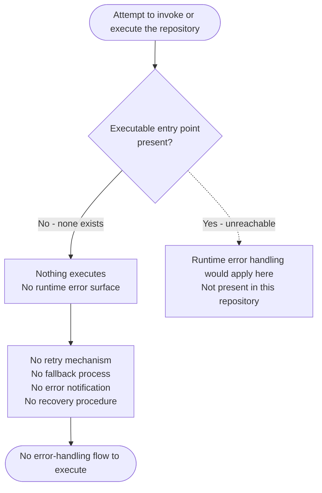

*Figure 4.3.2 — Error-handling flow (absence). With no executable entry point, no runtime error surface exists, and no retry, fallback, notification, or recovery path is defined. The dotted branch is unreachable because no entry point is present.*

## 4.4 References

The following repository artifacts and Technical Specification sections were examined as evidence for Section 4. Every claim and diagram above is grounded in these sources.

**Repository artifacts examined**

- `hello` — The sole tracked file (4 bytes, content `hii`); established the absence of any executable code, entry point, interface, or workflow logic, and served as the only concrete node in Figures 4.1.1 and 4.1.2.
- `./` (repository root working tree) — Contained only the `.git` directory and the `hello` file; established the absence of application source, dependency/build manifests, configuration, CI/CD, tests, and documentation, confirming that no process, integration, or state-management flow could be derived.
- Git version-control history (single commit `97e6b3a`, "Create hello", across all branches: `main`, `QA-20-july-branch`, `QA-02-july-branch`, `QA-09-Feb-branch`) — Established the single-commit provenance and branch structure that are the only observable "process" and "state," used in Figures 4.1.1, 4.1.2, and 4.3.1.

**Cross-referenced Technical Specification sections**

- §1.2 System Overview — Corroborated that the repository does not contain an implemented system, with no capabilities, components, or runtime.
- §1.3 Scope (§1.3.1 In-Scope, §1.3.2 Out-of-Scope) — Corroborated that the in-scope surface is only the `hello` file plus Git version control, and that APIs, UIs/CLIs, data storage, external integrations, and CI/CD are out of scope because none exist; source for the "no user touchpoints / no entry point" and "system boundary = working tree" statements.
- §2.1 Feature Catalog — Corroborated that zero features are catalogued, supporting the conclusion that no per-feature process flow can be produced.
- §2.2 Functional Requirements — Corroborated that no functional requirements, business rules, data validation, security requirements, or compliance requirements exist; primary source for §4.2.2 Validation Rules.
- §2.3 Feature Relationships — Corroborated the empty dependency map and the absence of integration points; source of the established precedent for depicting only version-control artifacts in Mermaid diagrams.
- §2.4 Implementation Considerations — Corroborated that no technical constraints, performance requirements, scalability considerations, or security implications are declared; source for the "no timing/SLA" and "no transaction/data tier" statements.

**Web sources**

- None. No external sources were required or consulted; all findings derive from direct repository inspection.

# 5. System Architecture

## 5.1 High-Level Architecture

Section 5 documents the system architecture of the repository under specification. Consistent with the evidence-based approach applied throughout this document, only architecture that is directly substantiated by repository artifacts is documented; no architectural style, component, interface, data flow, technical decision, or cross-cutting mechanism is invented.

A direct investigation of the repository (Git `origin` `existing-projects-qa-test`, checked out on branch `QA-20-july-branch`) establishes that it is a **near-empty scaffold**. The entire version-controlled surface consists of a single 4-byte placeholder file, `hello` (content `hii`), introduced by one commit ("Create hello", `97e6b3a`). There is no application source code, no runnable entry point, no interface, no service or data tier, and no configuration. Consequently, **there is no implemented system architecture to describe** — no architectural style, no components, no data flows, and no integrations. This finding is corroborated by §1.1 Executive Summary, §1.2 System Overview, §1.3 Scope, §2.1 Feature Catalog, §2.4 Implementation Considerations, §3.4 Third-Party Services, §3.5 Databases & Storage, §3.6 Development & Deployment, and §4.1 System Workflows.

To honor the required structure of this section while remaining strictly evidence-based, each sub-section below reproduces the requested architectural dimensions and maps them to the observed repository state. Every Mermaid diagram depicts only artifacts that actually exist — the repository's version-control provenance and system boundary — and never a fabricated runtime architecture.

### 5.1.1 System Overview

The repository declares no architectural style and no rationale for one. There is no monolithic, layered, microservice, event-driven, serverless, or client-server structure, because no executable code, runtime, or framework is present to embody any such style (see §1.2.2 High-Level Description and §3.1 Programming Languages). The sole tracked artifact, `hello`, is inert text carrying no logic, so it neither implements nor implies an architectural pattern.

- **Overall architecture style and rationale:** None. No language, framework, or runtime is declared anywhere in the repository, so no architecture style has been selected or can be inferred.
- **Key architectural principles and patterns:** None observable. There is no layering, separation of concerns, dependency inversion, or design pattern; the working tree contains a single inert file and no code in which principles could be expressed.
- **System boundaries and major interfaces:** The system boundary is effectively the single `hello` file within the Git working tree (see §1.3.1 In-Scope). The repository exposes no user interface, API, command-line entry point, or network listener, and therefore has no major interfaces.

| Architectural Dimension | Observed Evidence |
|---|---|
| Architecture style | None declared; no code or runtime to embody a style |
| Architectural principles / patterns | None observable; sole artifact is inert text |
| System boundary | The single `hello` file in the Git working tree (§1.3.1) |
| Major interfaces (UI / API / CLI / network) | None present |

The diagram below depicts the only architecture surface that can be substantiated from evidence: a system boundary enclosing the single inert artifact, with every conventional architectural tier shown as explicitly absent. It is a factual representation of the repository's structural state, not a model of any runtime architecture.

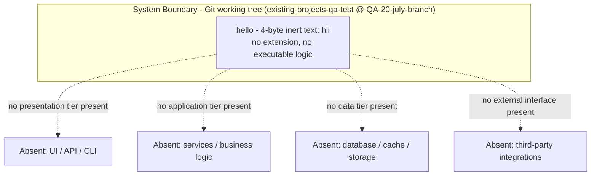

*Figure 5.1.1 — System boundary and architecture surface. The boundary encloses the repository's only tracked artifact; every conventional tier and interface is shown as absent because none exists in the source.*

### 5.1.2 Core Components

No runtime or software components exist. The repository contains no modules, services, layers, or executable units — only the single version-controlled artifact `hello`, which is inert text and performs no responsibility. Because there are zero components, the requested component-catalog attributes (Component Name, Primary Responsibility, Key Dependencies, Integration Points, Critical Considerations) cannot be populated. The schema is reproduced below to define the intended structure and to make the absence explicit, following the convention established in §2.1 Feature Catalog.

| Requested Core-Component Attribute | Status in Repository |
|---|---|
| Component Name | No component exists to name |
| Primary Responsibility | None; no component performs any responsibility |
| Key Dependencies | None; no dependency or build manifest is present (see §3.3) |
| Integration Points | None; no component exposes or consumes an interface |
| Critical Considerations | Not applicable; there is no component to consider |

The only version-controlled artifact is catalogued below for completeness. It is an inert repository artifact, not a software component.

| Artifact | Type | Responsibility | Observed State |
|---|---|---|---|
| `hello` | 4-byte plain-text file (`hii`) | None (placeholder) | Tracked in Git; no behavior, dependency, or interface |

### 5.1.3 Data Flow Description

No data flows exist between components, because there are no components and no data tier. The repository defines no request/response paths, no message passing, no event streams, and no batch pipelines. There are no integration protocols, no data-transformation points, and no data stores or caches (see §3.5 Databases & Storage and §4.1.2 Integration Workflows).

- **Primary data flows between components:** None; there is no second component and no runtime in which data could move.
- **Integration patterns and protocols:** None; no HTTP, gRPC, messaging, or file-based protocol is configured.
- **Data transformation points:** None; no code exists to read, transform, or write data.
- **Key data stores and caches:** None; the only persisted artifact is the 4-byte `hello` file stored as a Git blob under version control (see §3.5).

| Requested Data-Flow Dimension | Status in Repository |
|---|---|
| Inter-component data flows | None; no components exist |
| Integration patterns / protocols | None; no protocol configured |
| Data transformation points | None; no code to transform data |
| Data stores / caches | None; only the `hello` Git blob persists |

The single flow observable anywhere in the repository is its version-control provenance — the commit that created the `hello` placeholder — which is depicted from an interaction perspective in §4.1.2 and from a component-provisioning perspective in §5.2. That provenance is a source-control activity, not an application-level data flow.

### 5.1.4 External Integration Points

No application-level external integrations exist. The repository references no external systems, declares no APIs or SDKs, and contains no credentials or service configuration (see §3.4 Third-Party Services). The only external reference of any kind is the Git `origin` remote used to host the source on GitHub, which is version-control hosting rather than an application integration; no service-level agreement (SLA) is defined anywhere in the repository.

| System | Integration Type | Protocol / Format | Observed State (incl. SLA) |
|---|---|---|---|
| GitHub `origin` remote (`Sandeep01Kumar/existing-projects-qa-test`) | Source-code hosting via version control — not an application integration | Git over HTTPS | Repository push/fetch only; no application data exchange; no SLA defined in the repository |
| Application external integrations | None present | Not applicable | No external system is referenced, called, or configured (§3.4) |

## 5.2 Component Details

This sub-section documents each major component in detail. Because the repository contains no application source code, **there are no major components to detail** — no services, modules, layers, or executable units. The only version-controlled artifact is the inert `hello` file. The requested per-component dimensions and the required diagrams are reproduced below and mapped strictly to the observed repository state; each diagram depicts only the repository's real version-control artifacts and is explicitly not a model of application behavior.

### 5.2.1 Component Inventory, Responsibilities, and Technologies

The repository defines zero components. Consequently, the per-component detail dimensions required by this section (purpose and responsibilities, technologies and frameworks, key interfaces and APIs, data persistence requirements, and scaling considerations) cannot be populated from any component. They are recorded against the observed repository state below.

| Requested Per-Component Detail | Status in Repository |
|---|---|
| Purpose and responsibilities | None; no component exists (the sole artifact `hello` is inert text) |
| Technologies and frameworks used | None declared; no language, framework, or runtime is present (see §3.1, §3.2) |
| Key interfaces and APIs | None; no interface, endpoint, or API is defined (see §1.3.2) |
| Data persistence requirements | None; no database, cache, or data file exists beyond the `hello` Git blob (see §3.5) |
| Scaling considerations | None; no runtime, service, or data tier exists to scale (see §2.4) |

The diagram below presents the only component-interaction view that can be substantiated: the repository's version-controlled structure (branch and blob) with an explicit statement that no runtime component exists to interact. It is an artifact-relationship view, not an application component diagram.

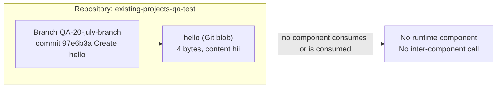

*Figure 5.2.1 — Component-interaction view (version-control artifacts). The branch references the single `hello` blob; no runtime component exists, so no inter-component interaction is possible.*

### 5.2.2 Component State Model

No application component state exists, because no component and no runtime are present. The only observable lifecycle is the version-control state of the sole artifact: it does not exist prior to the commit, is created by the single commit "Create hello", and thereafter matches a clean working tree. This mirrors the version-control lifecycle documented in §4.3.1 State Management and is reproduced here from a component-artifact perspective to satisfy the state-transition requirement of this section.

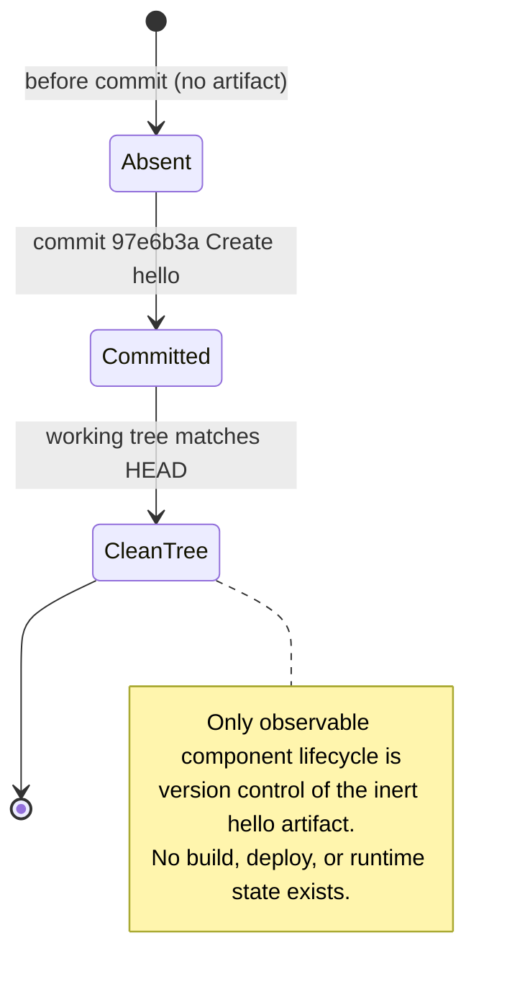

*Figure 5.2.2 — Artifact lifecycle (the only observable component state). This depicts the Git lifecycle of the `hello` artifact across a single commit, not an application state machine; no build, deployment, or runtime state exists.*

### 5.2.3 Key Interaction Sequence

The repository exposes no application request/response flow, message exchange, or integration sequence. The single "key flow" that can be substantiated is the provisioning of the sole artifact through version control — the author adding `hello`, committing it, and pushing the branch to the GitHub origin. This is the same provenance interaction described in §4.1.2 Integration Workflows, presented here from an architecture-provisioning perspective to satisfy the sequence-diagram requirement of this section.

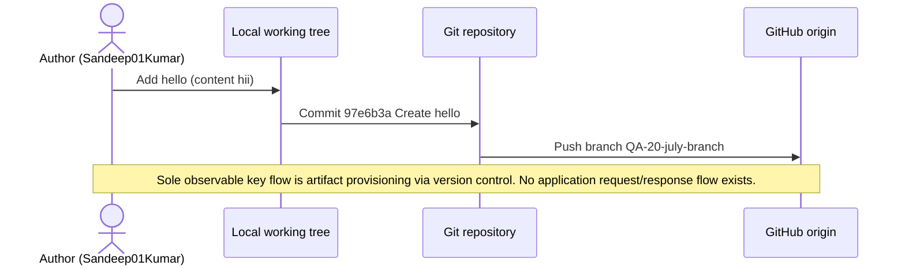

*Figure 5.2.3 — Key interaction sequence (artifact provisioning). The only observable sequence is version-control provenance; no application-level request, response, event, or batch sequence exists.*

## 5.3 Technical Decisions

This sub-section documents and justifies the system's key technical decisions. A direct investigation establishes that the repository records **no technical or architectural decisions**: there are no architecture decision records, design documents, configuration files, or dependency manifests in which a decision could be expressed (see §3.2 Frameworks & Libraries, §3.3 Open Source Dependencies, and §3.6 Development & Deployment). The only action evidenced in the repository is the creation of the inert `hello` placeholder. Each decision area required by this section is therefore mapped to its observed state below, with no rationale fabricated where none exists.

### 5.3.1 Architecture Decision Summary

Because no code, runtime, datastore, or dependency is present, no decision has been made about architecture style, inter-component communication, data storage, caching, or security. The table records each required decision area against the observed repository state and the corroborating evidence.

| Decision Area | Status in Repository | Evidence / Reference |
|---|---|---|
| Architecture style and tradeoffs | No style selected; no code or runtime to embody one | §1.2.2, §5.1.1 |
| Communication pattern choices | None; no components or interfaces exist to communicate | §5.1.3, §4.1.2 |
| Data storage solution rationale | None; no database or storage configured | §3.5 |
| Caching strategy justification | None; no cache or in-memory store present | §3.5 |
| Security mechanism selection | None; no authentication, authorization, secrets, or data handling present | §2.4, §3.4 |

The decision tree below models the evidence-based reasoning: with no implemented source code and no dependency, runtime, or datastore, every architectural decision point resolves to "no decision to record". The dotted branch is unreachable because the prerequisite (implemented code) is not present.

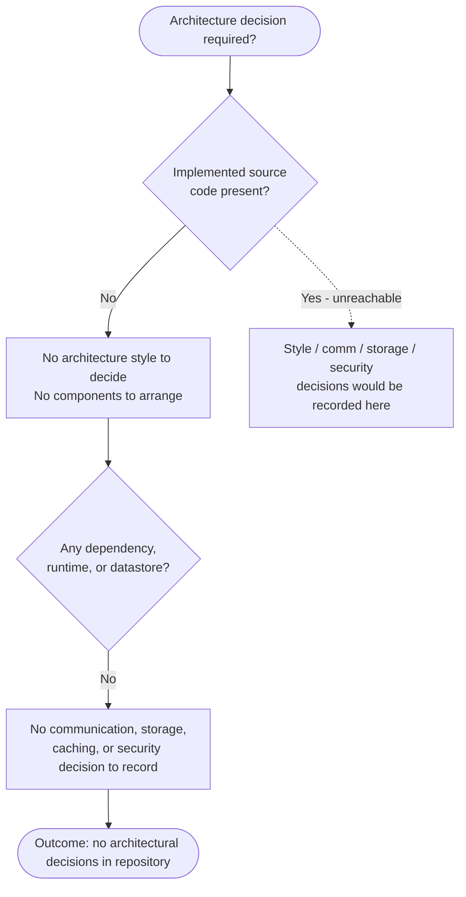

*Figure 5.3.1 — Technical-decision tree. Every decision point resolves to "no decision to record" because no implemented code, dependency, runtime, or datastore exists. The dotted branch is unreachable in the current repository.*

### 5.3.2 Architecture Decision Records (ADRs)

The repository contains no ADRs, no `docs/adr/` directory, and no design documentation. The ADR schema below defines the intended structure; because no architectural decision has been made, the schema is unpopulated, following the convention used for the unpopulated feature schema in §2.1 Feature Catalog.

| ADR Field | Prescribed Content | Populated? |
|---|---|---|
| Title / ID | `ADR-NNN` and a short decision title | No architectural decision to title |
| Status | Proposed / Accepted / Superseded | Not applicable |
| Context | Forces and constraints motivating the decision | No implemented system to constrain |
| Decision | The choice made and its rationale | No choice made or recorded |
| Consequences | Resulting tradeoffs | None; nothing is decided |

For completeness, the single evidence-based record that can be stated is the factual absence of architecture, captured below. It documents the observed state rather than asserting any design intent.

| ADR-000 Field | Value (evidence-based) |
|---|---|
| Title / ID | ADR-000 — No architecture defined (near-empty scaffold) |
| Status | Accepted (records the current factual state) |
| Context | The repository tracks only the inert 4-byte `hello` file; no code, dependency, runtime, or datastore exists (see §1.1, §1.3) |
| Decision | No architectural style, communication pattern, storage solution, caching strategy, or security mechanism has been selected |
| Consequences | No components, interfaces, or data flows exist; any future architecture must be recorded in new ADRs once source code is introduced |

## 5.4 Cross-Cutting Concerns

This sub-section addresses the system's cross-cutting concerns. Because the repository contains no executable code, no runtime, and no configuration, **none of these concerns is implemented or configured**. There is no monitoring, logging, tracing, error handling, authentication, authorization, performance target, or disaster-recovery procedure present in the source. Each concern is mapped to its observed state below, and the required error-handling flow is depicted as the evidence-based reality of absence.

### 5.4.1 Monitoring, Observability, Logging, and Tracing

No monitoring, observability, logging, or tracing capability exists. There is no logging framework, metrics endpoint, tracing instrumentation, dashboard, or alerting configuration, and no third-party observability tool is integrated (see §3.4 Third-Party Services and §3.6 Development & Deployment).

| Cross-Cutting Concern | Status in Repository |
|---|---|
| Monitoring / metrics | None; no metrics, health endpoint, or dashboard exists |
| Observability tooling | None; no APM, tracing, or error-reporting integration (§3.4) |
| Logging | None; no logging framework or log configuration is present |
| Distributed tracing | None; no trace context, span, or exporter is defined |

### 5.4.2 Authentication and Authorization

No authentication or authorization framework exists. There is no identity provider, OAuth/OIDC configuration, token or session handling, role/permission model, or secrets management, because there is no code, interface, or protected resource (see §2.4 Implementation Considerations and §3.4 Third-Party Services).

| Security Concern | Status in Repository |
|---|---|
| Authentication mechanism | None; no identity provider, credential, or token flow is configured |
| Authorization model | None; no roles, permissions, or access-control checks exist |
| Secrets / credential management | None; no secrets, keys, or `.env` files are tracked |
| Protected resources | None; no interface or data resource exists to protect |

### 5.4.3 Error Handling

No error-handling logic exists, because no executable code is present in which errors could arise or be handled. There are no retry mechanisms, fallback processes, error-notification flows, or recovery procedures. This mirrors the finding in §4.3.2 Error Handling and is presented here from a cross-cutting perspective: any attempt to invoke the repository encounters no executable entry point, so no cross-cutting layer (authentication, logging, error handling, or recovery) is ever engaged.

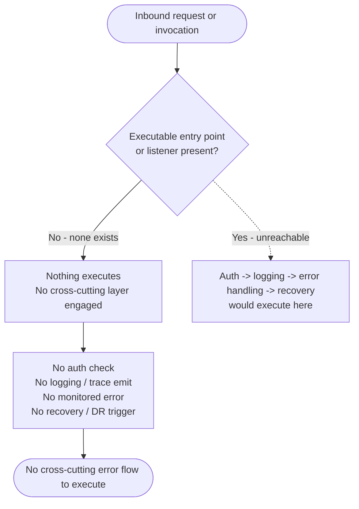

*Figure 5.4.3 — Cross-cutting error-handling flow (absence). With no executable entry point, no cross-cutting layer engages and no retry, fallback, notification, or recovery path exists. The dotted branch is unreachable because no entry point is present.*

### 5.4.4 Performance, SLAs, and Disaster Recovery

No performance requirements, service-level agreements, or disaster-recovery procedures are defined. There is no runtime whose performance could be measured, no availability or latency target documented, and no backup, replication, or recovery plan beyond the inherent version-control redundancy of the Git repository itself (see §2.4 Implementation Considerations and §3.6 Development & Deployment).

| Concern | Status in Repository |
|---|---|
| Performance requirements | None; no executable code or performance target exists (§2.4) |
| SLAs (availability / latency) | None defined anywhere in the repository |
| Backup / redundancy | None at the application level; only Git version-control history provides artifact redundancy |
| Disaster-recovery procedures | None; no failure mode, runbook, or recovery plan is documented |

## 5.5 References

The following repository artifacts and Technical Specification sections were examined as evidence for Section 5. No web sources were consulted; every statement in this section is grounded in the repository's observed contents.

**Repository files and folders examined**

- `hello` — the sole tracked file (4 bytes, content `hii`); established the absence of any component, interface, data, dependency, or executable logic, and served as the single artifact in all diagrams.
- Repository root / Git working tree (`existing-projects-qa-test`, branch `QA-20-july-branch`) — contained only `hello` and the `.git` directory; established the system boundary and the near-empty-scaffold state used throughout Section 5.
- Git version-control history (single commit `97e6b3a`, "Create hello", author Sandeep01Kumar) — verified across branches `main`, `QA-20-july-branch`, `QA-02-july-branch`, and `QA-09-Feb-branch`; established the provenance depicted in Figures 5.2.2 and 5.2.3.

**Cross-referenced Technical Specification sections**

- §1.1 Executive Summary — corroborated the near-empty scaffold and single-commit history.
- §1.2 System Overview — confirmed no implemented system, language, framework, runtime, or architecture.
- §1.3 Scope — defined the system boundary (the `hello` file) and the out-of-scope surface.
- §2.1 Feature Catalog — confirmed zero components/features; source of the unpopulated-schema convention.
- §2.4 Implementation Considerations — confirmed no performance, scalability, or security implications.
- §3.1 Programming Languages — confirmed no language is declared.
- §3.2 Frameworks & Libraries — confirmed no framework or library is used.
- §3.3 Open Source Dependencies — confirmed no dependencies or manifests exist.
- §3.4 Third-Party Services — confirmed no external services, auth, or observability integrations.
- §3.5 Databases & Storage — confirmed no database, cache, or storage; only the `hello` Git blob persists.
- §3.6 Development & Deployment — confirmed no build, containerization, CI/CD, or IaC.
- §4.1 System Workflows — confirmed no business or integration workflows; source of the provenance-interaction basis.
- §4.3 Technical Implementation Flows — confirmed no application state or error handling; basis for Figures 5.2.2 and 5.4.3.

# 6. SYSTEM COMPONENTS DESIGN

## 6.1 Core Services Architecture

### 6.1.1 Architecture Applicability Determination

**Core Services Architecture is not applicable for this system.**

The repository under specification is a near-empty scaffold that contains no microservices, no distributed architecture, and no distinct service components. Direct inspection of the version-controlled surface confirms a single tracked artifact — a 4-byte text file named `hello` whose entire content is the string `hii` — introduced by one commit (`97e6b3a`, "Create hello") that is identical across every branch (`main`, `QA-20-july-branch`, `QA-02-july-branch`, `QA-09-Feb-branch`). There is no application source code, no runnable entry point, no dependency or build manifest, no container or infrastructure-as-code definition, and no configuration of any kind. Because no service, process, or runtime exists, none of the constructs that a Core Services Architecture describes — service boundaries, inter-service communication, discovery, load balancing, circuit breakers, scaling, or failover — can be present.

This determination is corroborated by the previously documented architecture sections: §5.1 High-Level Architecture characterizes the repository as a "near-empty scaffold" with no architectural style and no components; §5.2 Component Details records that there are no major components to detail — no services, modules, layers, or executable units; §5.3 Technical Decisions records no architecture, communication, storage, or caching decisions; §5.4 Cross-Cutting Concerns records no monitoring, error handling, performance targets, SLAs, or disaster-recovery procedures; and §1.2 System Overview states that the repository does not contain an implemented system.

The remaining sub-sections (§6.1.2–§6.1.4) address each required Core Services Architecture area for completeness and document, with evidence, the observed absence of the corresponding capability. Each includes the diagram required by this section, drawn to depict the actual repository state rather than any hypothetical runtime.

**Table 6.1.1-1 — Core-Services Preconditions vs. Observed Repository State**

| Precondition for a Core Services Architecture | Observed State in Repository |
|---|---|
| One or more independently deployable services | None; the only tracked artifact is the 4-byte `hello` text file |
| An executable runtime or process | None; `hello` is inert text with no shebang, entry point, or logic |
| Service, container, or orchestration manifests | None; no package, `Dockerfile`, or IaC (`*.tf`) manifests exist |
| Inter-service interfaces or network protocols | None; no APIs, listeners, or messaging are defined |
| An evolving multi-component codebase | Single commit `97e6b3a` "Create hello", identical on all branches |

**Table 6.1.1-2 — Applicability of Each Required Domain**

| Required Domain | Applicability | Documented In |
|---|---|---|
| Service Components | Not applicable — no services exist | §6.1.2 |
| Scalability Design | Not applicable — no runtime to scale | §6.1.3 |
| Resilience Patterns | Not applicable — no runtime to protect | §6.1.4 |

### 6.1.2 Service Components

No service components exist in the repository, so there are no service boundaries, communication patterns, discovery mechanisms, load-balancing strategies, circuit breakers, or retry/fallback mechanisms to document. As established in §5.2 Component Details, the component inventory is empty; the `hello` file is a passive text blob with no callable interface, network endpoint, or dependency. The table below maps each required Service Components topic to its observed state.

**Table 6.1.2-1 — Service Components Topics vs. Observed State**

| Required Topic | Observed State in Repository | Reference |
|---|---|---|
| Service boundaries & responsibilities | None; zero services, modules, or executable units | §5.2 |
| Inter-service communication patterns | None; no APIs, network protocols, or message formats defined | §5.1 |
| Service discovery mechanisms | None; no services, registry, DNS, or configuration store | Direct inspection |
| Load balancing strategy | None; no runtime, endpoints, or traffic to balance | §5.2 |
| Circuit breaker patterns | None; no code or dependency implements them | §5.4 |
| Retry & fallback mechanisms | None; no error-handling, retry, or fallback logic | §5.4, §4.3 |

Figure 6.1.2-1 depicts the (absent) service-interaction topology: an inbound caller cannot reach any service because no endpoint or listener exists; the only artifact within the system boundary is the inert `hello` blob; and the service constructs that a Core Services Architecture would require are all absent. The dotted branch marks where service-to-service interactions would appear only if application code were introduced.

**Figure 6.1.2-1 — Service Interaction Diagram (Observed Absence of Services)**

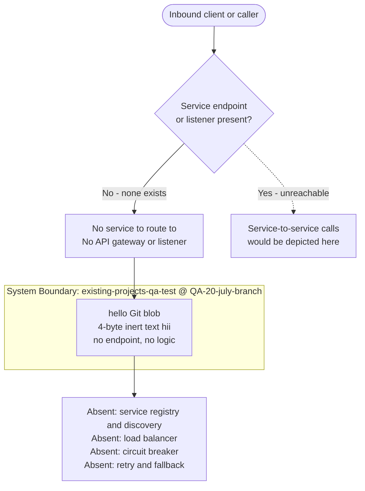

### 6.1.3 Scalability Design

No deployable runtime or service instance exists, so the repository defines no scaling approach, auto-scaling rules, resource-allocation strategy, performance-optimization techniques, or capacity-planning guidelines. §2.4 Implementation Considerations records that scalability considerations are none because no runtime, service, or data tier exists, and §3.6 Development & Deployment records no build system, containerization, CI/CD, or infrastructure-as-code through which scaling could be configured. The table below maps each required Scalability Design topic to its observed state.

**Table 6.1.3-1 — Scalability Design Topics vs. Observed State**

| Required Topic | Observed State in Repository | Reference |
|---|---|---|
| Horizontal / vertical scaling approach | None; no deployable process or instance to scale | §2.4, §5.2 |
| Auto-scaling triggers & rules | None; no runtime, metrics, or orchestrator | §5.4 |
| Resource allocation strategy | None; no deployment or orchestration configuration | §3.6 |
| Performance optimization techniques | None; no executable code to optimize | §2.4 |
| Capacity planning guidelines | None; no workload, SLA, or traffic projection | §5.4 |

Figure 6.1.3-1 depicts the (absent) scalability architecture as a decision flow: an increase in load has no process to act upon, no orchestrator or autoscaler is configured, and consequently neither horizontal nor vertical scaling is possible. The dotted branch marks where a load balancer, replica set, and autoscaler would appear only if a deployable runtime existed.

**Figure 6.1.3-1 — Scalability Architecture (Observed Absence of a Scalable Runtime)**

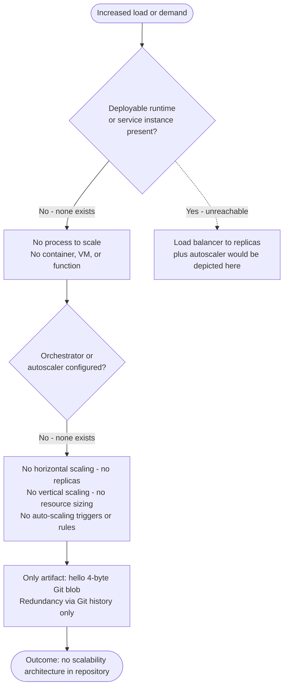

### 6.1.4 Resilience Patterns

No executable service or runtime exists, so the repository implements no fault-tolerance, disaster-recovery, failover, or service-degradation mechanisms. As recorded in §5.4 Cross-Cutting Concerns, there are no performance requirements, no SLAs, and no disaster-recovery procedures. The only form of redundancy observable anywhere in the repository is the inherent version-control history maintained by Git — an artifact-level protection for the `hello` file, not an application-data or runtime resilience mechanism. The table below maps each required Resilience Patterns topic to its observed state.

**Table 6.1.4-1 — Resilience Pattern Topics vs. Observed State**

| Required Topic | Observed State in Repository | Reference |
|---|---|---|
| Fault tolerance mechanisms | None; no runtime in which a fault could occur | §5.4 |
| Disaster recovery procedures | None; no DR plan, runbook, or backup process | §5.4 |
| Data redundancy approach | Git version-control history only (artifact-level, not application data) | §5.4 |
| Failover configurations | None; no replicas, standby, or clustering | Direct inspection |
| Service degradation policies | None; no service exists to degrade | Direct inspection |

Figure 6.1.4-1 depicts the (absent) resilience posture: because nothing runs, no runtime fault can occur, and no fault-tolerance, failover, disaster-recovery, or degradation pattern is present; the sole redundancy is Git history. The dotted branch marks where retry, circuit-breaker, replica failover, and DR failback patterns would appear only if application code were introduced.

**Figure 6.1.4-1 — Resilience Pattern Implementation (Observed Absence of Runtime Resilience)**

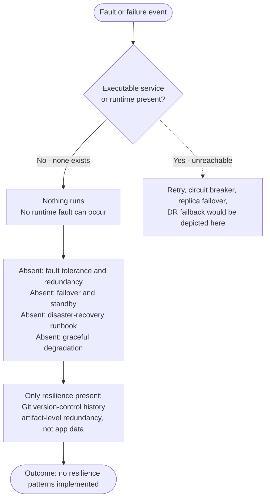

### 6.1.5 References

The following repository artifacts and previously written specification sections were examined as evidence for this section.

**Repository files and folders**

- `hello` - the single 4-byte tracked artifact (content `hii`); established that no service, runtime, or executable component exists.
- `.git/` - version-control metadata; established the single-commit history (`97e6b3a`, "Create hello") identical across all branches (`main`, `QA-20-july-branch`, `QA-02-july-branch`, `QA-09-Feb-branch`) and the only observable form of redundancy.
- Repository root (path `""`) - inspection returned an empty child set, confirming no source directories, manifests, containers, or infrastructure-as-code definitions.

**Cross-referenced specification sections**

- §1.2 System Overview - confirmed the repository does not contain an implemented system.
- §2.4 Implementation Considerations - confirmed no scalability, performance, or security considerations exist.
- §3.6 Development & Deployment - confirmed no build system, containerization, CI/CD, or infrastructure-as-code.
- §4.3 Technical Implementation Flows - confirmed no error handling, retry, or fallback logic.
- §5.1 High-Level Architecture - confirmed the near-empty scaffold with no architectural style or components.
- §5.2 Component Details - confirmed zero services, modules, layers, or executable units.
- §5.3 Technical Decisions - confirmed no architecture, communication, storage, or caching decisions.
- §5.4 Cross-Cutting Concerns - confirmed no monitoring, SLAs, or disaster-recovery procedures.

## 6.2 Database Design

### 6.2.1 Database Applicability Determination

**Database Design is not applicable to this system.**

The repository under specification is a near-empty scaffold that persists no application data and integrates no database or storage technology. Direct inspection of the version-controlled surface confirms a single tracked artifact — a 4-byte text file named `hello` whose entire content is the string `hii` — introduced by one commit (`97e6b3a`, "Create hello") that is byte-for-byte identical across every branch (`main`, `QA-20-july-branch`, `QA-02-july-branch`, `QA-09-Feb-branch`) and the `origin` remote. A case-insensitive search of all tracked content for database, ORM, schema, migration, replication, and cache keywords returned zero matches, and the working tree contains no directories other than `.git`. There is no database engine, no database driver or ORM, no connection string or datasource configuration, no schema or Data Definition Language (DDL), no migration or seed artifacts, and no caching or object-storage integration. Because no data is defined, collected, stored, retrieved, or processed anywhere in the source, none of the constructs that a Database Design describes — entities, relationships, indexes, constraints, partitions, replicas, backups, migrations, retention rules, or query paths — can be present.

This determination is corroborated by the previously written specification sections: §3.5 Databases & Storage states that "no database or storage technology is used by the repository" and that the only persisted artifact is the 4-byte `hello` file stored as a Git blob; §1.2 System Overview states that the repository does not contain an implemented system; §1.3 Scope places "Data storage & data domains" out of scope because "no schema, database, or data files exist"; §2.4 Implementation Considerations records no data tier and no data-handling logic; §5.3 Technical Decisions records no data-storage or caching decision; and §5.4 Cross-Cutting Concerns records that the only redundancy present anywhere is Git version-control history.

The remaining sub-sections (§6.2.2–§6.2.5) address each required Database Design area for completeness and document, with evidence, the observed absence of the corresponding capability. Each embeds the diagram required by this section — an entity-relationship (ERD) / schema diagram, a replication-architecture diagram, and a data-flow diagram — drawn to depict the actual repository state rather than any hypothetical datastore.

**Table 6.2.1-1 — Preconditions for a Database Design vs. Observed Repository State**

| Precondition for a Database Design | Observed State in Repository |
|---|---|
| A configured database engine (relational, document, key-value, etc.) | None; no engine, driver, ORM, or connection string exists |
| A schema, data model, or entity definitions | None; no DDL, ORM model, or `.sql`/schema file exists |
| Persistence or data-access code | None; `hello` is inert text with no read/write logic |
| Migration, seed, or versioning artifacts | None; no migration tooling or migration files exist |
| A caching layer or object storage | None; no Redis/Memcached or object-store integration exists |
| Any stored or processed application data | None; only the 4-byte `hello` Git blob is persisted (via version control) |

**Table 6.2.1-2 — Applicability of Each Required Database Design Area**

| Required Area | Applicability | Documented In |
|---|---|---|
| Schema Design | Not applicable — no schema, entities, indexes, or constraints exist | §6.2.2 |
| Data Management | Not applicable — no migrations, storage/retrieval, or caching exist | §6.2.3 |
| Compliance Considerations | Not applicable — no stored data to retain, protect, or audit | §6.2.4 |
| Performance Optimization | Not applicable — no queries, connections, or datastore to optimize | §6.2.5 |

### 6.2.2 Schema Design

No database schema exists in the repository, so there are no entities, relationships, data models, indexes, partitions, replica topologies, or application-level backups to document. As established in §3.5 Databases & Storage, no database or storage technology is configured; the only persisted artifact is the 4-byte `hello` Git blob, which is a version-controlled text file rather than a database record. The table below maps each required Schema Design topic to its observed state.

**Table 6.2.2-1 — Schema Design Topics vs. Observed State**

| Required Topic | Observed State in Repository | Reference |
|---|---|---|
| Entity relationships | None; zero entities exist, so no 1:1, 1:N, or M:N relationships are defined | §3.5 |
| Data models & structures | None; no relational tables, documents, collections, or typed records | §1.2, §3.5 |
| Indexing strategy | None; no table or collection exists to index | §3.5 |
| Partitioning approach | None; no data volume, so no range/hash/list partitioning or sharding | §3.5 |
| Replication configuration | None; no primary/replica topology; only Git history provides redundancy | §5.4 |
| Backup architecture | None at the application level; Git version-control history is the only artifact backup | §5.4 |

**Indexes and constraints.** The output-format requirement to document all indexes and constraints is satisfied by recording their complete absence: because no table, collection, or entity is defined, there are no keys, indexes, or integrity constraints of any kind. The table below enumerates each conventional index/constraint category against the observed state.

**Table 6.2.2-2 — Indexes and Constraints Inventory (Observed Absence)**

| Constraint / Index Category | Observed State in Repository |
|---|---|
| Primary keys | None defined; no table or entity exists |
| Foreign keys | None defined; no inter-entity references exist |
| Unique / check / not-null constraints | None defined; no schema or DDL exists |
| Secondary / composite / full-text indexes | None defined; no query workload or table to index |

**Entity-relationship (schema) diagram.** A conventional entity-relationship model cannot be populated because the repository defines zero database entities. Figure 6.2.2-1 depicts the only persisted artifact — the version-controlled `hello` Git blob — for completeness. This node is **not** a database table or entity: it has no primary key, no foreign key, no attributes participating in any relationship, and no second entity to relate to.

**Figure 6.2.2-1 — Entity-Relationship / Schema Diagram (Observed Absence of a Database Schema)**

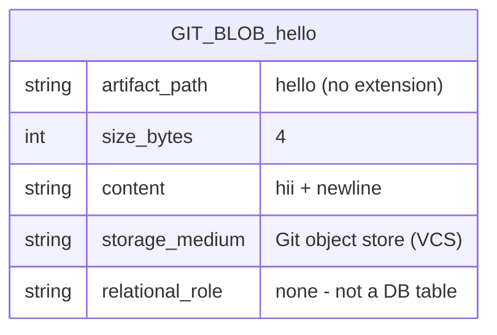

**Replication configuration.** No database exists, so there is no primary instance, no read replica, no hot standby, and no streaming, logical, or multi-master replication. The only redundancy observable anywhere in the repository is Git version-control history, which mirrors the single commit identically across every branch and the `origin` remote (see §5.4 Cross-Cutting Concerns) — an artifact-level protection for the `hello` file, not a database-replication mechanism. Figure 6.2.2-2 depicts this observed state; the dotted branch marks where a primary-to-replica topology and automatic failover would appear only if a database were introduced.

**Figure 6.2.2-2 — Replication Architecture (Observed Absence of Database Replication)**

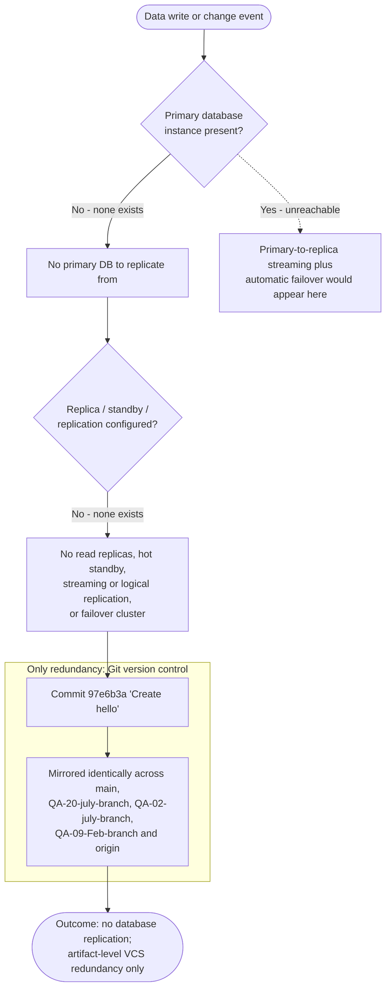

### 6.2.3 Data Management

No application data is managed by the repository, so there are no migration procedures, no schema/data versioning strategy, no archival policies, no storage or retrieval mechanisms, and no caching policies. As recorded in §3.5 Databases & Storage, there is no database driver, ORM, schema, migration file, or caching layer; the sole persisted artifact is the 4-byte `hello` file held as a Git blob. The only versioning present is the repository's own Git version control, which tracks the `hello` file rather than any application dataset. The table below maps each required Data Management topic to its observed state.

**Table 6.2.3-1 — Data Management Topics vs. Observed State**

| Required Topic | Observed State in Repository | Reference |
|---|---|---|
| Migration procedures | None; no migration tool/framework and no migration files exist | §3.5 |
| Versioning strategy | No data/schema versioning; only Git version control tracks the `hello` file | §5.4 |
| Archival policies | None; no data lifecycle, tiering, retention, or archival process | §3.5 |
| Data storage & retrieval mechanisms | None; no datastore, query interface, DAO, or API — only Git-blob storage of `hello` | §1.2, §3.5 |
| Caching policies | None; no in-memory or distributed cache (e.g., Redis/Memcached) is present | §3.5, §5.3 |

**Data storage and retrieval.** There is no application read/write path in the repository: no query language, data-access object, ORM, file I/O, or API endpoint exists through which data could be stored or retrieved. The only observable data movement is the version-control operation that persisted the `hello` blob into the Git object store during commit `97e6b3a`. Figure 6.2.3-1 depicts this observed state; the dotted branch marks where client-to-service-to-datastore read/write flows would appear only if application code and a datastore were introduced.

**Figure 6.2.3-1 — Data Flow Diagram (Observed Absence of Application Data Flow)**

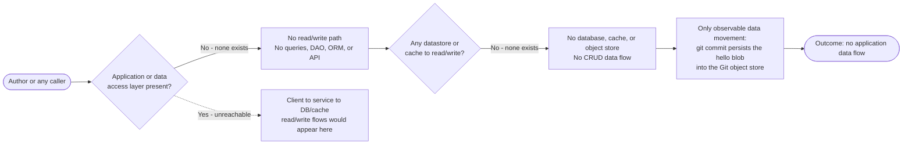

### 6.2.4 Compliance Considerations

No data-governance or compliance controls exist in the repository because there is no data to govern. As recorded in §3.5 Databases & Storage, "no data is collected, stored, or processed," so no data-at-rest, data-in-transit, or data-privacy considerations arise from the current source. §5.4 Cross-Cutting Concerns further confirms the absence of the mechanisms that compliance controls depend on: no monitoring, logging, or tracing (§5.4.1); no authentication mechanism, authorization model, secrets management, or protected resource (§5.4.2); and no disaster-recovery procedure, with the only redundancy being Git version-control history (§5.4.4). The table below maps each required Compliance topic to its observed state.

**Table 6.2.4-1 — Compliance Considerations vs. Observed State**

| Required Topic | Observed State in Repository | Reference |
|---|---|---|
| Data retention rules | None; no stored data and no retention, expiry, or purge policy | §3.5 |
| Backup & fault-tolerance policies | None at the application level; only Git version-control history provides artifact redundancy, and no disaster-recovery procedure is defined | §5.4 |
| Privacy controls | None; no personal or sensitive data is collected, stored, or processed, so no encryption, masking, or consent control applies | §3.5, §5.4 |
| Audit mechanisms | None; no application logging, monitoring, or audit trail — the only change history is Git commit metadata | §5.4 |
| Access controls | None; no authentication, authorization, roles, permissions, or protected data resource exists | §5.4 |

The single change-tracking facility that can be observed anywhere in the repository is Git commit metadata (author, timestamp, and message for commit `97e6b3a`, "Create hello"). This is a version-control provenance record for the `hello` file, not a database audit log, access-control list, or retention mechanism, and it governs no application data.

### 6.2.5 Performance Optimization

No database performance-optimization techniques exist in the repository because there is no datastore, query workload, or runtime to optimize. §3.5 Databases & Storage records no database, connection configuration, or caching layer; §5.3 Technical Decisions records no caching-strategy decision; and both §2.4 Implementation Considerations and §5.4 Cross-Cutting Concerns record no performance requirements or service-level agreements, because no executable code is present. The table below maps each required Performance Optimization topic to its observed state.

**Table 6.2.5-1 — Performance Optimization Topics vs. Observed State**

| Required Topic | Observed State in Repository | Reference |
|---|---|---|
| Query optimization patterns | None; no queries, query planner, execution plans, or indexes (no datastore) | §3.5 |
| Caching strategy | None; no in-memory or distributed cache, and no caching decision recorded | §3.5, §5.3 |
| Connection pooling | None; no database connections to pool (no driver or datasource) | §3.5 |
| Read/write splitting | None; no primary/replica topology exists to route reads versus writes | §5.4 |
| Batch processing approach | None; no batch/ETL jobs, schedulers, or bulk data operations | §3.5 |

Because no data tier, connection, or query path exists, there is no measurable database performance dimension in the current source. Any query-tuning, caching, pooling, read/write-routing, or batch-processing strategy would be introduced only when a datastore and application code are added to the repository.

### 6.2.6 References

The following repository artifacts and previously written specification sections were examined as evidence for this section.

**Repository files and folders**

- `hello` — the single 4-byte tracked artifact (content `hii`); established that no database, schema, entity, data record, index, or constraint exists, and that the only persisted artifact is a version-controlled text file.
- `.git/` — version-control metadata; established the single-commit history (`97e6b3a`, "Create hello") identical across all branches (`main`, `QA-20-july-branch`, `QA-02-july-branch`, `QA-09-Feb-branch`) and the `origin` remote, which is the only observable form of redundancy/backup.
- Repository root (path `""`) — inspection returned an empty child set, confirming no schema, migration, connection-configuration, ORM, or datastore files exist anywhere in the working tree.

**Cross-referenced specification sections**

- §1.2 System Overview — confirmed the repository does not contain an implemented system.
- §1.3 Scope — confirmed "Data storage & data domains" is out of scope because no schema, database, or data files exist.
- §2.4 Implementation Considerations — confirmed no data tier, no performance requirements, and no data-handling logic.
- §3.5 Databases & Storage — confirmed no database or storage technology, no driver/ORM, no schema/migration, no connection configuration, and no caching or object-storage integration; the only persisted artifact is the `hello` Git blob, and no data is collected, stored, or processed.
- §5.3 Technical Decisions — confirmed no data-storage solution decision and no caching-strategy decision were recorded.
- §5.4 Cross-Cutting Concerns — confirmed no monitoring/logging/tracing (no audit trail), no authentication/authorization/secrets/protected resource (no access controls), backup/redundancy limited to Git history, and no disaster-recovery procedure.
- §6.1 Core Services Architecture — established the document's evidence-based "not applicable" precedent and corroborated the absence of any runtime, service, or data tier.

## 6.3 Integration Architecture

### 6.3.1 Integration Architecture Applicability Determination

**Integration Architecture is not applicable for this system.**

The repository under specification is a near-empty scaffold that integrates with no external systems or services, exposes no application programming interface, and processes no messages. Direct inspection of the version-controlled surface confirms a single tracked artifact — a 4-byte text file named `hello` whose entire content is the string `hii` — introduced by one commit (`97e6b3a`, "Create hello") that is identical across every branch (`main`, `QA-20-july-branch`, `QA-02-july-branch`, `QA-09-Feb-branch`) and the `origin` remote. A case-insensitive search of all tracked content for integration keywords (`api`, `http`, `rest`, `grpc`, `graphql`, `kafka`, `rabbit`, `queue`, `webhook`, `oauth`, `jwt`, `endpoint`, `gateway`) returned zero matches, and a file-type sweep for interface, client, and configuration artifacts (`*.json`, `*.yaml`, `*.yml`, `*.toml`, `*.xml`, `*.env*`, `Dockerfile*`, `*.proto`, `*.graphql`, and common source extensions) found none. Because no interface, client, message channel, or configuration exists, none of the constructs that an Integration Architecture describes — API protocols, authentication and authorization, rate limiting, versioning, message queues, event or stream processing, batch pipelines, API gateways, or external service contracts — can be present.

The only external reference of any kind observable anywhere in the repository is the Git `origin` remote used for source hosting on GitHub (repository `Sandeep01Kumar/existing-projects-qa-test`). As recorded in §3.4 Third-Party Services, this is version-control hosting rather than an application-level service integration; it moves the `hello` blob and commit metadata between the local repository and the hosting provider and carries no application API, message, or event traffic.

This determination is corroborated by the previously written specification sections: §1.2 System Overview states that the repository does not contain an implemented system and records "Enterprise / third-party integrations: None"; §1.3 Scope places "External / enterprise integrations" and "APIs, user interfaces, CLIs" out of scope because no integration code, configuration, or interface definitions exist, and states that "All integration points are uncovered, as none are defined"; §3.4 Third-Party Services confirms there are no external APIs, authentication providers, monitoring tools, or cloud services in use; §5.4 Cross-Cutting Concerns records no authentication mechanism, authorization model, monitoring, or error handling; and §6.1 Core Services Architecture confirms there are no services, no inter-service communication patterns, and no APIs, network protocols, or message formats.

The remaining sub-sections (§6.3.2–§6.3.4) address each required Integration Architecture area for completeness and document, with evidence, the observed absence of the corresponding capability. Each embeds the diagram required by this section — an API architecture diagram, a message flow diagram, and an integration flow diagram (with a sequence diagram for the only observable external interaction) — drawn to depict the actual repository state rather than any hypothetical integration.

**Table 6.3.1-1 — Preconditions for an Integration Architecture vs. Observed Repository State**

| Precondition for an Integration Architecture | Observed State in Repository |
|---|---|
| A network-exposed API or interface (REST, gRPC, GraphQL, etc.) | None; no listener, route, controller, or protocol binding exists |
| An outbound client, SDK, or connector to an external service | None; no HTTP client, SDK, or connector is present in tracked source |
| Messaging, event, stream, or batch infrastructure | None; no broker, queue, topic, stream, or scheduler exists |
| An API gateway, reverse proxy, or service-mesh configuration | None; no gateway, proxy, or mesh configuration file exists |
| An external service contract (OpenAPI, WSDL, `.proto`, schema) | None; no contract or interface-definition file exists |
| Credentials / configuration for any third-party integration | None; no secrets, keys, endpoint URLs, or `.env` files are tracked |

**Table 6.3.1-2 — Applicability of Each Required Integration Area**

| Required Area | Applicability | Documented In |
|---|---|---|
| API Design | Not applicable — no API, protocol, authentication, rate limiting, or versioning exists | §6.3.2 |
| Message Processing | Not applicable — no events, queues, streams, or batch jobs exist | §6.3.3 |
| External Systems | Not applicable — no third-party, legacy, gateway, or service-contract integration exists | §6.3.4 |

### 6.3.2 API Design

No application programming interface exists in the repository, so there are no protocol specifications, authentication methods, authorization framework, rate-limiting strategy, versioning approach, or documentation standards to describe. As established in §1.3 Scope, "APIs, user interfaces, CLIs" are out of scope because "no entry points or interface definitions exist," and §6.1 Core Services Architecture confirms that no APIs, network protocols, or message formats are defined. A keyword search of tracked content for `api`, `http`, `rest`, `grpc`, `graphql`, `endpoint`, `oauth`, and `jwt` returned no matches, and the sole tracked artifact — the 4-byte `hello` text file — carries no route, handler, listener, or protocol binding. The table below maps each required API Design topic to its observed state.

**Table 6.3.2-1 — API Design Topics vs. Observed State**

| Required Topic | Observed State in Repository | Reference |
|---|---|---|
| Protocol specifications | None; no HTTP/REST, gRPC, GraphQL, WebSocket, or other protocol binding, listener, or route is defined | §6.1 |
| Authentication methods | None; no identity provider, credential, token (JWT/OAuth/OIDC), API key, or session flow is configured | §5.4 |
| Authorization framework | None; no roles, scopes, permissions, or access-control checks exist | §5.4 |
| Rate limiting strategy | None; no throttle, quota, or rate-limiter middleware or configuration exists | Direct inspection |
| Versioning approach | None; no URI, header, or media-type version scheme exists (no API surface to version) | Direct inspection |
| Documentation standards | None; no OpenAPI/Swagger, API Blueprint, or endpoint reference is present | §3.4 |

**API endpoint specification.** The output-format requirement to document API specifications in tabular form is satisfied by recording the complete absence of any endpoint or operation: because no protocol listener, route, or handler is defined anywhere in the tracked source, the endpoint inventory is empty and no authentication, authorization, or version metadata attaches to any operation.

**Table 6.3.2-2 — API Endpoint / Operation Specification (Observed Absence)**

| Endpoint / Operation | Protocol & Method | Authentication / Authorization | Observed State |
|---|---|---|---|
| None defined | None | None | No route, handler, or operation exists in tracked source |

**API architecture.** Figure 6.3.2-1 depicts the (absent) API architecture: an external client cannot reach any API because no network-exposed endpoint or protocol binding exists; the only artifact within the system boundary is the inert `hello` blob; and the layers an API architecture would require — authentication, authorization, rate limiting, versioning, and documentation — are all absent. The dotted branch marks where an API gateway and versioned, authenticated endpoints would appear only if application code were introduced.

**Figure 6.3.2-1 — API Architecture Diagram (Observed Absence of an API)**

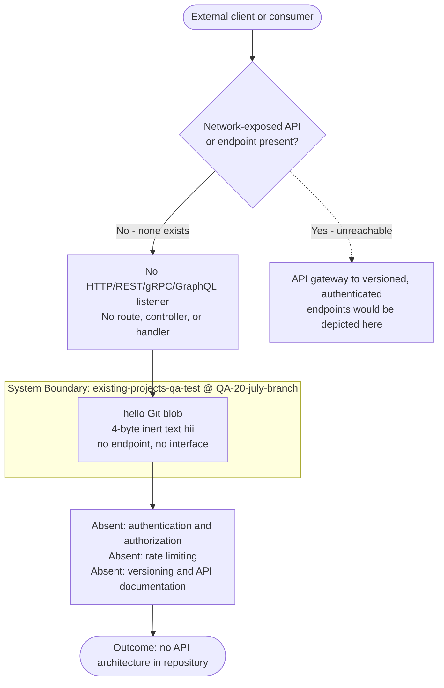

Because no API surface, protocol, or credential exists in the current source, there is no API design dimension to measure. Any protocol selection, authentication method, authorization model, rate-limiting policy, versioning scheme, or documentation standard would be introduced only when application code that exposes an interface is added to the repository.

### 6.3.3 Message Processing

No message processing exists in the repository, so there are no event processing patterns, message-queue architecture, stream-processing design, batch-processing flows, or message-level error-handling strategy to document. A keyword search of tracked content for `kafka`, `rabbit`, `queue`, and `webhook` returned no matches; there is no message broker, queue, topic, stream, event bus, scheduler, or consumer defined anywhere in the source. As recorded in §6.2 Database Design, there are "no batch/ETL jobs, schedulers, or bulk data operations," and §5.4 Cross-Cutting Concerns confirms there are no retry mechanisms, fallback processes, or error-notification flows. The table below maps each required Message Processing topic to its observed state.

**Table 6.3.3-1 — Message Processing Topics vs. Observed State**

| Required Topic | Observed State in Repository | Reference |
|---|---|---|
| Event processing patterns | None; no event emitter, publisher/subscriber, event bus, or event handler exists | §6.1 |
| Message queue architecture | None; no broker (Kafka, RabbitMQ, SQS, etc.), queue, topic, or exchange is configured | §3.4 |
| Stream processing design | None; no stream processor, consumer group, or windowing/aggregation logic exists | Direct inspection |
| Batch processing flows | None; no scheduler, cron, ETL job, or bulk data operation exists | §6.2 |
| Error handling strategy | None; no retry, dead-letter queue, fallback, or error-notification flow exists | §5.4 |

**Message flow.** There is no producer, broker, consumer, or subscriber in the repository, and therefore no message flow to trace. The only observable "message-like" event anywhere in the repository is the version-control operation that persisted the `hello` blob during commit `97e6b3a` — a Git action, not an application message on a channel. Figure 6.3.3-1 depicts this observed state; the dotted branch marks where a producer-to-broker-to-consumer flow with a dead-letter queue would appear only if messaging infrastructure and application code were introduced.

**Figure 6.3.3-1 — Message Flow Diagram (Observed Absence of Message Processing)**

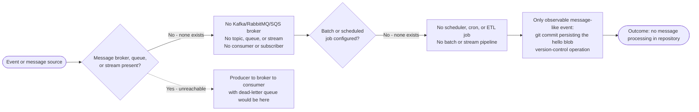

Because no channel, event, or job exists, there is no message-processing dimension to measure in the current source. Any event pattern, queue topology, stream-processing pipeline, batch flow, or message error-handling strategy (retries, dead-letter queues, or notifications) would be introduced only when application code and messaging infrastructure are added to the repository.

### 6.3.4 External Systems

No external systems are integrated with the repository, so there are no third-party integration patterns, legacy system interfaces, API-gateway configuration, or external service contracts to document. As recorded in §3.4 Third-Party Services, "no third-party services are integrated with the repository... no integration code, no client SDK, no service configuration, and no environment or credential files," and §1.3 Scope places "External / enterprise integrations" out of scope because "no integration code or configuration exists." The table below maps each required External Systems topic to its observed state.

**Table 6.3.4-1 — External Systems Topics vs. Observed State**

| Required Topic | Observed State in Repository | Reference |
|---|---|---|
| Third-party integration patterns | None; no HTTP client, SDK, connector, or adapter to any third-party service exists | §3.4 |
| Legacy system interfaces | None; no legacy adapter, file drop, database link, or protocol bridge exists | §1.3 |
| API gateway configuration | None; no gateway, reverse proxy, or service-mesh configuration file exists | Direct inspection |
| External service contracts | None; no OpenAPI, WSDL, `.proto`, or schema contract is defined | §6.1 |

**External dependency inventory.** The output-format requirement to document all external dependencies is satisfied by recording the single external reference of any kind that exists anywhere in the repository — the Git `origin` remote used for source hosting on GitHub. This is version-control hosting, not an application-level service integration: it transports the `hello` blob and commit metadata, and no tracked source calls it as an API or exchanges application data with it.

**Table 6.3.4-2 — External Dependency Inventory (Complete)**

| External Reference | Type | Protocol | Role in Repository |
|---|---|---|---|
| GitHub `origin` remote (`Sandeep01Kumar/existing-projects-qa-test`) | Source-code hosting (version control) | Git over HTTPS | Stores and serves the `hello` blob and commit metadata; not an application integration |

**Integration flow.** Figure 6.3.4-1 depicts the (absent) integration topology: the application integration layer has no outbound client, connector, or service contract through which to reach a third-party or legacy system, and no API gateway is configured; the only external reference is the Git `origin` remote used for source hosting. The dotted branch marks where third-party and legacy adapters would appear only if application code were introduced.

**Figure 6.3.4-1 — Integration Flow Diagram (Observed Absence of External Integration)**

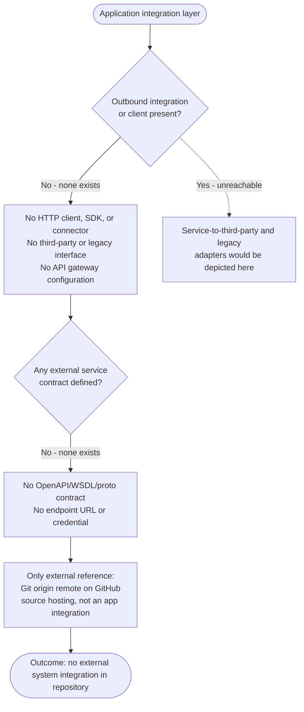

**Key external interaction (sequence).** The only observable interaction between this repository and any external system is the version-control synchronization with the GitHub `origin` remote. Figure 6.3.4-2 sequences that interaction for completeness. It is explicitly a Git operation over HTTPS that moves the `hello` artifact and commit metadata; it involves no application API calls, no in-code authentication or token exchange, and no message or event flow.

**Figure 6.3.4-2 — Sequence Diagram: Version-Control Synchronization (Only Observable External Interaction)**

```mermaid
sequenceDiagram
    participant Dev as Author (Git client)
    participant Local as Local repository
    participant Origin as GitHub origin remote
    Note over Dev,Origin: Only observable external interaction = version-control sync (not an application integration)
    Dev->>Local: git commit "Create hello" (97e6b3a)
    Dev->>Origin: git push over HTTPS
    Origin-->>Dev: ack - refs updated
    Local->>Origin: git fetch / clone over HTTPS
    Origin-->>Local: hello blob + commit metadata
    Note over Dev,Origin: No application API calls, no in-code auth/token exchange, no message or event flow
```

Because no outbound client, gateway, or service contract exists, there is no external-system integration dimension to measure in the current source. Any third-party integration pattern, legacy interface, API-gateway configuration, or external service contract would be introduced only when application code that communicates with an external system is added to the repository.

### 6.3.5 References

The following repository artifacts and previously written specification sections were examined as evidence for this section.

**Repository files and folders**

- `hello` — the single 4-byte tracked artifact (content `hii`); established that no API, interface, message channel, client, connector, or external service contract exists, and that the only persisted artifact is an inert version-controlled text file.
- `.git/` — version-control metadata; established the single-commit history (`97e6b3a`, "Create hello") identical across all branches (`main`, `QA-20-july-branch`, `QA-02-july-branch`, `QA-09-Feb-branch`) and the `origin` remote, and confirmed that the GitHub `origin` remote (`Sandeep01Kumar/existing-projects-qa-test`) is the only external reference — a source-hosting endpoint, not an application integration.
- Repository root (path `""`) — inspection returned an empty child set, confirming no API definitions, client SDKs, gateway/proxy configuration, message-broker configuration, interface-definition files (OpenAPI/WSDL/`.proto`/`.graphql`), or environment/credential files exist anywhere in the working tree.

**Cross-referenced specification sections**

- §1.2 System Overview — confirmed the repository does not contain an implemented system and records no enterprise or third-party integrations.
- §1.3 Scope — confirmed "External / enterprise integrations" and "APIs, user interfaces, CLIs" are out of scope because no integration code, configuration, or interface definitions exist, and that all integration points are uncovered.
- §3.4 Third-Party Services — confirmed no third-party services, external APIs, authentication providers, monitoring tools, or cloud services are integrated; the only external reference is the Git `origin` remote (version-control hosting).
- §5.4 Cross-Cutting Concerns — confirmed no authentication mechanism, no authorization model, no monitoring/logging/tracing, and no error handling (retry/fallback/notification).
- §6.1 Core Services Architecture — confirmed no services, no inter-service communication patterns, and no APIs, network protocols, or message formats.
- §6.2 Database Design — confirmed no batch/ETL jobs, schedulers, or bulk data operations.

## 6.4 Security Architecture

### 6.4.1 Security Architecture Applicability Determination

**Detailed Security Architecture is not applicable for this system.**

The repository under specification does not contain an implemented software system. It is a near-empty version-control scaffold whose only tracked artifact is a single 4-byte text file, `hello` (content `hii`), carrying no file extension, no shebang, and no executable logic. There is no source code, no runtime, no network-exposed interface, no user or client, no data store, and no configuration. Consequently there is no authentication surface to protect, no principal to authorize, no protected resource against which an access-control decision could be made, and no data to classify or encrypt. A dedicated Authentication Framework, Authorization System, and Data Protection design would therefore have nothing to govern.

This determination is consistent with the findings recorded elsewhere in this specification. Per §5.4.2 (Authentication and Authorization), the repository has no authentication mechanism, no authorization model, no secrets or credential management, and no protected resources. Per §2.4 (Implementation Considerations), the security implications are recorded as None because no code, secrets, authentication, or data handling are present. Per §1.2 (System Overview), the repository does not contain an implemented system, and per §3.4 (Third-Party Services), no identity provider, OAuth/OIDC, token, or session configuration exists.

**Evidence basis.** The applicability conclusion rests on direct, repeatable inspection of the repository:

- The working tree contains exactly one tracked file, `hello` (4 bytes, content `hii`), verified with `git ls-files` and `git cat-file -s`.
- A single commit, `97e6b3a` ("Create hello"), is the only commit across every reference — local branches `main` and `QA-20-july-branch`, and remotes `origin/main`, `origin/QA-02-july-branch`, `origin/QA-09-Feb-branch`, and `origin/QA-20-july-branch` — each of which resolves to the identical single-file tree.
- A case-insensitive keyword sweep across all reachable objects (`git grep` over `git rev-list --all`) for `password`, `token`, `jwt`, `oauth`, `oidc`, `auth`, `login`, `credential`, `encrypt`, `tls`, `ssl`, `rbac`, `role`, `permission`, `session`, `api_key`, `private_key`, `bcrypt`, `mfa`, and related terms returned **zero matches**.
- No secret, key, certificate, or configuration files of any kind are present in history (no `.env`, `.pem`, `.key`, `.crt`, `.p12`, `.json`, `.yaml`, `.yml`, `.toml`, `Dockerfile`, or `.tf`).
- No `.blitzyignore` file exists, so no repository content was excluded from this analysis.

**Table 6.4.1-1 — Preconditions for a Dedicated Security Architecture vs. Observed Repository State**

| Precondition for a Dedicated Security Architecture | Observed State in the Repository |
| --- | --- |
| An authentication surface (login endpoint, identity provider, or credential store) | None; the only tracked file is the 4-byte `hello` text file |
| Principals and a runtime that make access-control decisions | None; no source code, no executable entry point, no service process |
| Protected resources (APIs, user interfaces, or data stores) | None; no interface or data resource exists to protect |
| Data classified as sensitive or regulated | None; no data domains are defined (per §1.3) |
| Secrets, keys, or credentials requiring management | None; keyword and file sweeps returned zero matches |

Because none of the preconditions are met, the three required security areas (Authentication Framework, Authorization System, and Data Protection) are each documented as not applicable, with the observed absence detailed in the sub-sections that follow.

**Table 6.4.1-2 — Applicability of Each Required Security Area**

| Required Area (per §6.4 prompt) | Applicability | Rationale / Documented In |
| --- | --- | --- |
| Authentication Framework | Not applicable | No identity surface, credential store, session, or token flow exists (§6.4.2; corroborated by §5.4.2) |
| Authorization System | Not applicable | No principals, roles, permissions, policy enforcement points, or protected resources exist (§6.4.3; corroborated by §5.4.2) |
| Data Protection | Not applicable | No sensitive/regulated data, encryption, key management, or compliance obligations exist (§6.4.4; corroborated by §2.4) |

#### Standard Security Practices Followed Instead

Although a system-level Security Architecture is not applicable, the repository still exists as a versioned artifact managed through Git and a remote hosting platform. The following standard practices apply to that artifact and its lifecycle, and are grounded in observed configuration rather than inferred capability:

- **Version-control integrity (content-addressable storage).** Git stores every object under a SHA-1 content hash, providing tamper-evidence for the tracked artifact. Any modification to the committed content changes the object identifier. The current state is fixed at commit `97e6b3ab90d303f17cbaea70508367c4fb1b5f8c` with the `hello` blob addressed as `47a950ff8bf3c1352e95eabc505d8306eacc67e9`; the empty-except-one-blob tree is `0a8380db5158277ad25c294940b2feacd92ae448`.
- **Transport security for synchronization.** The `origin` remote is reached over HTTPS/TLS. Repository fetch and push operations therefore travel over an encrypted channel rather than a plaintext protocol.
- **Environment-supplied, token-based transport authentication.** Authentication to the remote is performed with a token supplied by the execution environment at the transport layer. This credential is injected at runtime and is **not** part of the tracked repository content; it is not committed, not referenced by any file, and is out of scope for the application itself. (Its value is intentionally omitted from this specification.)
- **Platform-managed access control.** Read/write authorization for the `Sandeep01Kumar/existing-projects-qa-test` repository is governed by the GitHub hosting platform's account and repository permission model. This is a provider-level control external to the repository, not an access-control mechanism implemented within the tracked content.
- **Secure default through absence of secrets.** Because no secrets, keys, or credentials are present in any tracked object, the repository carries no committed sensitive material that could be exposed. This "nothing to leak" posture is verified rather than assumed.

The control matrix below summarizes these practices, the mechanism observed for each, the asset each protects, and its status.

**Table 6.4.1-3 — Security Control Matrix (Applicable Standard Practices)**

| Security Control | Mechanism (Observed) | Protected Asset / Scope | Status |
| --- | --- | --- | --- |
| Artifact integrity | Git content-addressable SHA-1 object IDs (commit `97e6b3a`, blob `47a950f`) | The `hello` artifact and full commit history | Active (inherent to Git) |
| Transport confidentiality | HTTPS/TLS channel for fetch/push to `origin` | Repository data in transit to/from GitHub | Active |
| Remote authentication | Environment-supplied token at the transport layer (not tracked) | Access to the `origin` remote endpoint | Active (external to repository) |
| Repository access control | GitHub platform account/repository permissions | Read/write access to the hosted repository | Active (provider-managed) |
| Secrets exposure prevention | Verified absence of secrets in all tracked objects | Committed repository content | Active (secure default) |
| Application-level auth / authz / encryption | None implemented | No system present to protect | Not applicable |

#### Security Zones and Trust Boundaries

The only observable trust boundaries are those of the version-control workflow: a developer-controlled workstation holding the local Git repository, an encrypted transport channel, and the provider-managed GitHub hosting platform acting as the `origin` remote. There is no application DMZ, no runtime or service tier, no database zone, and no internal service network, because no such components exist in the repository. Figure 6.4.1-1 depicts the actual zones and the security-relevant absence beyond them.

**Figure 6.4.1-1 — Security Zone / Trust Boundary Diagram**

```mermaid
flowchart LR
    subgraph ZoneA["Zone A - Author Workstation (developer-controlled)"]
        GitClient["Git client<br/>commit / push / fetch"]
        WorkTree["Local working tree + .git<br/>hello blob 47a950f"]
        GitClient --> WorkTree
    end
    subgraph Transit["Transport Boundary"]
        TLS{{"HTTPS / TLS channel<br/>token-based auth<br/>environment-supplied, not tracked"}}
    end
    subgraph ZoneB["Zone B - GitHub Hosting Platform (provider-managed)"]
        Origin["origin remote<br/>Sandeep01Kumar/existing-projects-qa-test<br/>platform-managed access control"]
    end
    WorkTree -->|git push / fetch| TLS
    TLS --> Origin
    Absent["Absent security zones:<br/>no DMZ, no application / runtime tier,<br/>no database zone, no internal service network"]
    Origin -.->|none present| Absent
```

The remaining sub-sections (§6.4.2 through §6.4.4) document, area by area, the observed absence of the authentication, authorization, and data-protection constructs enumerated in the section prompt, so that each required topic is explicitly accounted for.

### 6.4.2 Authentication Framework

**No authentication framework is present in this system.** The repository contains no login endpoint, no identity provider integration, no credential store, no session mechanism, and no token-issuance logic. This is verified by the absence of any source code or configuration and by a case-insensitive keyword sweep across all reachable Git objects (for `auth`, `login`, `password`, `token`, `jwt`, `oauth`, `oidc`, `session`, `mfa`, `2fa`, and related terms) that returned zero matches. The finding aligns with §5.4.2, which records the authentication mechanism as None, and with §3.4, which records no identity provider, OAuth/OIDC, token, or session configuration.

Each authentication topic enumerated in the section prompt is accounted for below against its observed state.

**Table 6.4.2-1 — Authentication Topics vs. Observed Repository State**

| Required Topic | Observed State in the Repository | Reference |
| --- | --- | --- |
| Identity management | None; no user model, directory, or identity provider exists | §5.4.2; §3.4 |
| Multi-factor authentication (MFA) | None; no primary authentication exists, so no second factor applies | §5.4.2 |
| Session management | None; no session issuance, storage, expiry, or cookie handling exists | §5.4.2 |
| Token handling | None in application scope; no JWT/opaque token issuance or validation exists | §5.4.2; §6.4.1 |
| Password policies | None; no credential store, hashing, complexity, or rotation rules exist | §5.4.2 |

**Only identity signal present.** The single identity-related datum anywhere in the repository is the Git commit authorship metadata attached to commit `97e6b3a` ("Create hello"), authored by `Sandeep01Kumar <sandeep@blitzy.com>`. This is descriptive version-control provenance, not an authentication control: it is unverified within the repository, grants no access, issues no session or token, and is unrelated to any runtime identity decision. Transport-level authentication to the `origin` remote is handled by an environment-supplied token as described in §6.4.1; that credential is not tracked in the repository and is not an application authentication framework.

Because no authentication entry point exists, there is no runtime authentication flow to trace. Figure 6.4.2-1 makes the absence explicit and, via an unreachable (dotted) branch, indicates where credential verification, MFA, and session/token issuance *would* occur if such code were introduced.

**Figure 6.4.2-1 — Authentication Flow (Depicting Absence)**

```mermaid
flowchart TD
    Subject([User or client attempting access]) --> Q1{Authentication entry point<br/>or identity provider present?}
    Q1 -->|No - none exists| NoIdP["No login endpoint, IdP, or credential store<br/>No session issuance, no token flow<br/>No MFA challenge, no password policy"]
    NoIdP --> OnlyGit["Only identity signal in repository:<br/>Git commit authorship metadata<br/>commit 97e6b3a Create hello"]
    OnlyGit --> Outcome([Outcome: no authentication framework in repository])
    Q1 -.->|Yes - unreachable| Hypo["Credential / MFA verification to<br/>session and token issuance would occur here"]
```

Should an application with an authentication surface be introduced in a future revision, this sub-section would be expanded to specify the identity-management model, MFA policy, session lifecycle, token format and handling, and password policy. None of these constructs exist in the repository today.

### 6.4.3 Authorization System

**No authorization system is present in this system.** Authorization presupposes an authenticated principal, a protected resource, and a decision point that evaluates access. None of these exist in the repository: there is no authenticated principal (per §6.4.2), no protected API, interface, or data resource (per §6.4.1), and no code in which an access-control decision could be made. The keyword sweep across all reachable Git objects for `role`, `permission`, `rbac`, `access`, `policy`, and related terms returned zero matches. This aligns with §5.4.2, which records the authorization model as None (no roles, permissions, or access-control checks).

Each authorization topic enumerated in the section prompt is accounted for below.

**Table 6.4.3-1 — Authorization Topics vs. Observed Repository State**

| Required Topic | Observed State in the Repository | Reference |
| --- | --- | --- |
| Role-based access control (RBAC) | None; no roles, groups, or role assignments are defined | §5.4.2 |
| Permission management | None; no permission model, grants, or scopes exist | §5.4.2 |
| Resource authorization | None; no protected resource exists to authorize access to | §6.4.1; §5.4.2 |
| Policy enforcement points (PEPs) | None; no middleware, guard, filter, or decision point exists | §5.4.2 |
| Audit logging | None; no logging or monitoring is configured, so no authorization audit trail exists | §5.4.1 |

**Audit logging.** There is no application logging, monitoring, or tracing anywhere in the repository (per §5.4.1), and therefore no authorization audit trail — no record of access decisions, grants, or denials. The only change record that exists at all is the Git commit history (a single commit, `97e6b3a`), which documents repository modifications for version-control purposes; it is not an authorization audit log and captures no access-decision events.

Because no policy enforcement point exists, there is no runtime authorization flow to trace. Figure 6.4.3-1 depicts the absence and, via an unreachable (dotted) branch, indicates where a policy decision and enforcement (for example, an RBAC or permission check) *would* occur if such code were introduced.

**Figure 6.4.3-1 — Authorization Flow (Depicting Absence)**

```mermaid
flowchart TD
    Request([Authenticated principal requesting a resource]) --> Q1{Protected resource and<br/>policy enforcement point present?}
    Q1 -->|No - none exists| NoPEP["No PEP, no role or permission model<br/>No access-control checks or policies<br/>No protected API, UI, or data resource"]
    NoPEP --> Q2{Audit log or decision<br/>record configured?}
    Q2 -->|No - none exists| NoAudit["No authorization audit trail<br/>Only Git commit history records change"]
    NoAudit --> Outcome([Outcome: no authorization system in repository])
    Q1 -.->|Yes - unreachable| Hypo["Policy decision and enforcement<br/>RBAC or permission check would occur here"]
```

Should an application with protected resources be introduced in a future revision, this sub-section would be expanded to specify the RBAC/permission model, resource-authorization rules, the placement of policy enforcement points, and an authorization audit-logging design. None of these constructs exist in the repository today.

### 6.4.4 Data Protection

**Application-level data protection is not applicable for this system, and no compliance obligations are triggered.** The repository holds no application data: the sole tracked artifact is the 4-byte `hello` file (content `hii`), which contains no personal, financial, health, or otherwise sensitive information. Per §1.3, no data domains are defined; per §2.4, no data handling is present. A keyword and file-type sweep across all reachable Git objects found no encryption logic, no key material, and no certificate, keystore, or secret files (`.pem`, `.key`, `.crt`, `.p12`), returning zero matches. The single data-protection control that is genuinely present applies only to the version-control artifact in transit — Git synchronization to the `origin` remote over HTTPS/TLS, as established in §6.4.1 — not to any application data flow.

Each data-protection topic enumerated in the section prompt is accounted for below.

**Table 6.4.4-1 — Data Protection Topics vs. Observed Repository State**

| Required Topic | Observed State in the Repository | Reference |
| --- | --- | --- |
| Encryption standards | None at the application layer; no encryption-at-rest logic exists; the `hello` blob is stored unencrypted by Git and holds no sensitive data | §2.4; §6.4.1 |
| Key management | None; no keys, keystores, KMS integration, or certificates exist in any tracked object | §6.4.1 |
| Data masking rules | None; no data fields, PII, output, or logs exist to mask | §5.4.1; §1.3 |
| Secure communication | Applicable only to VCS sync: Git fetch/push to `origin` uses HTTPS/TLS; no application data-in-transit exists | §6.4.1 |
| Compliance controls | None; no regulated data category is present to trigger any control | §1.3; Table 6.4.4-2 |

**Data inventory and classification.** The complete data inventory of the repository is one non-sensitive text artifact, `hello` (4 bytes, content `hii`), fixed at blob `47a950ff8bf3c1352e95eabc505d8306eacc67e9`. It carries no identifiers, no user records, and no confidential content, and therefore requires no classification tier, masking, tokenization, or field-level encryption. Any storage-level protection applied by the GitHub hosting platform is provider-managed and external to the repository; it is not implemented or evidenced within the tracked content and is therefore out of scope for this specification.

**Compliance requirements.** Regulatory data-protection regimes are activated by the presence of specific categories of regulated data. Because no such data category exists anywhere in the repository, none of the common regimes are triggered, and no compliance control is required or implemented. The matrix below documents this determination against the frameworks most frequently applicable to software systems.

**Table 6.4.4-2 — Compliance Control Matrix**

| Compliance Regime | Triggering Data Category | Applicability & Basis |
| --- | --- | --- |
| GDPR (EU data protection) | Personal data of data subjects | Not triggered; no personal data is stored or processed (§1.3) |
| HIPAA (US health) | Protected health information (PHI) | Not triggered; no health data exists |
| PCI-DSS (payment card) | Cardholder / payment data | Not triggered; no payment data or transaction flow exists |
| SOX (financial reporting) | Financial reporting records | Not triggered; no financial records or reporting system exists |
| SOC 2 (service trust criteria) | Customer service data | Not triggered; no service, customer data, or runtime exists |

No data-protection control, encryption standard, key-management process, masking rule, or compliance safeguard is implemented in the repository, and none is required given the verified absence of application data and regulated data categories. Should an application that stores or transmits sensitive data be introduced in a future revision, this sub-section would be expanded to specify encryption standards (at rest and in transit), a key-management lifecycle, data-masking and classification rules, and the compliance controls corresponding to the data categories then handled.

### 6.4.5 References

The following repository artifacts, specification sections, and sources were examined as evidence for this Security Architecture section.

**Repository files and folders examined**

- `hello` — the sole tracked artifact (4-byte text file, content `hii`, blob `47a950ff8bf3c1352e95eabc505d8306eacc67e9`); established the complete absence of application code, authentication/authorization logic, encryption, secrets, and application data.
- `.git/` — version-control metadata; established the single-commit history (`97e6b3ab90d303f17cbaea70508367c4fb1b5f8c`, "Create hello") identical across all local and remote branches (`main`, `QA-20-july-branch`, `origin/main`, `origin/QA-02-july-branch`, `origin/QA-09-Feb-branch`, `origin/QA-20-july-branch`), the HTTPS/TLS `origin` transport to `Sandeep01Kumar/existing-projects-qa-test`, content-addressable integrity, and the verified absence of any secret/credential/certificate objects. The environment-supplied transport token found in local configuration was treated as out-of-scope and is never reproduced.
- Repository root (`""`) — confirmed via directory inspection to contain no children beyond `hello` and version-control metadata (empty tree apart from the single blob).

**Cross-referenced specification sections**

- §1.2 System Overview — confirmed the repository does not contain an implemented system.
- §1.3 Scope — confirmed no data domains, user groups, interfaces, or integrations are defined.
- §2.4 Implementation Considerations — confirmed security implications and data handling are recorded as None.
- §3.4 Third-Party Services — confirmed no identity provider, OAuth/OIDC, token, or session configuration exists.
- §5.4 Cross-Cutting Concerns — §5.4.1 confirmed no monitoring/logging (hence no audit trail); §5.4.2 confirmed no authentication mechanism, authorization model, secrets management, or protected resources; §5.4.4 confirmed only Git history provides artifact redundancy.

**External / web sources**

- [web] None — no external lookups were required; all conclusions derive from direct inspection of the repository's tracked content and version-control metadata.

## 6.5 Monitoring and Observability

### 6.5.1 Monitoring and Observability Applicability Determination

**Detailed Monitoring Architecture is not applicable for this system.**

The repository under specification does not contain an implemented software system. It is a near-empty version-control scaffold whose only tracked artifact is a single 4-byte text file, `hello` (content `hii`), carrying no file extension, no shebang, and no executable logic. There is no source code, no runtime, no service process, no network-exposed endpoint, and no configuration of any kind. Monitoring and observability presuppose a running system that emits signals — metrics, logs, and traces — and objectives against which those signals are evaluated. Because nothing executes, no signal is ever produced, there is no interface whose health could be probed, and there are no service-level objectives, thresholds, or key performance indicators to measure. Consequently, a dedicated monitoring infrastructure, a set of observability patterns, and an incident-response process would have nothing to observe or act upon.

This determination is consistent with findings recorded elsewhere in this specification. Per §5.4.1 (Monitoring, Observability, Logging, and Tracing), no monitoring, observability, logging, or tracing capability exists — there is no logging framework, metrics endpoint, tracing instrumentation, dashboard, or alerting configuration, and no third-party observability tool is integrated. Per §5.4.4 (Performance, SLAs, and Disaster Recovery), no performance requirements, service-level agreements, or disaster-recovery procedures are defined. Per §1.2 (System Overview), the repository does not contain an implemented system and defines no key performance indicators. Per §6.1 (Core Services Architecture), no service, process, or runtime exists.

**Evidence basis.** The applicability conclusion rests on direct, repeatable inspection of the repository:

- The working tree contains exactly one tracked file, `hello` (4 bytes, content `hii`), verified with `git ls-files` and `git cat-file -s`; its blob is `47a950ff8bf3c1352e95eabc505d8306eacc67e9` under tree `0a8380db5158277ad25c294940b2feacd92ae448`.
- A single commit, `97e6b3ab90d303f17cbaea70508367c4fb1b5f8c` ("Create hello"), is the only commit across every reference — local branches `main` and `QA-20-july-branch`, and remotes `origin/main`, `origin/QA-02-july-branch`, `origin/QA-09-Feb-branch`, and `origin/QA-20-july-branch` — each of which resolves to the identical single-file tree.
- A case-insensitive keyword sweep across all reachable Git objects (`git grep` over `git rev-list --all`) for `log`, `metric`, `trace`, `monitor`, `health`, `alert`, `prometheus`, `grafana`, `opentelemetry`, `statsd`, `sentry`, and `datadog` returned **zero matches**.
- No configuration, manifest, container, or infrastructure-as-code files exist in any commit (no `Dockerfile`, `docker-compose.yml`, `*.yaml`, `prometheus.yml`, `*.tf`, or `.github/workflows/`), so there is no place a monitoring agent, exporter, scrape target, or probe could be declared.
- No `.blitzyignore` file exists, so no repository content was excluded from this analysis.

**Table 6.5.1-1 — Preconditions for a Monitoring Architecture vs. Observed Repository State**

| Precondition for a Monitoring Architecture | Observed State in the Repository |
| --- | --- |
| A running service, process, or runtime that emits telemetry | None; the only tracked artifact is the 4-byte `hello` text file |
| An interface or endpoint whose health could be probed | None; no HTTP, gRPC, or CLI entry point exists |
| Metrics, logs, or trace spans generated at run time | None; nothing executes, so no signal is produced |
| A metrics/log/trace backend, exporter, or agent configuration | None; no Prometheus, OpenTelemetry, ELK, Grafana, or agent config exists |
| Defined objectives (SLOs/SLAs/KPIs) to measure against | None; no objectives or thresholds are defined (per §1.2, §5.4.4) |

**Table 6.5.1-2 — Applicability of Each Required Monitoring/Observability Area**

| Required Area (per §6.5 prompt) | Applicability | Rationale / Documented In |
| --- | --- | --- |
| Monitoring Infrastructure | Not applicable | No telemetry source or backend exists (§6.5.2; corroborated by §5.4.1) |
| Observability Patterns | Not applicable | No runtime to health-check, measure, or capacity-plan (§6.5.3; §5.4.4) |
| Incident Response | Not applicable | No alerts, on-call, or runbooks; nothing to respond to (§6.5.4) |

#### Baseline Monitoring Practices Followed Instead

Although a system-level Monitoring Architecture is not applicable, the repository still exists as a versioned artifact managed through Git and a remote hosting platform. The following baseline observability practices apply to that artifact and its lifecycle, and are grounded in observed configuration rather than inferred capability:

- **Change visibility (version-control audit trail).** The Git commit history is the only activity signal the repository produces. The current state is a single commit, `97e6b3a` ("Create hello"), authored by `Sandeep01Kumar <sandeep@blitzy.com>` on 2025-11-14; every future modification appends an inspectable, attributable record.
- **Artifact integrity monitoring.** Git stores every object under a SHA-1 content hash, providing tamper-evidence: any change to the tracked content changes the identifier. The `hello` blob is fixed at `47a950f`, allowing drift to be detected by comparison.
- **Platform-managed activity monitoring.** Push, fetch, and access events against `Sandeep01Kumar/existing-projects-qa-test` are observable through the GitHub hosting platform's repository insights and audit facilities. This is a provider-level capability external to the tracked content, not monitoring implemented within the repository.
- **Transport visibility.** Synchronization with the `origin` remote occurs over HTTPS/TLS, so fetch/push traffic travels over an observable, encrypted channel rather than a plaintext protocol.

**Table 6.5.1-3 — Baseline Observability Practices (Applicable)**

| Practice | Mechanism (Observed) | Signal / Scope | Status |
| --- | --- | --- | --- |
| Change / audit trail | Git commit history (commit `97e6b3a`) | Repository modifications and authorship | Active (inherent to Git) |
| Artifact integrity | Git content-addressable SHA-1 (blob `47a950f`) | The `hello` artifact and full history | Active (inherent to Git) |
| Platform activity monitoring | GitHub repository insights / audit log | Push, fetch, and access events | Active (provider-managed, external) |
| Transport visibility | HTTPS/TLS channel for fetch/push to `origin` | Repository data in transit | Active |
| Application metrics / logs / traces / alerts | None implemented | No runtime to observe | Not applicable |

The only observable "monitoring surface" is therefore the version-control and hosting-platform layer; the application telemetry pipeline that a Monitoring Architecture would describe is entirely absent. Figure 6.5.1-1 depicts this reality: the decision point resolves to "no runtime," the application pipeline (metrics collection, log aggregation, distributed tracing, alert management, dashboards) is drawn as absent, and the only populated layer is the version-control signal set.

**Figure 6.5.1-1 — Monitoring Architecture (Observed State)**

```mermaid
flowchart TD
    Runtime{{"Runtime or service emitting<br/>telemetry present?"}}
    Runtime -->|"No — repository has no executable code"| NoTel["No metrics, logs, or traces are produced"]

    NoTel --> NoCollect
    NoTel --> NoLog
    NoTel --> NoTrace

    subgraph Absent["Absent: Application Monitoring & Observability Pipeline"]
        NoCollect["Metrics collection<br/>none — no Prometheus / OTel / StatsD"]
        NoLog["Log aggregation<br/>none — no ELK / Loki / CloudWatch"]
        NoTrace["Distributed tracing<br/>none — no Jaeger / Tempo / X-Ray"]
        NoAlert["Alert management<br/>none — no Alertmanager / PagerDuty"]
        NoDash["Dashboards<br/>none — no Grafana / Kibana"]
        NoCollect --> NoAlert
        NoLog --> NoAlert
        NoTrace --> NoAlert
        NoAlert --> NoDash
    end

    subgraph Observed["Observed: Version-Control Signals (only telemetry available)"]
        Commit["Commit history<br/>1 commit 97e6b3a Create hello"]
        Platform["GitHub platform activity logs & insights<br/>Sandeep01Kumar/existing-projects-qa-test<br/>provider-managed, external to repository"]
        Commit -->|"git push / fetch over HTTPS/TLS"| Platform
    end

    NoDash -.->|"no dashboards consume version-control signals"| Commit
    Runtime -.->|"Yes — unreachable, no runtime exists"| Hypo["Instrument to collect to aggregate to trace to<br/>alert to visualize would run here"]
```

The remaining sub-sections (§6.5.2 through §6.5.4) document, area by area, the observed absence of the monitoring infrastructure, observability patterns, and incident-response constructs enumerated in the section prompt, each with the diagrams and tables the prompt requires, so that every required topic is explicitly accounted for.

### 6.5.2 Monitoring Infrastructure

No monitoring infrastructure exists in the repository. A monitoring infrastructure is the set of components that collect, transport, store, evaluate, and visualize telemetry from a running system: metric collectors and time-series stores, log shippers and aggregators, trace exporters and backends, an alerting engine, and dashboards. None of these is present, because there is no telemetry source to feed them — the sole tracked artifact is the inert 4-byte `hello` file, and the keyword sweep across all reachable Git objects (§6.5.1) found no reference to any collector, exporter, agent, or backend. This aligns with §5.4.1, which records that no logging framework, metrics endpoint, tracing instrumentation, dashboard, or alerting configuration exists, and with §3.4 (Third-Party Services), which records no integrated observability tool. Each required infrastructure topic is accounted for below against its observed state.

**Table 6.5.2-1 — Monitoring Infrastructure Topics vs. Observed Repository State**

| Required Topic | Observed State in the Repository | Reference |
| --- | --- | --- |
| Metrics collection | None; no metrics are emitted and no collector/exporter (Prometheus, OpenTelemetry, StatsD) is configured | §5.4.1; §6.5.1 |
| Log aggregation | None; no logging framework, log output, or shipper/aggregator (ELK, Loki, CloudWatch, Fluentd) exists | §5.4.1 |
| Distributed tracing | None; no trace context, span, exporter, or backend (Jaeger, Tempo, Zipkin, X-Ray) is defined | §5.4.1 |
| Alert management | None; no alerting engine, rules, or routing (Alertmanager, PagerDuty, Opsgenie) exists | §5.4.1; §6.5.4 |
| Dashboard design | None; no dashboard definition or visualization tool (Grafana, Kibana) exists | §5.4.1 |

#### Metrics Collection

No metrics are produced or collected. There is no application code to instrument, no counter, gauge, histogram, or summary defined anywhere, and no `/metrics` endpoint, push gateway, or scrape configuration. No exporter or agent (for example, a Prometheus client library, an OpenTelemetry SDK, or a StatsD client) appears in any tracked object. Because the repository declares no dependency manifest of any kind, no metrics library could even be resolved at build time.

#### Log Aggregation

No logs are generated and no aggregation pipeline exists. There is no logging framework or configuration, no structured or unstructured log output, and no shipper, collector, index, or retention policy. The only chronological record associated with the repository is the Git commit history — a version-control log of source changes, not an application or system log stream — currently consisting of the single commit `97e6b3a`.

#### Distributed Tracing

No distributed tracing is present. Distributed tracing correlates a request as it traverses multiple services via propagated trace and span context; this requires at least one running service and an instrumentation layer. The repository has neither. No trace/span model, context-propagation code, sampler, or trace exporter/backend is defined, and there are no services between which a trace could be correlated (per §6.1).

#### Alert Management

No alert management exists. Alerting requires metrics or logs to evaluate and rules that define when a condition is breached; neither the signals nor the rules exist. There is no alerting engine, no alert-rule file, no notification channel, and no routing or silencing configuration. The absence of alerting is documented in detail, with the alert-flow diagram and alert-threshold matrix, in §6.5.4 (Incident Response).

#### Dashboard Design

No dashboards are designed or defined. There is no dashboard specification (for example, a Grafana JSON model or a provisioning file), no visualization tool, and — as established above — no data source that a panel could query. The only information that could populate any panel is version-control activity, which is viewable directly through the hosting platform rather than through a purpose-built dashboard. Figure 6.5.2-1 renders a conceptual dashboard canvas to make the data-availability gap explicit: the application health, performance, and capacity panels have no data because no runtime exists, while the only populated region reflects version-control activity (one commit, one 4-byte artifact).

**Figure 6.5.2-1 — Dashboard Layout (Observed Data Availability)**

```mermaid
flowchart TB
    subgraph Canvas["Conceptual Dashboard Canvas — Observed Data Availability"]
        direction TB
        subgraph Row1["Row 1 — Service Health (application scope)"]
            P1["Uptime / Availability<br/>NO DATA — no runtime"]
            P2["Request rate & error ratio<br/>NO DATA — no endpoints"]
        end
        subgraph Row2["Row 2 — Performance & Capacity (application scope)"]
            P3["Latency percentiles p50/p95/p99<br/>NO DATA — no traffic"]
            P4["CPU / memory / storage utilization<br/>NO DATA — no process"]
        end
        subgraph Row3["Row 3 — Version-Control Activity (only populated source)"]
            P5["Commits: 1 — 97e6b3a Create hello"]
            P6["Tracked artifacts: 1 — hello (4 bytes)"]
        end
    end
    Row1 --> Row2
    Row2 --> Row3
```

Should an application with a runtime be introduced in a future revision, this sub-section would be expanded to specify the collection topology (scrape versus push, agent placement), the log pipeline (format, shipper, index, retention), the tracing backend and sampling strategy, the alerting engine and routing, and the dashboard catalog. None of these components exists in the repository today.

### 6.5.3 Observability Patterns

No observability patterns are implemented. Observability patterns — health checks, performance metrics, business metrics, service-level monitoring, and capacity tracking — describe how a running system exposes and interprets its own state. Every one of them requires a runtime that produces signals; the repository has none. As established in §6.5.1 and §6.5.2, nothing executes, no signal is emitted, and no objectives or thresholds are defined. Each required pattern is accounted for below against its observed state.

**Table 6.5.3-1 — Observability Patterns vs. Observed Repository State**

| Required Pattern | Observed State in the Repository | Reference |
| --- | --- | --- |
| Health checks | None; no liveness/readiness endpoint, probe, or health command exists | §6.1; §5.4.1 |
| Performance metrics | None; no latency, throughput, or error-rate signal is produced | §5.4.4 |
| Business metrics | None; no domain events, features, or KPIs are defined | §1.2; §2.1 |
| SLA monitoring | None; no availability/latency SLA or SLO is defined to monitor | §5.4.4 |
| Capacity tracking | None; no resource, workload, or utilization signal exists | §6.1 (§6.1.3) |

#### Health Checks

No health checks exist. A health check is an endpoint or command (for example, an HTTP `/healthz` liveness probe or a `/readyz` readiness probe) that a monitor or orchestrator polls to determine whether a service is up and ready. The repository exposes no HTTP, gRPC, or CLI entry point and defines no container or orchestration manifest in which a probe could be declared (per §6.1). The only "liveness" statement that can be made is about the versioned artifact: the `hello` blob (`47a950f`) is present and intact in the working tree — an artifact-existence fact, not a runtime health signal.

#### Performance Metrics

No performance metrics are produced. The metric definitions a performance-monitoring practice would populate are enumerated below to make the gap explicit; each is undefined because there is no runtime to measure. Per §5.4.4, no performance requirements are defined anywhere in the repository.

**Table 6.5.3-2 — Performance Metric Definitions (None Defined)**

| Metric | Definition (if a runtime existed) | Observed Value |
| --- | --- | --- |
| Request latency (p50/p95/p99) | Response-time distribution per endpoint | Not defined; no endpoints, no traffic |
| Throughput | Requests processed per unit time | Not defined; no request path exists |
| Error rate | Fraction of failed requests over total | Not defined; no requests are served |
| Saturation | Degree to which a resource is fully used | Not defined; no process or resource to observe |

#### Business Metrics

No business metrics are defined. Business metrics quantify domain outcomes (for example, sign-ups, transactions, or conversion rates) and depend on implemented features that emit domain events. The repository implements no features — §2.1 (Feature Catalog) records zero features — and §1.2 (System Overview) records no key performance indicators or measurable objectives. The `hello` file carries no domain semantics; its content (`hii`) represents no business entity or event.

**Table 6.5.3-3 — Business Metric Definitions (None Defined)**

| Business Metric | Source Event (if features existed) | Observed Value |
| --- | --- | --- |
| Feature usage / adoption | Domain events from implemented features | Not defined; zero features (§2.1) |
| Transaction / conversion volume | Completed domain workflows | Not defined; no workflows (§4.1) |
| Key performance indicators | Aggregated domain outcomes | Not defined; no KPIs (§1.2) |

#### SLA Monitoring

No SLA monitoring exists because no service-level agreement, service-level objective, or service-level indicator is defined. SLA monitoring compares measured indicators against agreed targets and reports on compliance and error budgets; without a runtime, indicators, or targets, none of this applies. Per §5.4.4, no availability or latency SLA is defined anywhere in the repository. The SLA requirements are documented below as explicitly undefined so the topic is fully accounted for.

**Table 6.5.3-4 — SLA / SLO Requirements (None Defined)**

| SLA / SLO Dimension | Typical Target (illustrative only) | Defined for This System? |
| --- | --- | --- |
| Availability (uptime) | e.g., 99.9% monthly | No; no service to make available (§5.4.4) |
| Latency (response time) | e.g., p95 < 300 ms | No; no request path exists (§5.4.4) |
| Error budget | e.g., 0.1% of requests | No; no requests are served |
| Recovery objectives (RTO/RPO) | e.g., RTO 1 h / RPO 15 min | No; only Git history provides redundancy (§5.4.4, §6.1.4) |

The "Typical Target" column is illustrative context only; no value in it is a commitment of this system. The repository defines and monitors no service level.

#### Capacity Tracking

No capacity tracking exists. Capacity tracking observes resource consumption (CPU, memory, storage, connections, queue depth) against limits to anticipate scaling needs. There is no deployable runtime, container, or resource allocation to observe, and §6.1.3 (Scalability Design) records that no capacity-planning guideline, workload projection, or scaling rule is defined. The only quantifiable "capacity" fact is the repository's storage footprint — a single 4-byte blob — which is a static artifact size, not a runtime utilization signal.

Should an application with a runtime be introduced in a future revision, this sub-section would be expanded to define concrete health endpoints, the performance and business metric catalog with owners and targets, the SLA/SLO set with error budgets, and capacity-tracking signals with thresholds. None of these constructs exists in the repository today.

### 6.5.4 Incident Response

No incident-response process exists. Incident response is the operational discipline that begins when an alert fires and proceeds through routing, escalation, runbook-guided mitigation, post-mortem analysis, and improvement tracking. Its very first step — an alert firing — can never occur here: there are no metrics or logs to evaluate, no thresholds defined, and no runtime that could fail. As established in §6.5.1 through §6.5.3 and corroborated by §5.4 (Cross-Cutting Concerns), the repository has no monitoring, no alerting, no service, and no disaster-recovery procedure. Each required incident-response topic is accounted for below against its observed state.

**Table 6.5.4-1 — Incident Response Topics vs. Observed Repository State**

| Required Topic | Observed State in the Repository | Reference |
| --- | --- | --- |
| Alert routing | None; no alerts are produced and no router/receiver is configured | §6.5.2; §5.4.1 |
| Escalation procedures | None; no on-call rotation, severity tiers, or escalation policy exists | §5.4.4 |
| Runbooks | None; no operational runbook or recovery procedure is documented | §5.4.4; §6.1.4 |
| Post-mortem processes | None; no incident record or review process exists | §5.4.3 |
| Improvement tracking | None; no action-item backlog or issue-tracking workflow is defined | §2.4 |

#### Alert Routing

No alert routing exists. Routing directs a fired alert to the correct receiver (a channel, on-call schedule, or ticket queue) based on labels such as service, severity, and team. There is no alerting engine to produce alerts (per §6.5.2), no routing tree or receiver configuration, and no notification integration (email, chat, SMS, or paging). Because no alert can be generated, there is nothing to route.

#### Escalation Procedures

No escalation procedures exist. Escalation defines how an unacknowledged or worsening incident moves through severity tiers and on-call levels within bounded time windows. The repository defines no on-call rotation, no severity model, no acknowledgement or time-to-escalate policy, and no responder roles. This is consistent with §5.4.4, which records that no service-level or recovery targets are defined.

#### Runbooks

No runbooks exist. A runbook is a documented, step-by-step procedure for diagnosing and mitigating a specific failure mode. The repository contains no operational documentation of any kind — no runbook, no recovery procedure, and no disaster-recovery plan (per §5.4.4 and §6.1.4). The single tracked file, `hello`, is inert text and documents no procedure. The only recovery mechanism observable anywhere is Git's inherent version-control history, which allows the `hello` artifact to be restored to commit `97e6b3a`; this is artifact-level version control, not an incident runbook.

#### Post-Mortem Processes

No post-mortem process exists. A post-mortem (or post-incident review) is conducted after an incident to establish a timeline, root cause, and corrective actions. Because no runtime exists, no incident can occur, and there is no incident record, review template, or blameless-retrospective process defined. Per §5.4.3 (Error Handling), no error-handling or notification flow exists in which an incident could even arise.

#### Improvement Tracking

No improvement-tracking mechanism exists within the repository. Improvement tracking captures corrective and preventive actions from incidents and reviews and follows them to completion. The repository defines no action-item backlog, no issue-tracking configuration, and no linkage between findings and follow-up work (per §2.4). Any issue tracking that may exist at the GitHub project level is a provider-managed facility external to the tracked content and is not evidenced within the repository.

#### Alert Threshold Matrix

Because no metrics are emitted and no alerting rules are defined, there are no alert thresholds. The matrix below is presented to document that absence explicitly across the severity dimensions an alerting configuration would normally specify; every threshold and route is undefined.

**Table 6.5.4-2 — Alert Threshold Matrix (None Defined)**

| Severity | Example Condition (illustrative only) | Threshold Defined? | Routing Defined? |
| --- | --- | --- | --- |
| Critical (P1) | Service down / health check failing | No; no health check exists | No; no receiver configured |
| High (P2) | Error rate above budget | No; no error signal exists | No; no receiver configured |
| Warning (P3) | Latency degradation (p95) | No; no latency signal exists | No; no receiver configured |
| Info | Capacity/utilization nearing a limit | No; no utilization signal exists | No; no receiver configured |

The "Example Condition" column is illustrative context only and represents no configured rule of this system. No threshold, severity, or route is defined anywhere in the repository.

Figure 6.5.4-1 depicts the incident-response and alert flow as the evidence-based reality of absence: the triggering decision can never evaluate true (no thresholds, no metrics), so routing, escalation, runbook execution, post-mortem, and improvement tracking are all unreachable. The dotted branch marks the detect-to-track workflow that would run only if monitoring and a runtime were introduced.

**Figure 6.5.4-1 — Alert Flow and Escalation (Observed Absence)**

```mermaid
flowchart TD
    Trigger{{"Monitored condition<br/>breaches a defined threshold?"}}
    Trigger -->|"No thresholds defined & no metrics emitted"| NoSignal["No alert condition can ever evaluate true"]
    NoSignal --> NoRoute["No alert routing<br/>no Alertmanager / PagerDuty / Opsgenie"]
    NoRoute --> NoEsc["No escalation policy<br/>no on-call rotation or severity tiers"]
    NoEsc --> NoRun["No runbook to execute"]
    NoRun --> NoPost["No post-incident review / post-mortem"]
    NoPost --> NoImprove["No improvement-tracking backlog"]
    NoImprove --> Outcome([No incident-response workflow exists])
    Trigger -.->|"Yes — unreachable, no monitoring present"| Hypo["Detect to route to notify on-call to escalate to<br/>mitigate to post-mortem to track actions would run here"]
```

Should an application with a runtime and monitoring be introduced in a future revision, this sub-section would be expanded to specify the alert routing tree and receivers, the severity model and escalation timelines, per-failure-mode runbooks, a blameless post-mortem template, and an improvement-tracking workflow with owners and due dates. None of these constructs exists in the repository today.

### 6.5.5 References

The following repository artifacts, specification sections, and sources were examined as evidence for this Monitoring and Observability section.

#### Repository Files and Folders Examined

- `hello` — the sole tracked artifact (4-byte text file, content `hii`, blob `47a950ff8bf3c1352e95eabc505d8306eacc67e9`); established the complete absence of any runtime, telemetry source, health endpoint, or monitoring/observability configuration.
- `.git/` — version-control metadata; established the single-commit history (`97e6b3ab90d303f17cbaea70508367c4fb1b5f8c`, "Create hello", authored by `Sandeep01Kumar <sandeep@blitzy.com>` on 2025-11-14) identical across all local and remote branches (`main`, `QA-20-july-branch`, `origin/main`, `origin/QA-02-july-branch`, `origin/QA-09-Feb-branch`, `origin/QA-20-july-branch`), the tree `0a8380db5158277ad25c294940b2feacd92ae448`, the HTTPS/TLS `origin` transport to `Sandeep01Kumar/existing-projects-qa-test`, and the zero-match keyword sweep for monitoring/observability terms across all reachable objects. The environment-supplied transport token present in local configuration was treated as out-of-scope and is never reproduced.
- Repository root (path `""`) — inspected via directory listing and confirmed to contain no children beyond `hello` and version-control metadata; no monitoring, dashboard, alerting, configuration, or infrastructure-as-code files exist, and no `.blitzyignore` file is present.

#### Cross-Referenced Specification Sections

- §1.2 System Overview — confirmed the repository does not contain an implemented system and defines no key performance indicators or measurable objectives.
- §2.1 Feature Catalog — confirmed zero implemented features, hence no business metrics or domain events.
- §2.4 Implementation Considerations — confirmed no maintenance, performance, or improvement-tracking constructs beyond the placeholder artifact.
- §4.1 System Workflows — confirmed no runtime workflows from which domain/business metrics could be derived.
- §5.4 Cross-Cutting Concerns — §5.4.1 confirmed no monitoring, observability, logging, or tracing capability; §5.4.3 confirmed no error-handling/notification flow; §5.4.4 confirmed no performance requirements, SLAs, or disaster-recovery procedures.
- §6.1 Core Services Architecture — confirmed no service, process, or runtime exists to health-check, and (§6.1.3) no capacity-planning guideline and (§6.1.4) no disaster-recovery runbook are defined.

#### External / Web Sources

- [web] None — no external lookups were required; all conclusions derive from direct inspection of the repository's tracked content and version-control metadata.

## 6.6 Testing Strategy

### 6.6.1 Testing Strategy Applicability Determination

**Detailed Testing Strategy is not applicable for this system.**

The repository under specification does not contain an implemented software system, and therefore contains nothing that can be tested. Testing — at every level (unit, integration, and end-to-end) — presupposes a unit of behavior (a function, module, service, API endpoint, or user interface) that accepts input and produces an observable output against which an assertion can be made. This repository defines no such behavior: its sole tracked artifact is a single 4-byte text file, `hello` (content `hii`), that carries no file extension, no shebang, and no executable logic. There is no source code to exercise, no build that could produce a testable unit, no runtime or service to drive, no interface to automate, and no dependency manifest through which a test framework could even be declared or resolved. Consequently, there are no test suites, no testing frameworks, no mocking libraries, no code-coverage tooling, and no continuous-integration pipeline to run any of them.

This determination is consistent with findings recorded elsewhere in this specification. Per §1.3 (Scope), "Testing & quality gates" is explicitly listed as out-of-scope because no test suites or frameworks exist, and "Build, packaging, CI/CD, deployment" is out-of-scope because no manifests, pipelines, or infrastructure definitions exist. Per §3.6 (Development & Deployment), no build system, containerization, CI/CD pipeline, or infrastructure-as-code is defined — the only development-lifecycle tooling in evidence is Git itself. Per §6.1 (Core Services Architecture), no service, process, or runtime exists to integration- or end-to-end-test. Per §1.2 (System Overview), the repository does not contain an implemented system and defines no measurable objectives or KPIs, and per §2.1 (Feature Catalog) there are zero implemented features whose behavior could be verified.

**Evidence basis.** The applicability conclusion rests on direct, repeatable inspection of the repository:

- The working tree contains exactly one tracked file, `hello` (4 bytes, content `hii`), whose blob is `47a950ff8bf3c1352e95eabc505d8306eacc67e9` under tree `0a8380db5158277ad25c294940b2feacd92ae448`, verified with `git ls-files`, `od -c`, and `git cat-file`.
- A single commit, `97e6b3ab90d303f17cbaea70508367c4fb1b5f8c` ("Create hello", authored by `Sandeep01Kumar <sandeep@blitzy.com>`), is the only commit across every reference — local branches `main` and `QA-20-july-branch`, and remotes `origin/main`, `origin/QA-02-july-branch`, `origin/QA-09-Feb-branch`, and `origin/QA-20-july-branch` — each resolving to the identical single-file tree.
- A case-insensitive keyword sweep across all reachable Git objects (`git grep` over `git rev-list --all`) for the terms `test`, `spec`, `jest`, `pytest`, `unittest`, `junit`, `mocha`, `jasmine`, `cypress`, `playwright`, `selenium`, `coverage`, `nyc`, `karma`, `vitest`, `rspec`, `phpunit`, `go test`, `testify`, `ci`, `workflow`, `assert`, `fixture`, `mock`, and `stub` returned **zero matches**.
- No test directory or framework/config file exists in the working tree (no `tests/`, `test/`, `__tests__/`, `spec/`, `package.json`, `pyproject.toml`, `setup.py`, `go.mod`, `pom.xml`, `build.gradle`, `Makefile`, `tox.ini`, `pytest.ini`, or `jest.config.js`), and no CI definition exists (no `.github/workflows/` or `.gitlab-ci.yml`).
- No `.blitzyignore` file exists, so no repository content was excluded from this analysis.

**Table 6.6.1-1 — Preconditions for a Testing Strategy vs. Observed Repository State**

| Precondition for a Testing Strategy | Observed State in the Repository |
| --- | --- |
| Executable code (function, module, or service) to exercise | None; the only artifact is the 4-byte `hello` text file |
| A build that can compile or package a testable unit | None; no build manifest or task runner exists (§3.6) |
| A runtime, service, or endpoint to drive under test | None; no process or interface exists (§6.1) |
| A dependency manifest to declare a test framework | None; no manifest of any kind is present (§3.2, §3.3) |
| A CI/CD pipeline to execute tests automatically | None; no pipeline is defined (§3.6) |

**Table 6.6.1-2 — Applicability of Each Required Testing Area**

| Required Area (per §6.6 prompt) | Applicability | Rationale / Documented In |
| --- | --- | --- |
| Unit Testing | Not applicable | No code units to test (§6.6.2) |
| Integration Testing | Not applicable | No services, APIs, or database to integrate (§6.6.2; §6.1) |
| End-to-End Testing | Not applicable | No runtime, UI, or workflow to drive (§6.6.2) |
| Test Automation (CI/CD) | Not applicable | No pipeline and no tests to trigger (§6.6.3; §3.6) |
| Quality Metrics | Not applicable | No tests, so no coverage or pass-rate to measure (§6.6.4) |

#### Baseline Testing Practices Followed Instead

Although a system-level testing strategy is not applicable, the repository still exists as a versioned artifact. The only meaningful "test" that can be defined for it is a verification that the tracked artifact is present and unaltered — an artifact-integrity check rather than a behavioral test. These baseline practices are grounded in observed Git configuration, not inferred capability:

- **Artifact-integrity verification.** Git stores the `hello` file under the content-addressable SHA-1 `47a950f`; recomputing the object hash and comparing it to the recorded value detects any byte-level drift. This is the closest analogue to a "unit test" the repository supports.
- **Content assertion.** The expected content of `hello` is exactly `hii` (4 bytes). A byte-for-byte comparison against this expected value is a deterministic pass/fail check that requires no framework — a shell one-liner suffices.
- **Version-control regression guard.** A clean `git status` and a diff against commit `97e6b3a` confirm the working tree has not regressed from its recorded state; Git history provides the restore path if it has.
- **Transport and platform checks (provider-managed, external).** Synchronization with `origin` occurs over HTTPS/TLS, and the GitHub hosting platform enforces access control on push and fetch — controls external to the tracked content, not tests implemented within the repository.

**Table 6.6.1-3 — Baseline Verification Practices (Applicable)**

| Practice | Mechanism (Observed) | Pass Condition |
| --- | --- | --- |
| Artifact integrity | Git SHA-1 of the `hello` blob (`47a950f`) | Recomputed hash equals the recorded hash |
| Content assertion | Byte comparison of `hello` against `hii` | Content and 4-byte size match exactly |
| Regression guard | `git status` / diff vs. commit `97e6b3a` | Working tree clean, no unintended change |
| Transport security | HTTPS/TLS channel to `origin` | Fetch/push occur over an encrypted channel |

Figure 6.6.1-1 depicts the test-execution flow as the evidence-based reality: the decision "is there executable code or a test suite?" resolves to "no," so no unit, integration, or end-to-end tests can be discovered or run, and the only executable check available is verification of the `hello` artifact. The dotted branch marks the discover-run-report workflow that would execute only if application code and tests were introduced.

**Figure 6.6.1-1 — Test Execution Flow (Observed State)**

```mermaid
flowchart TD
    Start(["Test execution invoked"]) --> Q1{{"Executable code or<br/>test suite present?"}}
    Q1 -->|"No — repository has no code or tests"| NoTests["No unit, integration, or E2E<br/>tests to discover or run"]
    NoTests --> Baseline["Only executable check available:<br/>version-control artifact verification"]
    Baseline --> Integrity

    subgraph BaselineChecks["Baseline verification of the hello artifact"]
        Integrity["Compare hello blob against<br/>recorded SHA-1 47a950f"]
        Content["Assert hello content equals hii<br/>expected size 4 bytes"]
        Integrity --> Content
    end

    Content --> Result{{"Artifact matches<br/>recorded state?"}}
    Result -->|Yes| Pass(["Verification passes — artifact intact"])
    Result -->|No| Fail(["Drift detected — restore from Git history"])
    Q1 -.->|"Yes — unreachable, no code exists"| Hypo["Discover tests, run unit, run integration,<br/>run E2E, publish coverage would run here"]
```

The remaining sub-sections (§6.6.2 through §6.6.5) document, area by area, the observed absence of the unit, integration, and end-to-end testing approaches, the test-automation constructs, the quality metrics, and the test-environment and resource requirements enumerated in the section prompt — each with the tables and diagrams the prompt requires — so that every required topic is explicitly accounted for.

### 6.6.2 Testing Approach

No testing approach — unit, integration, or end-to-end — is implemented in the repository, because there is no code, service, interface, or data store to test. Each of the three levels is documented below against its observed state. As established in §6.6.1, the only executable verification the repository supports is an artifact-integrity check of the `hello` file; the test-strategy matrix below records this reality, and Figure 6.6.2-1 traces the corresponding test-data flow.

**Table 6.6.2-1 — Test Strategy Matrix (Observed State)**

| Test Level | Target Under Test | Tooling (Observed) | Status |
| --- | --- | --- | --- |
| Unit | Individual functions or modules | None | Not applicable — no code exists |
| Integration | Service, API, or database boundaries | None | Not applicable — no services (§6.1) |
| End-to-End | User workflows via UI or API | None | Not applicable — no runtime or UI (§4.1) |
| Artifact integrity (baseline) | The `hello` file (bytes and SHA-1) | Git + shell | Active — the only applicable check |

Figure 6.6.2-1 depicts the observed test-data flow: the only "test data" is the recorded expected state of the `hello` artifact (its SHA-1 `47a950f`, content `hii`, and 4-byte size), which is compared against the working-tree copy; a match passes, a mismatch is remediated by restoring from commit `97e6b3a`. The dotted branch marks the fixtures/database/teardown pipeline that would feed the flow only if an application and tests existed.

**Figure 6.6.2-1 — Test Data Flow (Observed State)**

```mermaid
flowchart LR
    subgraph Sources["Test data sources (observed)"]
        Recorded["Recorded expected values:<br/>SHA-1 47a950f, content hii, size 4 bytes"]
        Working["Working-tree artifact:<br/>hello"]
    end
    Recorded --> Compare{{"Working-tree artifact<br/>matches recorded values?"}}
    Working --> Compare
    Compare -->|Match| Pass(["Pass — no drift detected"])
    Compare -->|Mismatch| Restore(["Restore hello from commit 97e6b3a"])

    subgraph Absent["Absent: application test-data pipeline"]
        Fixtures["Fixtures, factories, seed data:<br/>none defined"]
        DB["Test database or storage:<br/>none exists"]
        Teardown["Setup and teardown lifecycle:<br/>none defined"]
        Fixtures --> DB
        DB --> Teardown
    end
    Compare -.->|"no fixtures, database, or teardown feed this flow"| Fixtures
```

#### 6.6.2.1 Unit Testing

No unit testing exists. Unit testing exercises the smallest testable units of code (functions, methods, classes) in isolation; the repository contains no such units — only the inert `hello` text file — so there is nothing to unit-test, and no framework has been declared through which unit tests could be written or run. Each required unit-testing topic is accounted for below against its observed state.

**Table 6.6.2-2 — Unit Testing Topics vs. Observed Repository State**

| Required Topic | Observed State in the Repository | Reference |
| --- | --- | --- |
| Testing frameworks and tools | None; no framework (e.g., pytest, Jest, JUnit) is present or declarable — no manifest exists | §3.2, §3.3 |
| Test organization structure | None; no `tests/`, `test/`, `__tests__/`, or `spec/` directory exists | §6.6.1 |
| Mocking strategy | None; no mocking library or test double is present (zero matches for `mock`/`stub`) | §6.6.1 |
| Code coverage requirements | None; no coverage tool or threshold is configured (zero matches for `coverage`/`nyc`) | §6.6.4 |
| Test naming conventions | None; no tests exist to name, and no convention is documented | §6.6.1 |
| Test data management | None; no fixtures, factories, or seed data exist (see Figure 6.6.2-1) | §6.6.1 |

**Example baseline pattern.** No framework-based unit test exists or can be declared (no dependency manifest, per §3.2 and §3.3). The only unit-level check the repository supports is a content assertion on the `hello` artifact, expressible as a dependency-free shell command (illustrative only — this is the applicable baseline check, not a configured test runner):

```bash
# Passes only when the hello artifact is byte-identical to its recorded state

test "$(cat hello)" = "hii" && test "$(wc -c < hello)" -eq 4
```

Should application code with a dependency manifest be introduced in a future revision, this sub-section would be expanded to specify the concrete framework, the test directory layout and naming convention, the mocking approach for external collaborators, the coverage tool and thresholds, and the fixture/factory strategy for test data. None of these constructs exists in the repository today.

#### 6.6.2.2 Integration Testing

No integration testing exists. Integration testing verifies the interactions between two or more components — services, APIs, databases, or external systems. As established in §6.1 (Core Services Architecture), the repository has no service, process, or runtime; as established in §3.4 (Third-Party Services) and §3.5 (Databases & Storage), it integrates no external service and defines no database or persistence layer. With no components and no boundaries between them, there is nothing to integration-test. Each required topic is accounted for below.

**Table 6.6.2-3 — Integration Testing Topics vs. Observed Repository State**

| Required Topic | Observed State in the Repository | Reference |
| --- | --- | --- |
| Service integration test approach | None; no services or inter-service boundaries exist | §6.1 |
| API testing strategy | None; no API, endpoint, or contract is defined | §5.1, §6.3 |
| Database integration testing | None; no database, schema, or data-access layer exists | §3.5, §6.2 |
| External service mocking | None; no external dependency is referenced to mock or stub | §3.4 |
| Test environment management | None; no environment, container, or configuration is defined | §3.6 |

Should services, APIs, or a database be introduced in a future revision, this sub-section would define the integration test approach (in-process versus deployed), the API contract-testing strategy, the database integration harness (ephemeral schema, migrations, seed/rollback), the external-service virtualization/mocking approach, and the provisioning of isolated test environments. None of these exists in the repository today.

#### 6.6.2.3 End-to-End Testing

No end-to-end (E2E) testing exists. E2E testing drives a fully assembled system through complete user journeys, typically via a UI or public API. The repository exposes no user interface, no HTTP/gRPC/CLI entry point, and no runnable workflow (per §6.1 and §4.1 System Workflows), so there is no journey to drive from end to end. There are likewise no performance requirements defined anywhere (per §5.4.4), and no browser-based front end for which cross-browser coverage would apply. Each required topic is accounted for below.

**Table 6.6.2-4 — End-to-End Testing Topics vs. Observed Repository State**

| Required Topic | Observed State in the Repository | Reference |
| --- | --- | --- |
| E2E test scenarios | None; no user workflow or journey exists to script | §4.1 |
| UI automation approach | None; no UI exists, so no driver (Selenium, Cypress, Playwright) applies | §6.6.1 |
| Test data setup/teardown | None; no runtime data lifecycle to set up or tear down | §6.6.2 |
| Performance testing requirements | None; no performance targets, SLAs, or thresholds are defined | §5.4.4 |
| Cross-browser testing strategy | None; no browser-based front end exists to test across browsers | §5.1 |

Should a runnable system with a UI or public API be introduced in a future revision, this sub-section would enumerate the critical end-to-end scenarios, the UI-automation framework and driver strategy, the per-scenario data setup and teardown, the performance-testing workload and thresholds, and the cross-browser/device coverage matrix. None of these exists in the repository today.

### 6.6.3 Test Automation

No test automation exists. Test automation requires two things the repository does not have: a body of tests to run, and a pipeline configured to run them. As established in §6.6.2 there are no tests, and as established in §3.6 (Development & Deployment) there is no build system, task runner, or CI/CD pipeline — the case-insensitive keyword sweep across all reachable Git objects returned zero matches for `ci` and `workflow`, and neither a `.github/workflows/` directory nor a `.gitlab-ci.yml` file is present. Each required test-automation topic is accounted for below against its observed state.

**Table 6.6.3-1 — Test Automation Topics vs. Observed Repository State**

| Required Topic | Observed State in the Repository | Reference |
| --- | --- | --- |
| CI/CD integration | None; no pipeline definition exists (`.github/workflows/`, `.gitlab-ci.yml`) | §3.6 |
| Automated test triggers | None; no push/PR/schedule trigger configuration exists | §3.6 |
| Parallel test execution | None; no tests and no runner to shard or parallelize | §6.6.2 |
| Test reporting requirements | None; no reporter, JUnit-XML output, or dashboard is configured | §6.6.4 |
| Failed test handling | None; no test can fail and no merge/deploy gate is defined | §6.6.4 |
| Flaky test management | None; no test history, quarantine, or retry policy exists | §6.6.2 |

The section prompt enumerates the trigger events an automated pipeline would normally define; the matrix below records each as unconfigured so the topic is explicitly accounted for.

**Table 6.6.3-2 — Automated Trigger Configuration (None Defined)**

| Trigger Event | Purpose (if configured) | Configured? |
| --- | --- | --- |
| Push to a branch | Run tests on every commit | No; no CI pipeline exists (§3.6) |
| Pull request | Gate merges on passing tests | No; no CI pipeline exists (§3.6) |
| Scheduled (cron) | Periodic nightly or regression runs | No; no scheduler is defined |
| Manual dispatch | On-demand test execution | No; no workflow exists to dispatch |

**Baseline automation-adjacent facility.** The only automation-adjacent capability associated with the repository is the Git hosting platform itself. Push and fetch operations against `Sandeep01Kumar/existing-projects-qa-test` are handled by GitHub over HTTPS/TLS, and the platform could, in principle, host workflow automation — but no such workflow is defined in the tracked content. This is a provider-managed facility external to the repository, consistent with the baseline practices documented in §6.5 (Monitoring and Observability); it executes no tests because none exist.

Should application code, tests, and a pipeline be introduced in a future revision, this sub-section would specify the CI/CD platform and pipeline stages, the event triggers and branch filters, the parallelization/sharding strategy, the machine-readable test-report format and its consumers, the failure-gating and notification behavior, and a flaky-test detection-and-quarantine policy. None of these constructs exists in the repository today.

### 6.6.4 Quality Metrics

No test-quality metrics are defined. Quality metrics quantify test outcomes (coverage percentage, pass rate), runtime performance (latency and throughput thresholds), and the criteria that gate a release. All of these require either a test suite or a runtime, and the repository has neither (per §6.6.2 and §6.1). Consistent with §1.2 (System Overview), the repository defines no measurable objectives or KPIs, and consistent with §5.4.4 (Performance, SLAs, and Disaster Recovery), it defines no performance requirements, SLAs, or thresholds. The only quantifiable quality signal available is the binary pass/fail of the artifact-integrity check described in §6.6.1. Each required quality-metrics topic is accounted for below against its observed state.

**Table 6.6.4-1 — Quality Metrics Topics vs. Observed Repository State**

| Required Topic | Observed State in the Repository | Reference |
| --- | --- | --- |
| Code coverage targets | None; no coverage tool is configured and no target percentage is set | §6.6.2, §1.2 |
| Test success rate requirements | None; there are no tests to pass or fail and no success-rate target | §6.6.2 |
| Performance test thresholds | None; no performance test exists and no latency/throughput threshold is defined | §5.4.4 |
| Quality gates | None; no coverage, pass-rate, or lint gate blocks any pipeline (no pipeline exists) | §6.6.3, §3.6 |
| Documentation requirements | None; no documentation standard is defined and no README or docs exist | §1.3, §3.6 |

**Baseline quality signal.** Because no behavioral tests exist, the sole measurable quality signal is whether the tracked artifact matches its recorded state. Unlike the performance and coverage targets above — which are undefined — this baseline signal has a concrete, evidence-derived target: 100% of the repository's tracked artifacts (that is, the single `hello` file) must be byte-identical to their recorded value.

**Table 6.6.4-2 — Baseline Quality Signal (Applicable)**

| Metric | Definition | Target |
| --- | --- | --- |
| Artifact-integrity pass rate | Share of tracked artifacts matching the recorded SHA-1/content | 100% (1 of 1: `hello` equals `hii`) |
| Working-tree cleanliness | `git status` reports no unintended modification | Clean — no drift from commit `97e6b3a` |

Should application code, tests, and a pipeline be introduced in a future revision, this sub-section would define concrete coverage targets (for example, line and branch thresholds), a test success-rate requirement, performance-test thresholds tied to defined SLAs, the quality gates that block merges or deployments, and the documentation deliverables required at each quality gate. None of these targets is defined in the repository today.

### 6.6.5 Test Environment Architecture and Resource Requirements

This sub-section documents the test-environment needs, the resources required to execute the applicable checks, and the security-testing requirements. Because no application, tests, or CI pipeline exist, no dedicated test environment is provisioned anywhere in the repository. The only environment in which the baseline artifact-integrity check (§6.6.1) runs is a local Git working tree accessed from a POSIX shell, synchronized to the GitHub remote over HTTPS/TLS. Figure 6.6.5-1 depicts this observed environment and the dedicated test infrastructure that is absent.

**Figure 6.6.5-1 — Test Environment Architecture (Observed State)**

```mermaid
flowchart TB
    subgraph Observed["Observed test environment"]
        Dev["Developer workstation and shell"]
        WT["Local Git working tree:<br/>hello (4 bytes)"]
        Git["Local Git repository:<br/>commit 97e6b3a"]
        Dev --> WT
        WT --> Git
    end

    Git -->|"push and fetch over HTTPS/TLS"| GH["GitHub remote:<br/>Sandeep01Kumar/existing-projects-qa-test<br/>provider-managed, external"]

    subgraph Absent["Absent: dedicated test infrastructure"]
        Runner["CI test runners or agents:<br/>none"]
        TestDB["Test database or data store:<br/>none"]
        Staging["Ephemeral test or staging environment:<br/>none"]
        Grid["Browser or device grid:<br/>none"]
    end

    Git -.->|"no CI, database, staging, or browser grid provisioned"| Runner
```

#### Test Environment Needs

No test environment is defined or required, because there is nothing to deploy or exercise. There is no environment definition, container, or infrastructure-as-code through which a test or staging environment could be provisioned (per §3.6), no database or data store to stand up (per §3.5 and §6.2), and no CI runners or agents (per §6.6.3). The table below accounts for each environment need against its observed state.

**Table 6.6.5-1 — Test Environment Needs vs. Observed Repository State**

| Environment Need | Observed State in the Repository | Reference |
| --- | --- | --- |
| Dedicated test / staging environment | None; no environment definition or IaC exists | §3.6 |
| Test database or data store | None; no database, schema, or data-access layer exists | §3.5, §6.2 |
| CI test runners or agents | None; no pipeline or runner is defined | §6.6.3 |
| Configuration and secrets management | None; no configuration files or secrets are tracked | §6.4 |

#### Resource Requirements for Test Execution

The only executable check the repository supports is the baseline artifact-integrity verification, which operates on a single 4-byte file. Its resource footprint is therefore negligible: it runs in any POSIX shell, single-threaded, in well under a second, requiring no dedicated compute, database, or orchestration.

**Table 6.6.5-2 — Resource Requirements for the Baseline Check**

| Resource | Requirement for the Baseline Check | Basis |
| --- | --- | --- |
| Compute | Any POSIX shell; single-threaded, sub-second | Byte comparison of a 4-byte file |
| Memory | Negligible (kilobytes) | Single 4-byte artifact in memory |
| Storage | The repository footprint: one 4-byte blob plus Git metadata | Git object store |
| Network | HTTPS/TLS only, for clone/fetch/push | Synchronization with `origin` |

#### Security Testing Requirements

No security testing is applicable, because the repository presents no attack surface. There is no executable code to statically analyze, no running endpoint to dynamically probe, no dependency manifest to scan for vulnerable packages, and no secrets or configuration in the tracked content. This is consistent with §6.4 (Security Architecture), which records no authentication, authorization, data handling, or secrets management, and with §6.1, which records no runtime. The security-testing techniques enumerated below are therefore each accounted for as not applicable.

**Table 6.6.5-3 — Security Testing Techniques vs. Observed Applicability**

| Security Testing Technique | Applicability | Basis |
| --- | --- | --- |
| Static analysis (SAST) | Not applicable; no source code exists to analyze | §6.4 |
| Dynamic analysis (DAST) | Not applicable; no running endpoint exists to probe | §6.1, §6.4 |
| Dependency / SCA scanning | Not applicable; no dependency manifest exists to scan | §3.3 |
| Secrets scanning | Not applicable; no secrets or configuration are tracked | §6.4 |

The baseline security posture that does apply operates at the version-control and hosting-platform layer, not through security tests: Git content-addressable SHA-1 provides tamper-evidence for the `hello` artifact (blob `47a950f`), synchronization occurs over HTTPS/TLS, and the GitHub platform enforces access control on the repository — all consistent with §6.4 and §6.5. The environment-supplied transport credential present in the local checkout configuration is a checkout artifact rather than tracked repository content; it is out of scope for this specification and is never reproduced here.

Should a runnable, code-bearing system be introduced in a future revision, this sub-section would specify the provisioning of isolated test environments (containers or IaC), the test-data store and its lifecycle, the CI runner capacity and parallelism, and a security-testing program spanning SAST, DAST, dependency/SCA, and secrets scanning with defined resource allocations. None of these constructs exists in the repository today.

### 6.6.6 References

The following repository artifacts, specification sections, and sources were examined as evidence for this Testing Strategy section.

#### Repository Files and Folders Examined

- `hello` — the sole tracked artifact (4-byte text file, content `hii`, blob `47a950ff8bf3c1352e95eabc505d8306eacc67e9`); established the complete absence of any executable code, test suite, testing framework, or behavior to verify.
- `.git/` — version-control metadata; established the single-commit history (`97e6b3ab90d303f17cbaea70508367c4fb1b5f8c`, "Create hello", authored by `Sandeep01Kumar <sandeep@blitzy.com>`) identical across all local and remote branches (`main`, `QA-20-july-branch`, `origin/main`, `origin/QA-02-july-branch`, `origin/QA-09-Feb-branch`, `origin/QA-20-july-branch`), the tree `0a8380db5158277ad25c294940b2feacd92ae448`, the HTTPS/TLS `origin` transport to `Sandeep01Kumar/existing-projects-qa-test`, and the zero-match keyword sweep for testing terms (`test`, `spec`, `jest`, `pytest`, `junit`, `mocha`, `cypress`, `playwright`, `selenium`, `coverage`, `mock`, `stub`, `ci`, `workflow`, and others) across all reachable Git objects. The environment-supplied transport credential present in the local configuration was treated as out-of-scope and is never reproduced.
- Repository root (path `""`) — inspected via directory listing and confirmed to contain no children beyond `hello` and version-control metadata; no test directory (`tests/`, `test/`, `__tests__/`, `spec/`), no dependency/build manifest, no CI/CD configuration, and no `.blitzyignore` file exist.

#### Cross-Referenced Specification Sections

- §1.2 System Overview — confirmed the repository does not contain an implemented system and defines no measurable objectives or KPIs.
- §1.3 Scope — confirmed "Testing & quality gates" and "Build, packaging, CI/CD, deployment" are explicitly out-of-scope because no test suites, frameworks, manifests, or pipelines exist.
- §2.1 Feature Catalog — confirmed zero implemented features whose behavior could be tested.
- §3.2 Frameworks & Libraries and §3.3 Open Source Dependencies — confirmed no dependency manifest exists, so no test framework can be declared, resolved, or dependency-scanned.
- §3.4 Third-Party Services — confirmed no external service is integrated to test or mock.
- §3.5 Databases & Storage — confirmed no database or persistence layer exists to integration-test.
- §3.6 Development & Deployment — confirmed no build system, containerization, CI/CD pipeline, or infrastructure-as-code; the only lifecycle tooling in evidence is Git.
- §4.1 System Workflows — confirmed no runnable workflow or user journey exists to drive end-to-end.
- §5.1 High-Level Architecture — confirmed no API or UI surface exists.
- §5.4 Cross-Cutting Concerns — confirmed no performance requirements or SLAs (§5.4.4) and no authentication/authorization (§5.4.2).
- §6.1 Core Services Architecture — confirmed no service, process, or runtime exists to integration- or end-to-end-test.
- §6.2 Database Design — corroborated the absence of any database or schema.
- §6.3 Integration Architecture — corroborated the absence of any API or integration to test.
- §6.4 Security Architecture — corroborated the absence of any attack surface, secrets, or security controls within tracked content, informing the security-testing determination.
- §6.5 Monitoring and Observability — established the documentation pattern and the baseline Git/GitHub practices reused here for artifact integrity and transport security.

#### External / Web Sources

- [web] None — no external lookups were required; all conclusions derive from direct inspection of the repository's tracked content and version-control metadata.

# 7. User Interface Design

## 7.1 User Interface Assessment

**No user interface required.**

The repository under specification defines no user interface of any kind. A direct, evidence-based investigation establishes that the entire version-controlled surface consists of a single 4-byte placeholder file, `hello` (content `hii`), introduced by one commit ("Create hello", `97e6b3a`). There is no frontend framework, no markup or styling, no templating/view layer, no client-side components, no static assets, and no command-line or terminal interface — therefore no presentation layer exists to design or document. This finding is consistent with §1.2 System Overview, §1.3 Scope, and §5.1 High-Level Architecture.

The complete tracked-file inventory of the repository, reproduced verbatim below, contains no interface artifact:

```text
$ git ls-files
hello

$ find . -not -path './.git/*' -not -name '.git'
.
./hello
```

The single `hello` file is inert text with no extension, shebang, or executable logic; it neither renders nor drives any interface.

**Search for actual UI screens.** Consistent with this section's requirement to reference real UI screens, a repository-wide search was performed across all Git references for interface artifacts, and none were found:

- No web-frontend files (`.html`, `.css`/`.scss`/`.less`, `.js`/`.jsx`/`.ts`/`.tsx`, `.vue`, `.svelte`, `.astro`).
- No server-rendered templates (`.hbs`/`.handlebars`, `.ejs`, `.pug`, `.njk`, `.twig`, `.erb`, `.cshtml`/`.razor`).
- No desktop or mobile UI descriptors (`.xaml`, `.storyboard`, `.xib`) and no image or font assets (`.png`, `.svg`, `.woff`, etc.).
- No UI build manifests or configuration (`package.json`, `index.html`, `webpack`/`vite`/`next`/`angular` configuration, `tailwind.config`, `.storybook`).
- No command-line or terminal-interface code (no argument parser, prompt library, or `readline`/`curses` usage).

Because the repository contains zero screens, views, pages, routes, or interactive components, there are no UI screens to enumerate, illustrate, or reference.

**Requested UI dimensions mapped to observed state.** Although no UI exists, the dimensions this section would document for a UI-bearing system are reproduced below and mapped to the observed repository state, to make the absence explicit rather than fabricate design content:

| Requested UI Dimension | Observed State in Repository |
|---|---|
| Core UI technologies | None; no frontend framework, templating engine, styling system, or CLI/TUI toolkit is present |
| UI use cases | None; the repository exposes no interface, command, or entry point (§1.3) |
| UI / backend interaction boundaries | None; there is neither a UI tier nor a backend/API for a UI to interact with (§5.1) |
| UI schemas | None; no view models, form schemas, component props, or markup structures are defined |
| Screens required | None; no screens, pages, views, or routes exist in any Git reference |
| User interactions | None; no interactive elements, event handlers, or navigation are implemented |
| Visual design considerations | None; no layout, theming, typography, color system, or design tokens are defined |

This determination is corroborated throughout the specification: §1.2 System Overview establishes that the repository "does not contain an implemented system"; §1.3 Scope lists "APIs, user interfaces, CLIs" as out of scope because "no entry points or interface definitions exist," and records that the repository "exposes no interface, command, or entry point"; and §5.1 High-Level Architecture states that the repository "exposes no user interface, API, command-line entry point, or network listener," recording major interfaces (UI / API / CLI / network) as "None present."

Should a user interface be introduced in a future revision, this section is expected to be expanded to document the seven dimensions above from the then-present source. No such content can be substantiated from the repository's current contents.

## 7.2 References

The following repository artifacts, commands, and specification sections were examined as evidence for this section. Because the repository contains no user interface, the references establish the absence of any interface artifact rather than the design of one.

**Files and folders examined**

- `hello` — the repository's sole tracked file (4 bytes, content `hii`); confirmed to be inert placeholder text, not a UI artifact (no markup, component, screen, style, or interface definition).
- `.git/` — version-control metadata; confirmed a single commit ("Create hello", `97e6b3a`) across all branches, with `hello` as the only object in every reference.
- Repository root (`""`) — folder inspection returned no children (summary: "Repository is likely empty or contains unknown files"), confirming there are no frontend, template, asset, or component directories.

**Repository commands used as evidence**

- `git ls-files` and `git rev-list --all --objects` — established the complete tracked-file inventory (only `hello`) across all references.
- `find . -not -path './.git/*'` — confirmed the working tree contains only `./hello` and no UI/asset directories.
- UI extension, keyword, and manifest sweep across all references — returned no HTML/CSS/JS, template, desktop/mobile, image/font, CLI, or build-manifest artifacts.

**Cross-referenced technical specification sections**

- §1.2 System Overview — establishes that the repository "does not contain an implemented system."
- §1.3 Scope — places "APIs, user interfaces, CLIs" out of scope ("No entry points or interface definitions exist") and records that the repository "exposes no interface, command, or entry point."
- §5.1 High-Level Architecture — states that the repository "exposes no user interface, API, command-line entry point, or network listener," recording major interfaces (UI / API / CLI / network) as "None present."

# 8. Infrastructure

## 8.1 Infrastructure Applicability Determination

**Detailed Infrastructure Architecture is not applicable for this system.**

The repository under specification does not contain a deployable software system. It is a near-empty version-control scaffold whose only tracked artifact is a single 4-byte text file, `hello` (content `hii`), carrying no file extension, no shebang, and no executable logic. There is no application source code, no build manifest, no runtime, no container image, no orchestration manifest, no cloud-service configuration, and no infrastructure-as-code definition of any kind. Infrastructure — compute, storage, networking, containers, orchestration, deployment pipelines, and their monitoring — exists to run and operate a workload. Because no workload exists and nothing is built, deployed, or executed, there is no environment to provision, no resource to size, no pipeline to run, and no infrastructure to monitor.

This determination is consistent with findings recorded elsewhere in this specification. Per §1.2 (System Overview), the repository does not contain an implemented system. Per §1.3 (Scope), "Build, packaging, CI/CD, deployment" is explicitly out-of-scope because "no manifests, pipelines, or infrastructure definitions exist." Per §3.6 (Development & Deployment), there is no build system, no containerization, no CI/CD pipeline, and no infrastructure-as-code; the only lifecycle tooling in evidence is Git itself. Per §5.1 (High-Level Architecture), the repository is a "near-empty scaffold" with "no implemented system architecture to describe." Per §5.4.4 (as recorded in §6.5), no performance requirements, service-level agreements, or disaster-recovery procedures are defined.

**Evidence basis.** The applicability conclusion rests on direct, repeatable inspection of the repository:

- The working tree contains exactly one tracked file, `hello` (4 bytes, content `hii`), verified with `git ls-files` and `git cat-file -s`; its blob is `47a950ff8bf3c1352e95eabc505d8306eacc67e9` under tree `0a8380db5158277ad25c294940b2feacd92ae448`.
- A single commit, `97e6b3ab90d303f17cbaea70508367c4fb1b5f8c` ("Create hello"), authored by `Sandeep01Kumar <sandeep@blitzy.com>` on 2025-11-14, is the only commit across every reference — local branches `main` and `QA-20-july-branch`, and remotes `origin/main`, `origin/QA-02-july-branch`, `origin/QA-09-Feb-branch`, and `origin/QA-20-july-branch` — each resolving to the identical single-file tree.
- A case-insensitive keyword sweep across all reachable Git objects (`git grep` over `git rev-list --all`) for `docker`, `kubernetes`, `terraform`, `cloudformation`, `helm`, `ansible`, `pulumi`, `aws`, `azure`, `gcp`, `jenkins`, `circleci`, `gitlab-ci`, `pipeline`, `deploy`, `serverless`, `lambda`, and `cloud` returned **zero matches**.
- A file-name sweep across the full history for any build, container, or infrastructure manifest (`Dockerfile`, `docker-compose*.yml`, `*.tf`, `*.yaml`/`*.yml`, `Makefile`, `Jenkinsfile`, `package.json`, `pom.xml`, `*.gradle`, `requirements.txt`, `.github/workflows/`) returned none.
- No `.blitzyignore` file exists, so no repository content was excluded from this analysis.

**Table 8.1-1 — Preconditions for an Infrastructure Architecture vs. Observed Repository State**

| Precondition for an Infrastructure Architecture | Observed State in the Repository |
| --- | --- |
| A deployable workload (application, service, or job) | None; the only tracked artifact is the 4-byte `hello` text file |
| A build that produces a distributable artifact | None; no build manifest, compiler, or packaging configuration exists |
| A runtime or hosting target (VM, container, or function) | None; no runtime, image, or function definition exists |
| An infrastructure or environment definition (IaC/config) | None; no Terraform, CloudFormation, Kubernetes, or config file exists |
| A pipeline that provisions, deploys, or promotes | None; no CI/CD workflow exists in any commit |

**Table 8.1-2 — Applicability of Each Required Infrastructure Area**

| Required Area (per §8 prompt) | Applicability | Rationale / Documented In |
| --- | --- | --- |
| Deployment Environment | Not applicable | No environment to provision, size, or manage (§8.2) |
| Cloud Services | Not applicable | No cloud provider or service is selected or configured (§8.3) |
| Containerization | Not applicable | No Dockerfile, image, or registry exists (§8.4) |
| Orchestration | Not applicable | No Kubernetes / Compose / scaling definition exists (§8.5) |
| CI/CD Pipeline | Not applicable | No build or deployment pipeline exists (§8.6) |
| Infrastructure Monitoring | Not applicable | No infrastructure or telemetry source to monitor (§8.7) |

**Baseline practices followed instead.** Although a system-level Infrastructure Architecture is not applicable, the repository still exists as a versioned artifact managed through Git and a remote hosting platform. The only "infrastructure" genuinely in evidence is this version-control and hosting layer, and it is grounded in observed configuration rather than inferred capability:

- **Source hosting.** The repository is hosted on GitHub as `Sandeep01Kumar/existing-projects-qa-test` and reached through the `origin` remote. This is version-control hosting, not application infrastructure.
- **Transport.** Synchronization with `origin` occurs over HTTPS/TLS, so fetch/push traffic travels over an encrypted channel (consistent with §6.4.1). Transport authentication uses an environment-supplied token that is injected at runtime, is not part of the tracked content, and is intentionally omitted from this specification.
- **Artifact integrity and redundancy.** Git stores every object under a content-addressable SHA-1 hash; the `hello` blob is fixed at `47a950f`. Each clone (the local working tree and the GitHub remote) is a full copy of history, which is the only redundancy mechanism present (consistent with §5.4.4 and §6.1.4).

**Table 8.1-3 — Baseline Infrastructure Surface (Applicable)**

| Surface | Mechanism (Observed) | Scope | Status |
| --- | --- | --- | --- |
| Source hosting | GitHub repository `Sandeep01Kumar/existing-projects-qa-test` | Version-control hosting (provider-managed) | Active (external) |
| Transport | HTTPS/TLS channel for fetch/push to `origin` | Repository data in transit | Active |
| Artifact integrity | Git content-addressable SHA-1 (blob `47a950f`) | The `hello` artifact and full history | Active (inherent to Git) |
| Compute / storage / network infrastructure | None provisioned | No workload to host | Not applicable |

**Infrastructure cost posture.** Because no compute, storage, network, container, or managed cloud resource is provisioned, no billable infrastructure is incurred by this repository. The entire persisted footprint is a single 4-byte Git blob hosted within a GitHub repository. Detailed cost estimates, resource-sizing guidelines, and external-dependency inventories are documented — as explicit "none / not applicable" determinations — in §8.2 (Deployment Environment) and §8.6 (CI/CD Pipeline). Any billing associated with the GitHub account itself is a provider-level concern external to the repository and is not defined or evidenced within the tracked content.

**Figure 8.1-1 — Infrastructure Architecture (Observed State).** The diagram depicts the only infrastructure surface that can be substantiated from evidence — the version-control and hosting layer — with every conventional infrastructure tier shown as explicitly absent. The dotted branch marks the provision-to-monitor workflow that would run only if a deployable workload were introduced.

```mermaid
flowchart TD
    subgraph Observed["Observed: Version-Control & Hosting Surface (only infrastructure present)"]
        Dev["Author workstation<br/>local Git working tree + .git<br/>hello blob 47a950f"]
        TLS{{"HTTPS / TLS transport<br/>environment-supplied token (not tracked)"}}
        GH["GitHub hosting platform<br/>Sandeep01Kumar/existing-projects-qa-test<br/>provider-managed"]
        Dev -->|"git push / fetch"| TLS
        TLS --> GH
    end

    subgraph Absent["Absent: Conventional Infrastructure Tiers"]
        Compute["Compute — no VM / container / function"]
        Store["Storage — no database / object store / volume"]
        Net["Network — no VPC / load balancer / DNS / CDN"]
        Pipe["CI/CD — no build or deployment pipeline"]
        Orch["Orchestration — no Kubernetes / autoscaling"]
    end

    Q{{"Deployable workload<br/>present in the repository?"}}
    Q -->|"No — only a 4-byte inert file exists"| NoWorkload["No environment to provision, size, deploy, or monitor"]
    NoWorkload --> Dev
    NoWorkload -.->|"none provisioned"| Compute
    Q -.->|"Yes — unreachable, no workload exists"| Hypo["Provision to build to deploy to scale to monitor would run here"]
```

The only observable infrastructure surface is therefore the version-control and hosting layer; the compute, storage, network, container, orchestration, pipeline, and monitoring tiers that a system-level Infrastructure Architecture would describe are entirely absent. The remaining sub-sections (§8.2 through §8.7) document, area by area, the observed absence of each infrastructure construct enumerated in the section prompt, with the diagrams and tables the prompt requires, so that every required topic is explicitly accounted for.

## 8.2 Deployment Environment

No deployment environment exists for this system. A deployment environment is the provisioned set of compute, storage, and network resources — together with their configuration and management processes — that hosts a running workload. Because the repository contains no deployable workload (per §8.1), there is no environment to assess or manage. The sub-sections below account for each required topic against the observed repository state and record the only lifecycle reality present: Git version control synchronized to a GitHub remote.

### 8.2.1 Target Environment Assessment

No target environment is defined. The repository selects no hosting model, declares no geographic footprint, requires no runtime resources, and triggers no regulatory obligation. Each required assessment dimension is documented below against its observed state.

**Table 8.2.1-1 — Target Environment Dimensions vs. Observed Repository State**

| Assessment Dimension | Observed State in the Repository | Reference |
| --- | --- | --- |
| Environment type (on-prem / cloud / hybrid / multi-cloud) | None; no hosting target is declared. The repository exists only as source in Git, hosted on GitHub | §3.6; §8.1 |
| Geographic distribution | None; no regions, availability zones, edge locations, or residency requirements are defined | §1.3 |
| Resource requirements (compute / memory / storage / network) | None at runtime; nothing executes. The only footprint is a 4-byte Git blob | §8.1; Table 8.2.1-2 |
| Compliance & regulatory requirements | None triggered; no regulated data category is present | §6.4.4 |

**Resource requirements and sizing.** Because there is no runtime, there is no compute, memory, or network requirement to size, and the only storage footprint is the version-controlled content itself. The sizing guideline below is therefore trivial and static; it is recorded to make the requirement explicit rather than to imply a provisioned resource.

**Table 8.2.1-2 — Resource Sizing Guidelines (Observed)**

| Resource Dimension | Runtime Requirement | Observed Footprint |
| --- | --- | --- |
| Compute (vCPU) | None; no process executes | 0 (no runtime) |
| Memory (RAM) | None; no process executes | 0 (no runtime) |
| Storage | None beyond version-controlled content | 4-byte `hello` blob + Git metadata |
| Network (bandwidth / ports) | None; no listener or endpoint | Only occasional Git fetch/push over HTTPS (443) |

**Compliance and regulatory requirements.** No regulated data category is present anywhere in the repository, so no data-protection or industry regime is triggered. This is established in detail in §6.4.4 (Table 6.4.4-2), which records GDPR, HIPAA, PCI-DSS, SOX, and SOC 2 as **not triggered** because no personal, health, payment, financial, or customer service data exists. Consequently, no compliance-driven environment control (data-residency region, isolation boundary, or audited landing zone) is required or implemented.

**Infrastructure cost estimate.** No compute, storage, network, or managed cloud resource is provisioned, so no billable infrastructure cost is incurred. The table below records the estimate against the categories a provisioned environment would normally itemize; every category resolves to zero because nothing is provisioned.

**Table 8.2.1-3 — Infrastructure Cost Estimate (Observed)**

| Cost Category | Provisioned Resource | Estimated Monthly Cost |
| --- | --- | --- |
| Compute (VM / container / function) | None | $0 (none provisioned) |
| Storage & database | None (4-byte Git blob only) | $0 (none provisioned) |
| Network (egress / load balancer / DNS) | None | $0 (none provisioned) |
| Source hosting (GitHub repository) | 1 repository, single 4-byte artifact | Provider account-level; not defined in the repository |

**Network architecture.** No application network topology exists — there is no VPC, subnet, load balancer, DNS zone, CDN, firewall, or private service network to document. The only network path in evidence is the version-control synchronization channel between a developer workstation and the GitHub `origin` remote over HTTPS/TLS, which is consistent with the transport described in §6.4.1. Figure 8.2.1-1 depicts that single path and marks every conventional network component as absent.

**Figure 8.2.1-1 — Network Architecture (Observed State)**

```mermaid
flowchart LR
    subgraph Client["Developer Workstation (untrusted external)"]
        GitCli["Git client<br/>local working tree + .git"]
    end
    subgraph Internet["Public Internet"]
        Tunnel{{"HTTPS / TLS (443)<br/>token-authenticated, not tracked"}}
    end
    subgraph Provider["GitHub Hosting Platform (provider-managed)"]
        Origin["origin remote endpoint<br/>Sandeep01Kumar/existing-projects-qa-test"]
    end
    Absent["Absent: VPC, subnets, load balancer, DNS, CDN,<br/>firewall / security groups, private service network"]
    GitCli -->|"git push / fetch"| Tunnel
    Tunnel --> Origin
    Origin -.->|"none present"| Absent
```

### 8.2.2 Environment Management

No environment management exists because there is no environment to manage. There is no infrastructure-as-code, no configuration-management system, no promotion pipeline across dev/staging/prod tiers, and no formal backup or disaster-recovery plan. Each required topic is accounted for below.

**Table 8.2.2-1 — Environment Management Dimensions vs. Observed Repository State**

| Management Dimension | Observed State in the Repository | Reference |
| --- | --- | --- |
| Infrastructure as Code (IaC) | None; no Terraform, CloudFormation, Pulumi, Bicep, or Ansible file exists in any commit | §3.6; §8.1 |
| Configuration management | None; no application configuration, environment file, or secret store exists. The only config is local Git metadata (`.git/config`), which is repository plumbing, not application configuration | §6.4.1 |
| Environment promotion (dev / staging / prod) | None; no environments exist. The only promotion-like construct is Git branching, and all branches resolve to the same commit | §3.6; Figure 8.2.2-1 |
| Backup & disaster recovery | No formal plan; the only redundancy is Git's distributed full-history copies (local clone + GitHub remote) | §5.4.4; §6.1.4 |

**Infrastructure as Code and configuration management.** No IaC tool or definition is present, and no configuration-management strategy is implemented. There is no declarative infrastructure specification to apply, no parameter or secret to inject, and no drift to reconcile. The verified absence of secrets in all tracked objects (per §6.4.1) means there is no committed configuration material of any kind; the sole `.git/config` file governs local Git behavior and the `origin` remote and is not application configuration.

**Environment promotion strategy.** No environment promotion strategy is defined. Promotion presupposes at least two distinct deployment environments and a mechanism to advance a built artifact between them; neither exists. The repository does maintain multiple Git branches — `main`, `QA-20-july-branch`, `QA-02-july-branch`, and `QA-09-Feb-branch` — but every branch resolves to the identical single commit `97e6b3a`, and no build or deployment step consumes any of them. Figure 8.2.2-1 depicts this observed reality: branches converge on one commit, and no dev/staging/prod environment is provisioned or promoted.

**Figure 8.2.2-1 — Environment Promotion Flow (Observed State)**

```mermaid
flowchart LR
    subgraph Branches["Observed: Git References (all resolve to commit 97e6b3a)"]
        Main["main"]
        B1["QA-20-july-branch"]
        B2["QA-02-july-branch"]
        B3["QA-09-Feb-branch"]
    end
    Commit["Commit 97e6b3a<br/>Create hello — single tree, hello blob 47a950f"]
    Q{{"Build produces a<br/>deployable artifact?"}}
    NoEnv["No dev / staging / prod environment<br/>is provisioned or promoted"]
    Hypo["Promote dev to staging to prod would run here"]
    Main --> Commit
    B1 --> Commit
    B2 --> Commit
    B3 --> Commit
    Commit --> Q
    Q -->|"No — no build system exists"| NoEnv
    Q -.->|"Yes — unreachable, nothing is built"| Hypo
```

**Backup and disaster recovery.** No formal backup or disaster-recovery procedure is defined; per §5.4.4 no recovery objectives (RTO/RPO) are documented, and per §6.1.4 no DR runbook exists. The only recovery capability that is genuinely present is inherent to Git: the repository history is fully replicated in every clone (the local working tree and the GitHub `origin` remote), and the `hello` artifact can be restored to commit `97e6b3a` at any time from that history. This is artifact-level version-control redundancy, not a system disaster-recovery plan.

**Table 8.2.2-2 — Backup & Disaster-Recovery Posture (Observed)**

| Mechanism | Observed State | Recovery Objective |
| --- | --- | --- |
| Distributed Git copies (local + `origin`) | Active; full history replicated to each clone | None defined; restore is manual `git` operation |
| Point-in-time artifact restore | Available; `hello` restorable to commit `97e6b3a` | None defined (no RTO/RPO per §5.4.4) |
| Formal DR plan / failover automation | None; no runbook or failover target exists | Not applicable (no runtime to fail over) |

**External dependencies.** The repository's lifecycle depends on exactly two external elements, neither of which is application infrastructure: the Git version-control system (the tooling that manages the working tree and history) and the GitHub hosting platform (the `origin` remote that stores the canonical copy). No package registry, cloud API, container registry, or third-party service is referenced (consistent with §3.4, which records no third-party services).

**Table 8.2.2-3 — External Dependencies (Observed)**

| Dependency | Role | Classification |
| --- | --- | --- |
| Git (version control) | Manages the working tree, commit history, and branches | Local tooling; not a runtime dependency |
| GitHub (`Sandeep01Kumar/existing-projects-qa-test`) | Hosts the canonical `origin` remote over HTTPS/TLS | Provider-managed source hosting (external) |
| Application / cloud / registry services | None referenced or configured | Not applicable (§3.4) |

Should a deployable workload be introduced in a future revision, this sub-section would be expanded to specify the target environment type and regions, an IaC and configuration-management approach, a concrete dev/staging/prod promotion strategy, and a backup/disaster-recovery plan with defined recovery objectives. None of these constructs exists in the repository today.

## 8.3 Cloud Services

**Cloud services are not applicable for this system.** The repository selects no cloud provider and configures no cloud service. There is no cloud SDK or client library, no provider credentials or service-account configuration, no infrastructure-as-code targeting a cloud, and no reference to any managed cloud resource. A case-insensitive keyword sweep across all reachable Git objects for `aws`, `azure`, `gcp`, `cloud`, `lambda`, `s3`, `ec2`, and `serverless` returned zero matches (per §8.1), and §3.4 (Third-Party Services) records that no third-party or cloud service is referenced, called, or configured. The only externally hosted element of any kind is the GitHub `origin` remote, which is source-code hosting — explicitly characterized in §5.1.4 as version-control hosting rather than an application cloud integration.

Because no cloud platform is in use, each cloud topic enumerated in the section prompt is documented below as not applicable rather than skipped silently, so the boundary is explicit.

**Table 8.3-1 — Cloud Service Topics vs. Observed Repository State**

| Required Cloud Topic | Observed State in the Repository | Reference |
| --- | --- | --- |
| Cloud provider selection & justification | None; no provider is selected, and no rationale exists to document | §3.4; §8.1 |
| Core services required (with versions) | None; no compute, storage, database, messaging, or identity service is configured | §3.4 |
| High-availability design | None; there is no service to make highly available (no multi-AZ/region, no failover) | §5.4.4; §6.1 |
| Cost optimization strategy | None; no billable cloud resource exists to optimize (see §8.2.1 cost estimate) | §8.2.1 |
| Security & compliance considerations | Governed only at the version-control layer (HTTPS/TLS transport, GitHub platform access control per §6.4.1); no cloud IAM, encryption, or compliance control exists | §6.4.1; §6.4.4 |

The only "cloud-adjacent" facility genuinely present is the GitHub hosting platform, whose account-level access control and repository storage are provider-managed and external to the tracked content (per §6.4.1). Should a cloud-hosted workload be introduced in a future revision, this sub-section would be expanded to document the selected provider and justification, the core managed services and their versions, the high-availability topology, a cost-optimization strategy, and cloud security and compliance controls. None of these exists in the repository today.

## 8.4 Containerization

**Containerization is not applicable for this system.** The repository defines no container of any kind. There is no `Dockerfile`, no `docker-compose*.yml`, no OCI image build definition, no `.dockerignore`, no image reference, and no container-registry configuration. A file-name sweep across the full history and a keyword sweep across all reachable Git objects for `docker` and related terms both returned zero matches (per §8.1), and §3.6 (Development & Deployment) independently records containerization as "None; no `Dockerfile` or container-orchestration definition exists." There is also no application to package into an image: the sole tracked artifact is the inert 4-byte `hello` file, which requires no runtime and produces no image layer.

Each containerization topic enumerated in the section prompt is documented below against its observed state.

**Table 8.4-1 — Containerization Topics vs. Observed Repository State**

| Required Container Topic | Observed State in the Repository | Reference |
| --- | --- | --- |
| Container platform selection | None; no Docker/OCI/containerd/Podman platform is chosen or configured | §3.6; §8.1 |
| Base image strategy | None; no base image (`FROM`) is declared because no image is built | §3.6 |
| Image versioning approach | None; no image tag, digest, or registry namespace exists | §3.6 |
| Build optimization (layer caching, multi-stage) | None; there is no image build to optimize | §3.6 |
| Security scanning requirements | None; there is no image to scan (no Trivy/Grype/Clair configuration) | §6.4.1 |

Should a containerized workload be introduced in a future revision, this sub-section would be expanded to specify the container platform, the base-image strategy, an image-versioning and tagging scheme, build-optimization techniques (for example, multi-stage builds and layer caching), and image security-scanning requirements. None of these exists in the repository today.

## 8.5 Orchestration

**Orchestration is not applicable for this system.** Orchestration coordinates the scheduling, scaling, networking, and lifecycle of containerized or distributed workloads; it presupposes at least one deployable service. The repository has none. There is no Kubernetes manifest (`Deployment`, `Service`, `StatefulSet`, `Ingress`), no Helm chart, no Kustomize overlay, no Docker Compose or Swarm file, no service mesh configuration, and no autoscaling policy. The keyword sweep across all reachable Git objects for `kubernetes`, `k8s`, and `helm` returned zero matches (per §8.1), and §6.1 records that no service, process, or runtime exists to orchestrate.

Each orchestration topic enumerated in the section prompt is documented below against its observed state.

**Table 8.5-1 — Orchestration Topics vs. Observed Repository State**

| Required Orchestration Topic | Observed State in the Repository | Reference |
| --- | --- | --- |
| Orchestration platform selection | None; no Kubernetes, Nomad, ECS, or Compose/Swarm platform is defined | §3.6; §8.1 |
| Cluster architecture | None; no cluster, node pool, or control-plane topology exists | §6.1 |
| Service deployment strategy | None; there is no service to schedule or deploy | §6.1; §8.6 |
| Auto-scaling configuration | None; no horizontal/vertical scaler or scaling rule exists | §6.1.3 |
| Resource allocation policies | None; no CPU/memory requests, limits, quotas, or affinity rules exist | §6.1.3 |

This aligns with §6.1.3 (Scalability Design), which records that no capacity-planning guideline, workload projection, or scaling rule is defined anywhere in the repository. Should a distributed or containerized workload be introduced in a future revision, this sub-section would be expanded to specify the orchestration platform, cluster architecture, service-deployment strategy, auto-scaling configuration, and resource-allocation policies. None of these exists in the repository today.

## 8.6 CI/CD Pipeline

No continuous-integration or continuous-deployment (CI/CD) pipeline exists in this system. No pipeline definition of any kind is present in any commit — there is no `.github/workflows/` directory, no `.gitlab-ci.yml`, no `Jenkinsfile`, no `.circleci/` configuration, and no `azure-pipelines.yml`. This is verified by direct inspection (the pipeline directories and files do not exist in the working tree) and corroborated by §3.6 (Development & Deployment), which records CI/CD as "None; no pipeline definitions exist." The only lifecycle activity in evidence is the manual Git commit-and-push that created the single commit `97e6b3a`; nothing automated is triggered, built, tested, or deployed. The sub-sections below account for each required build- and deployment-pipeline topic against this observed state.

### 8.6.1 Build Pipeline

No build pipeline exists. There is no build system, no automated trigger, no dependency resolution, no artifact generation, and no quality gate. A build pipeline requires source that compiles or packages into a distributable artifact; the sole tracked artifact is the inert 4-byte `hello` file, which neither compiles nor packages.

**Table 8.6.1-1 — Build Pipeline Topics vs. Observed Repository State**

| Required Build Topic | Observed State in the Repository | Reference |
| --- | --- | --- |
| Source control triggers | None; Git/GitHub stores commits but no webhook or workflow trigger is configured (no `.github/workflows/`) | §3.6; §8.1 |
| Build environment requirements | None; no build system, toolchain, runtime, or compiler is declared | §3.6 |
| Dependency management | None; no dependency manifest or lockfile exists (no `package.json`, `requirements.txt`, `pom.xml`, `go.mod`, or `Cargo.toml`), so nothing is resolved | §3.3; §8.1 |
| Artifact generation & storage | None; no build produces an artifact, and no artifact registry/repository is configured. The only stored object is the `hello` Git blob | §3.6 |
| Quality gates | None; no tests, linters, formatters, coverage thresholds, or required status checks exist | §1.3 |

**Source control triggers.** The repository is hosted on GitHub with the branches `main`, `QA-20-july-branch`, `QA-02-july-branch`, and `QA-09-Feb-branch` (all at commit `97e6b3a`), but no automation subscribes to pushes, pull requests, or tags. Because there is no `.github/workflows/` directory or other CI configuration, a commit produces no downstream build.

**Dependency management and quality gates.** No dependency manifest of any kind is present, so there is no dependency graph to install, pin, or audit (consistent with §3.3, Open Source Dependencies). No test suite, linter, formatter, or coverage gate exists; §1.3 (Scope) explicitly records "Testing & quality gates" as out-of-scope because "no test suites or frameworks exist." There is therefore no quality gate that a build could pass or fail.

### 8.6.2 Deployment Pipeline

No deployment pipeline exists. Nothing is deployed, so there is no deployment strategy, no environment-promotion automation, no rollback procedure, no post-deployment validation, and no formal release process. Each required topic is documented below against its observed state.

**Table 8.6.2-1 — Deployment Pipeline Topics vs. Observed Repository State**

| Required Deployment Topic | Observed State in the Repository | Reference |
| --- | --- | --- |
| Deployment strategy (blue-green / canary / rolling) | None; there is no deployable artifact or target environment | §8.2; §8.5 |
| Environment promotion workflow | None; all branches resolve to one commit and no environments exist (see Figure 8.2.2-1) | §8.2.2 |
| Rollback procedures | None as a deployment concept; the only reversion is Git history (`git revert`/`reset`), and history contains a single commit | §8.2.2 |
| Post-deployment validation | None; there is no deployment and no health check or smoke test to run | §6.5.3 |
| Release management | None; no release, version tag, or changelog exists (verified: `git tag` and remote tags are empty) | §3.6 |

**Deployment strategy, rollback, and post-deployment validation.** No blue-green, canary, or rolling strategy is defined because there is no artifact to release and no environment to release into (per §8.2 and §8.5). No rollback procedure exists at the deployment layer; the only reversion mechanism is Git's own history, and because the repository has exactly one commit (`97e6b3a`) there is no earlier state to roll back to. No post-deployment validation is configured — consistent with §6.5.3, which records that no health check, liveness/readiness probe, or performance signal exists.

**Release management.** No release-management process is present. There are no Git tags (verified: `git tag` returns empty and `git ls-remote --tags origin` returns none), no versioning scheme, no release branches distinct in content, and no changelog or release notes. The repository's entire "release" history is the single commit that created the placeholder file.

**Figure 8.6.2-1 — Deployment Workflow (Observed State).** The workflow terminates at source storage: a commit is pushed to GitHub over HTTPS/TLS, the pipeline decision resolves to "no pipeline configured," and every build and deployment stage is shown as absent. The dotted branch marks the trigger-to-validate workflow that would run only if a pipeline and a deployable artifact were introduced.

```mermaid
flowchart TD
    Dev["Developer: git commit"] --> Push["git push over HTTPS/TLS"]
    Push --> GH["GitHub origin stores commit 97e6b3a"]
    GH --> Q{{"CI/CD pipeline<br/>configured in the repository?"}}
    Q -->|"No — no .github/workflows, no pipeline file"| NoCI["No build, test, artifact, or deployment stage runs"]
    NoCI --> Stop([Workflow ends at source storage; nothing is deployed])

    subgraph AbsentStages["Absent: Build & Deployment Stages (never execute)"]
        S1["Build / compile"]
        S2["Test & quality gates"]
        S3["Artifact packaging & storage"]
        S4["Deploy: blue-green / canary / rolling"]
        S5["Post-deployment validation"]
        S1 --> S2 --> S3 --> S4 --> S5
    end

    NoCI -.->|"none of these run"| S1
    Q -.->|"Yes — unreachable, no pipeline exists"| Hypo["Trigger to build to test to package to deploy to validate would run here"]
```

Should a deployable workload and a pipeline be introduced in a future revision, this sub-section would be expanded to specify source-control triggers, the build environment and dependency management, artifact generation and storage, quality gates, a deployment strategy (blue-green, canary, or rolling), an environment-promotion workflow, rollback procedures, post-deployment validation, and a release-management process. None of these constructs exists in the repository today.

## 8.7 Infrastructure Monitoring

No infrastructure monitoring exists in this system because there is no infrastructure to monitor. Infrastructure monitoring observes provisioned resources — compute, storage, network, and the platforms that host a workload — for utilization, performance, cost, security, and compliance. As established in §8.1 through §8.6, none of these resources is provisioned: there is no runtime, no environment, no cloud service, no container, and no pipeline. Application-level monitoring and observability are separately and comprehensively documented as not applicable in §6.5 (Monitoring and Observability), which records that no metrics, logs, traces, dashboards, or alerts exist. This sub-section accounts for each required infrastructure-monitoring topic against the observed state.

**Table 8.7-1 — Infrastructure Monitoring Topics vs. Observed Repository State**

| Required Topic | Observed State in the Repository | Reference |
| --- | --- | --- |
| Resource monitoring | None; no compute/storage/network resource is provisioned, and no agent/exporter (CloudWatch, Azure Monitor, node-exporter) exists | §8.2.1; §6.5.2 |
| Performance metrics collection | None; no runtime emits CPU/memory/disk/network signals | §6.5.3 |
| Cost monitoring & optimization | None; no billable resource exists, so no budget, cost alert, or cost dashboard applies | §8.2.1 |
| Security monitoring | Only at the version-control/hosting layer (GitHub platform activity, HTTPS/TLS, verified absence of secrets); no infrastructure IDS/CSPM/vulnerability scanning | §6.4.1; §6.5.1 |
| Compliance auditing | None; no compliance regime is triggered; the only audit trail is Git commit history | §6.4.4; §6.5.1 |

**Resource monitoring, performance metrics, and cost monitoring.** There is no provisioned resource to monitor. No monitoring agent, exporter, or scrape target is configured (per §6.5.2, no metrics collection exists), and no runtime emits infrastructure performance signals such as CPU, memory, disk, or network utilization (per §6.5.3, no performance metric is defined). Because no billable compute, storage, or network resource is provisioned (per §8.2.1, the infrastructure cost estimate is $0 across all categories), there is no cost to monitor and no budget, billing alert, or cost-optimization dashboard to maintain.

**Security monitoring.** No infrastructure security monitoring (intrusion detection/prevention, cloud security-posture management, or infrastructure vulnerability scanning) exists, because there is no infrastructure to protect. The only security-relevant monitoring genuinely present operates at the version-control and hosting layer and is documented in §6.4.1 and §6.5.1: repository push, fetch, and access events are observable through the GitHub platform's insights and audit facilities (a provider-managed capability external to the tracked content); synchronization occurs over an encrypted HTTPS/TLS channel; and the verified absence of secrets in all tracked objects yields a "nothing to leak" posture (per §6.4.1).

**Compliance auditing.** No compliance auditing exists. As established in §6.4.4 (Table 6.4.4-2), no regulatory regime (GDPR, HIPAA, PCI-DSS, SOX, or SOC 2) is triggered, because no regulated data category is present; consequently there is no compliance control to audit and no audit report to produce. The only audit trail of any kind is the Git commit history — an attributable, tamper-evident record of repository changes (currently the single commit `97e6b3a` authored by `Sandeep01Kumar <sandeep@blitzy.com>`) — as described in §6.5.1. This is a version-control audit trail, not an infrastructure-compliance audit.

**Table 8.7-2 — Observable Infrastructure Signals (Applicable)**

| Signal | Mechanism (Observed) | Status |
| --- | --- | --- |
| Version-control change / audit trail | Git commit history (commit `97e6b3a`) | Active (inherent to Git) |
| Platform activity (push / fetch / access) | GitHub repository insights / audit log | Active (provider-managed, external) |
| Transport visibility | HTTPS/TLS channel for fetch/push to `origin` | Active |
| Resource / performance / cost / security telemetry | None; no infrastructure to emit signals | Not applicable |

Should provisioned infrastructure be introduced in a future revision, this sub-section would be expanded to specify a resource-monitoring approach (agents, exporters, and scrape targets), performance-metric collection, cost monitoring and optimization (budgets and alerts), infrastructure security monitoring, and compliance auditing. None of these constructs exists in the repository today; the only observable signals are those of the version-control and hosting layer.

## 8.8 References

The following repository artifacts, specification sections, and sources were examined as evidence for this Infrastructure section.

**Repository files and folders examined**

- `hello` — the sole tracked artifact (4-byte text file, content `hii`, blob `47a950ff8bf3c1352e95eabc505d8306eacc67e9`); established the complete absence of any deployable workload, build manifest, container definition, infrastructure-as-code, CI/CD pipeline, cloud-service configuration, or infrastructure-monitoring instrumentation.
- `.git/` — version-control metadata; established the single-commit history (`97e6b3ab90d303f17cbaea70508367c4fb1b5f8c`, "Create hello", authored by `Sandeep01Kumar <sandeep@blitzy.com>` on 2025-11-14, committer `GitHub <noreply@github.com>`) identical across all local and remote branches (`main`, `QA-20-july-branch`, `origin/main`, `origin/QA-02-july-branch`, `origin/QA-09-Feb-branch`, `origin/QA-20-july-branch`), the tree `0a8380db5158277ad25c294940b2feacd92ae448`, the HTTPS/TLS `origin` transport to `Sandeep01Kumar/existing-projects-qa-test`, the empty tag set (`git tag` and `git ls-remote --tags origin` both empty — no releases), the zero-match keyword sweep across all reachable objects for infrastructure/CI-CD/cloud/container/orchestration terms, and the absence of any manifest, configuration, or infrastructure-as-code file in history. The environment-supplied transport token present in local configuration (`.git/config`) was treated as out-of-scope and is never reproduced.
- Repository root (path `""`) — inspected via directory listing and confirmed to contain no children beyond `hello` and version-control metadata; no build, container, pipeline, cloud, orchestration, or infrastructure-as-code files exist, and no `.blitzyignore` file is present.

**Cross-referenced specification sections**

- §1.2 System Overview — confirmed the repository does not contain an implemented system.
- §1.3 Scope — confirmed "Build, packaging, CI/CD, deployment" and "Testing & quality gates" are out-of-scope because no manifests, pipelines, infrastructure definitions, or test frameworks exist; confirmed no data domains or integrations are defined.
- §3.3 Open Source Dependencies — confirmed no dependency manifest or lockfile exists.
- §3.4 Third-Party Services — confirmed no third-party or cloud service is referenced, called, or configured.
- §3.6 Development & Deployment — confirmed no build system, containerization, CI/CD pipeline, or infrastructure-as-code exists; the only lifecycle tooling is Git, hosted on GitHub.
- §5.1 High-Level Architecture — confirmed the "near-empty scaffold" characterization and that the only external reference is the GitHub `origin` remote (source hosting, not an application integration).
- §5.4.4 (Cross-Cutting Concerns, via §6.5) — confirmed no performance requirements, service-level agreements, or disaster-recovery procedures are defined.
- §6.1 Core Services Architecture — confirmed no service, process, or runtime exists to orchestrate; §6.1.3 confirmed no capacity-planning or scaling rule; §6.1.4 confirmed no disaster-recovery runbook.
- §6.4 Security Architecture — confirmed the HTTPS/TLS transport, the environment-supplied token treated as out-of-scope, the GitHub platform-managed access control, and the verified secrets-absence posture (§6.4.1); confirmed no compliance regime (GDPR, HIPAA, PCI-DSS, SOX, SOC 2) is triggered (§6.4.4).
- §6.5 Monitoring and Observability — confirmed no metrics, logs, traces, dashboards, or alerts exist and that the only observable surface is the version-control and hosting layer; §6.5.2 confirmed no metrics collection; §6.5.3 confirmed no performance or health signals.

**External / web sources**

- [web] None — no external lookups were required; all conclusions derive from direct inspection of the repository's tracked content and version-control metadata.

# 9. Appendices

## 9.1 Additional Technical Information

The substantive technical content of this repository is documented in full across Sections 1 through 8. Because the repository is a near-empty scaffold whose only tracked artifact is a single 4-byte file (`hello`, content `hii`), the material consolidated here is not new system behavior but the low-level, cross-cutting reference data that the body sections establish in a distributed fashion: the Git object identifiers, the byte-level encoding of the sole artifact, the branch/reference topology, the read-only commands used to substantiate the specification, and the documentation conventions applied throughout. Every value below was obtained by direct inspection of the version-controlled surface, consistent with §1.1, §5.1, §6.4.1, §6.5.1, and §8.1; no capability, dependency, service-level agreement, or pattern is asserted that the source does not contain.

### 9.1.1 Consolidated Repository and Git Object Reference

The repository's identity and its complete Git object graph are summarized in one place below. The individual values appear in context in §5.1.4, §6.4.1, §6.5.1, and §8.1; this table consolidates them for quick reference.

| Attribute | Observed Value |
|---|---|
| Repository name (Git `origin`) | `existing-projects-qa-test` |
| Hosting / owner | GitHub — `Sandeep01Kumar/existing-projects-qa-test` |
| Transport | HTTPS/TLS (fetch and push) |
| Checked-out branch | `QA-20-july-branch` |
| Commit (HEAD) | `97e6b3ab90d303f17cbaea70508367c4fb1b5f8c` (short `97e6b3a`) |
| Commit message | `Create hello` |
| Commit author / date | `Sandeep01Kumar` / 2025-11-14 13:34:49 +0530 |
| Commit committer | `GitHub` (indicating the commit was created via the GitHub web interface) |
| Root tree object | `0a8380db5158277ad25c294940b2feacd92ae448` |
| Tracked artifact | `hello` (the only tracked file) |
| Blob object (`hello`) | `47a950ff8bf3c1352e95eabc505d8306eacc67e9` (short `47a950f`) |
| Blob mode / size | `100644` (regular, non-executable) / 4 bytes |
| Object store | 3 reachable objects — 1 commit, 1 tree, 1 blob |
| Git tags | None (no tags exist locally or on `origin`) |

### 9.1.2 `hello` Artifact Byte-Level Encoding

The sole tracked artifact is four bytes of plain text. Its exact byte content (from a byte-level `od -An -tx1` inspection) is given below, confirming 7-bit ASCII text terminated by a single line feed, with no file extension, no shebang, and no executable logic. This corroborates the byte-level description in §3.1.

| Byte Offset | Hex | Character | Meaning |
|---|---|---|---|
| 0 | `68` | `h` | printable ASCII |
| 1 | `69` | `i` | printable ASCII |
| 2 | `69` | `i` | printable ASCII |
| 3 | `0a` | LF | line-feed terminator (Unix newline) |

Supplementary encoding facts: the content string is `hii`; the encoding is 7-bit ASCII (a subset of UTF-8) with no byte-order mark; the line ending is a Unix line feed (`LF`, `0x0A`); the total size is 4 bytes; and the file mode is `100644` (a regular, non-executable file). The artifact carries no domain semantics (per §6.5.3) and is inert (per §1.2.2).

### 9.1.3 Branch and Reference Topology

All seven Git references — two local branches and five remote-tracking references (including the symbolic `origin/HEAD`) — resolve to the single commit `97e6b3a`; no reference carries any history or content that differs from any other. The diagram below depicts this convergent topology.

```mermaid
flowchart LR
    subgraph Local["Local references"]
        L1["QA-20-july-branch (checked out)"]
        L2["main"]
    end
    subgraph Remote["Remote-tracking references (origin)"]
        R0["origin/HEAD points to origin/main"]
        R1["origin/main"]
        R2["origin/QA-02-july-branch"]
        R3["origin/QA-09-Feb-branch"]
        R4["origin/QA-20-july-branch"]
    end
    C(["Commit 97e6b3a — Create hello<br/>tree 0a8380d, blob 47a950f for hello"])
    L1 --> C
    L2 --> C
    R0 --> C
    R1 --> C
    R2 --> C
    R3 --> C
    R4 --> C
```

*Figure 9.1.3-1 — Reference topology. Every local and remote-tracking reference resolves to the same single commit, consistent with §3.6 (all branches point to one commit) and §8.6 (no tags, no release history).*

### 9.1.4 Verification and Reproducibility Command Reference

Every factual claim in this specification is reproducible from the version-controlled surface. The read-only Git and shell inspections below are those used across Sections 1–8 to establish the observed state; they are recorded here so the findings can be independently re-verified.

| Command | Purpose |
|---|---|
| `git ls-files` | Enumerate tracked files (returns only `hello`) |
| `git ls-tree -l HEAD` | List tree entries with file mode and size |
| `git cat-file -t` / `-s HEAD:hello` | Confirm object type (`blob`) and size (4 bytes) |
| `git rev-parse HEAD` / `HEAD:hello` | Resolve the commit and blob object identifiers |
| `git rev-list --all --objects` | List all reachable objects (1 commit, 1 tree, 1 blob) |
| `git grep -I -i <term> $(git rev-list --all)` | Keyword sweeps across all history (zero matches) |
| `git branch -a` / `git ls-remote --tags origin` | Enumerate branches; confirm no tags exist |
| `od -An -tx1 hello` / `wc -c hello` | Inspect the artifact's byte content and size |

### 9.1.5 Documentation Conventions and Out-of-Scope Artifacts

This specification applies a consistent set of conventions, noted here for the reader:

- **Evidence-based reporting.** Every claim is grounded in direct inspection of the repository's tracked content and Git metadata; no capability, service-level agreement, key performance indicator, or architectural pattern is asserted that the source does not contain.
- **"Not applicable" determinations.** Where a section's subject presupposes a running system that does not exist — Core Services Architecture (§6.1), Security Architecture (§6.4), Monitoring and Observability (§6.5), Testing Strategy (§6.6), and Infrastructure (§8) — the section states this explicitly and then accounts for each required topic as an observed absence.
- **Formatting.** Sections cross-reference one another with the section-symbol notation (for example, "§3.6"); tables are limited to four columns; and Mermaid diagrams depict only real version-control artifacts or explicitly labeled absence, never fabricated runtime behavior.

**Out-of-scope artifact — environment-supplied transport credential.** The local checkout's `origin` remote URL embeds an environment-supplied access token used solely for HTTPS transport authentication. Consistent with §6.4.1, §6.5.1, and §8.1, this credential is injected at runtime by the execution environment, is not part of the tracked repository content (it is not committed and is referenced by no tracked file), and is out of scope for this specification. Its value is intentionally omitted here and is never reproduced.

## 9.2 Glossary

The following definitions clarify terms used throughout this Technical Specification. They are grouped into version-control/repository terms (which describe the repository's actual observed surface) and general software-engineering/architecture terms (which appear across Sections 1–8, most often in the context of capabilities the repository does **not** implement). Definitions reflect the sense in which each term is used within this document.

### 9.2.1 Version Control and Repository Terms

| Term | Definition |
|---|---|
| Near-empty scaffold | The characterization used throughout this document for a repository that has been initialized under version control but contains no implemented system — here, a single placeholder file and one commit. |
| Placeholder file | A file added to establish or exercise the repository without providing functional behavior; the tracked `hello` file serves this role. |
| Inert text | Plain-text content that carries no executable logic and no domain semantics; describes the contents of `hello`. |
| Tracked file | A file recorded in Git's index and therefore under version control; the repository has exactly one (`hello`). |
| Working tree | The checked-out set of files on disk for the current branch, distinct from the `.git` object store. |
| Blob (Git blob) | The Git object type that stores raw file contents, addressed by the SHA-1 hash of its content; `hello` is stored as one 4-byte blob. |
| Tree object | The Git object type that records a directory listing — file names, modes, and the object each entry points to; the repository has a single root tree. |
| Commit | An immutable Git object capturing a snapshot (a root tree) plus author/committer metadata and a message; the repository has one (`Create hello`). |
| Branch | A movable, named pointer to a commit; all branches here point to the same single commit. |
| Reference (ref) | A named pointer to a commit, encompassing branches, remote-tracking references, and symbolic references such as `HEAD`. |
| Remote-tracking reference | A local pointer (e.g., `origin/main`) mirroring the last-known state of a branch on the remote. |
| Origin remote | The default named remote (`origin`) identifying the upstream repository — here the GitHub-hosted `Sandeep01Kumar/existing-projects-qa-test`. |
| HEAD | The symbolic reference indicating the currently checked-out commit or branch (here, `QA-20-july-branch`). |
| Content-addressable storage | A storage model in which an object is retrieved by a hash of its content; the basis of Git's object store and of artifact integrity in this repository. |
| SHA-1 hash | The 160-bit hash function Git uses to name objects; provides content-integrity verification, not confidentiality. |
| Version control system (VCS) | Software that records changes to files over time; Git is the only such tooling present in this repository. |
| Shebang | An initial `#!` line designating an interpreter for an executable script; verified absent from `hello`. |
| File extension | A filename suffix conventionally signaling file type; `hello` has none. |
| Provenance | The origin and authorship history of an artifact — here established solely from Git commit metadata. |
| Environment-supplied token | A credential injected at runtime by the execution environment (embedded in the `origin` HTTPS URL) for transport authentication; not committed, out of scope, and never reproduced in this document. |

### 9.2.2 General Software Engineering and Architecture Terms

| Term | Definition |
|---|---|
| Dependency manifest | A file declaring a project's external libraries (e.g., `package.json`, `requirements.txt`, `pom.xml`); none exist in this repository. |
| Lockfile | A file pinning resolved dependency versions for reproducible installs (e.g., `package-lock.json`); none exist here. |
| Vendored dependencies | Third-party code committed into the repository (e.g., `node_modules`, `vendor`); none are present. |
| Entry point | The defined starting location for program execution (e.g., a `main` function or script); the repository defines none. |
| Runtime | The language/execution environment in which an application runs; no runtime is required or configured. |
| Build system | Tooling that compiles or packages source into artifacts (e.g., Make, Gradle); none is present. |
| Containerization | Packaging an application with its dependencies into a portable image (e.g., Docker); not used. |
| Orchestration | Automated deployment, scaling, and management of containers/services (e.g., Kubernetes); not used. |
| Infrastructure-as-Code (IaC) | Declarative provisioning of infrastructure via versioned definitions (e.g., Terraform); none is present. |
| Telemetry | Signals emitted by a running system — metrics, logs, and traces — used for observability; none is produced. |
| Observability | The degree to which a system's internal state can be inferred from its telemetry; not applicable with no runtime. |
| Health check | An endpoint or probe (liveness/readiness) reporting whether a service is running and ready; no service exists to probe. |
| Policy Enforcement Point (PEP) | A component that enforces authorization decisions on requests; none exists, as there is no runtime or protected resource. |
| Error budget | The allowable amount of unreliability derived from a service-level objective; undefined, as no objectives or runtime exist. |
| Disaster recovery (DR) | Procedures for restoring service after a failure; only Git version-control history provides artifact-level redundancy. |
| System boundary | The line separating the system under specification from external actors; here it encloses the single `hello` file in the Git working tree. |
| "Not applicable" determination | The documented conclusion that a subject area does not apply, used where a section presupposes a running system that does not exist. |
| Deployment strategy | A method for releasing new versions (blue-green, canary, rolling); referenced as absent, since no pipeline or deployable artifact exists. |
| Circuit breaker | A resilience pattern that halts calls to a failing dependency; referenced as absent (no runtime or dependencies). |
| Service discovery | A mechanism by which services locate one another at runtime; not applicable with zero services. |
| Load balancing | Distribution of traffic across multiple instances; not applicable with no runtime or traffic. |
| Failover | Automatic switchover to a standby on failure; not applicable with no replicas or runtime. |
| Graceful degradation | Continued limited operation when a dependency fails; not applicable with no service to degrade. |
| Evidence-based approach | The documentation discipline applied here: every claim is grounded in directly observed repository content and Git metadata, never assumption. |

## 9.3 Acronyms

The table below expands every acronym and initialism used across this Technical Specification. The majority appear in Sections 3 through 8 in the context of technologies, protocols, and practices that the repository does **not** implement; they are listed here for completeness and reader reference. Entries are ordered alphabetically, and expansions are consistent with the technology and framework names referenced elsewhere in the document.

| Acronym | Expanded Form |
|---|---|
| 2FA | Two-Factor Authentication |
| ADR | Architecture Decision Record |
| API | Application Programming Interface |
| APM | Application Performance Monitoring |
| AWS | Amazon Web Services |
| CDN | Content Delivery Network |
| CI/CD | Continuous Integration / Continuous Delivery (or Deployment) |
| CLI | Command-Line Interface |
| CPU | Central Processing Unit |
| DAST | Dynamic Application Security Testing |
| DMZ | Demilitarized Zone (network perimeter segment) |
| DNS | Domain Name System |
| DR | Disaster Recovery |
| E2E | End-to-End (testing) |
| ELK | Elasticsearch, Logstash, Kibana (log-analytics stack) |
| GCP | Google Cloud Platform |
| GDPR | General Data Protection Regulation |
| gRPC | A remote procedure call (RPC) framework; "gRPC" is a recursive acronym |
| HIPAA | Health Insurance Portability and Accountability Act |
| HTTP | Hypertext Transfer Protocol |
| HTTPS | Hypertext Transfer Protocol Secure |
| IaC | Infrastructure as Code |
| IdP | Identity Provider |
| JSON | JavaScript Object Notation |
| JWT | JSON Web Token |
| KMS | Key Management Service |
| KPI | Key Performance Indicator |
| MFA | Multi-Factor Authentication |
| npm | Node Package Manager (registry and CLI for Node.js) |
| OAuth | Open Authorization |
| OIDC | OpenID Connect |
| ORM | Object-Relational Mapping |
| OTel | OpenTelemetry |
| P1/P2/P3 | Priority 1 / Priority 2 / Priority 3 (incident severity levels) |
| PCI-DSS | Payment Card Industry Data Security Standard |
| PEP | Policy Enforcement Point |
| PHI | Protected Health Information |
| PII | Personally Identifiable Information |
| POSIX | Portable Operating System Interface |
| PR | Pull Request |
| PyPI | Python Package Index |
| QA | Quality Assurance |
| RBAC | Role-Based Access Control |
| RPO | Recovery Point Objective |
| RTO | Recovery Time Objective |
| SAST | Static Application Security Testing |
| SCA | Software Composition Analysis |
| SDK | Software Development Kit |
| SHA-1 | Secure Hash Algorithm 1 |
| SLA | Service-Level Agreement |
| SLI | Service-Level Indicator |
| SLO | Service-Level Objective |
| SOC 2 | System and Organization Controls 2 |
| SOX | Sarbanes-Oxley Act |
| SSL | Secure Sockets Layer |
| TLS | Transport Layer Security |
| TOML | Tom's Obvious, Minimal Language |
| UI | User Interface |
| VCS | Version Control System |
| VM | Virtual Machine |
| VPC | Virtual Private Cloud |
| XML | Extensible Markup Language |
| YAML | YAML Ain't Markup Language |

## 9.4 References

The following sources were examined or cited in the preparation of Section 9.

**Repository files and folders examined:**

- `hello` — the sole tracked artifact; established the 4-byte content (`hii` + line feed), byte-level encoding (`68 69 69 0a`), file mode (`100644`), and absence of extension or shebang used in 9.1.2.
- `.git/` — the Git object store; provided the commit, tree, and blob object identifiers, the branch/reference topology, the committer identity, and the absence of tags consolidated in 9.1.1 and 9.1.3.
- Repository root (`""`) — confirmed via the folder-inspection tool to contain no source directories, manifests, or configuration, corroborating the near-empty-scaffold characterization.

**Technical Specification sections cross-referenced:**

- §1.1 Executive Summary, §1.2 System Overview, §1.3 Scope — established the near-empty-scaffold framing, the inert nature of `hello`, and the in-scope/out-of-scope boundaries reflected in the glossary and additional-information notes.
- §3.1 Programming Languages, §3.6 Development & Deployment — sourced the byte-level artifact description and the confirmed absence of build/CI-CD/IaC tooling, and supplied the branch/tag facts in 9.1.3.
- §5.1 High-Level Architecture, §5.3 Technical Decisions, §5.4 Cross-Cutting Concerns — sourced the system-boundary definition, the ADR terminology, and the disaster-recovery/redundancy framing.
- §6.1 Core Services Architecture, §6.4 Security Architecture, §6.5 Monitoring and Observability, §6.6 Testing Strategy — sourced resilience, security, observability, and testing terminology (and their "not applicable" determinations) reflected in the glossary and acronym list, plus the transport-credential handling noted in 9.1.1 and 9.1.5.
- §8 Infrastructure (§8.1 Applicability Determination, §8.6 CI/CD Pipeline) — sourced the infrastructure and deployment-strategy terminology and the confirmation that no tags or release history exist.
- §1.4, §2.6, §3.7, §4.4, §5.5, §8.8 References — reviewed for the document-wide reference and cross-referencing conventions applied in 9.1.5.

**Web sources:**

- None. No external web sources were required; all content is derived from direct repository inspection and cross-referenced Technical Specification sections.

